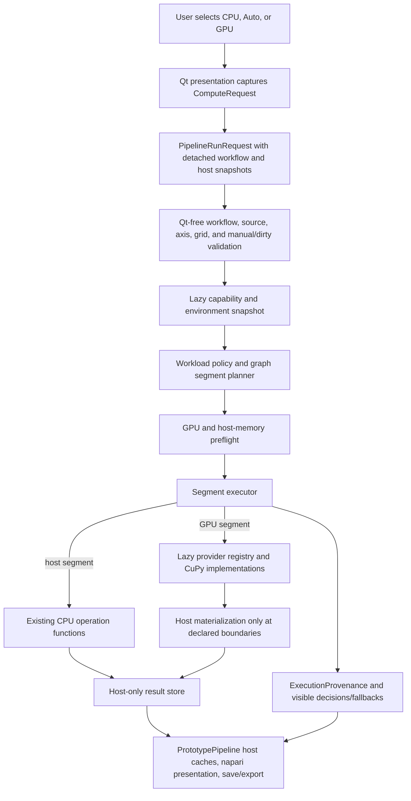

# Production GPU implementation plan

Date: 2026-07-15
Status: implementation-ready architecture and delivery plan; no production GPU
operation is enabled by this document.
Cross-platform review: 2026-07-15
cuCIM native-Windows evidence update: 2026-07-16

## Purpose and fixed constraints

This plan converts the GPU spike into reviewable production work without
changing current CPU results by accident. It is grounded in the current
`PrototypePipeline`, detached `PipelineRunRequest`, host-only interactive cache,
batch manifest, workflow v3, and generated-Python contracts.

The following constraints are non-negotiable:

- VIPP's base installation and CPU execution are supported on Windows, macOS,
  and Linux. NVIDIA GPU execution is supported only on native Windows and
  supported Linux distributions. macOS is CPU-only for the NVIDIA-only phase.
- CuPy/CuPyX is the first production GPU provider. cuCIM remains a separately
  gated candidate. A follow-up pinned source evaluation established a native-
  Windows `cucim.skimage` wheel and material benefits for selected operations,
  but not the native `cucim.clara` layer or the required Linux/multi-device,
  memory, cancellation, and packaging matrix. PyTorch remains out of scope for
  this operation family.
- The base installation, plugin discovery, workflow loading, generated Python,
  and CPU execution must work without importing an optional GPU package.
- `core/` remains free of Qt and napari imports. Qt presents decisions; it does
  not make backend, fallback, memory, or scientific-parity decisions.
- Existing CPU functions in `core/operations.py` remain the scientific
  reference. A GPU path must not change an algorithm, default, boundary mode,
  dtype conversion, initialization, PSF rule, clipping rule, or axis meaning.
- A CuPy array may exist only inside the provider execution scope. It must not
  appear in `PrototypePipeline.outputs`, `node_outputs`, a `SourcePayload`, a
  napari layer, an exported result, or a batch writer.
- RTX 4050 measurements are evidence for ordering and feasibility, not a
  universal `Auto` policy. Unknown workload-policy regions resolve to CPU.
- GPU work is introduced behind contracts and promotion gates. Median is the
  first production operation; Gaussian, RL, and RL-TV follow in that order.
- Existing unrelated working-tree changes, especially the current graph,
  parameter-visibility, toolbar, and axis-semantics work, must be preserved.

The minimum delivery is eleven passes, numbered 0 through 10. Pass 10 is an
umbrella for separately reviewed operation promotions, so the eventual PR count
will be greater than eleven.

### Cross-platform support contract

"Works on Windows, macOS, and Linux" applies to the VIPP application, saved
workflows, generated Python, and CPU results. It cannot mean NVIDIA GPU
execution on all three operating systems. NVIDIA's
[CUDA 10.2 release notes](https://docs.nvidia.com/cuda/archive/10.2/pdf/CUDA_Toolkit_Release_Notes.pdf)
state that 10.2 was the last toolkit release to support macOS, while this plan
uses current CuPy 14 with CUDA 12 or 13. Compiling CuPy, cuCIM, PyTorch CUDA
code, or a custom CUDA extension cannot restore a CUDA driver/runtime that
NVIDIA no longer supplies for macOS. If NVIDIA GPU execution on macOS is a
release requirement, this plan is a no-go rather than an implementation risk.

The supported product matrix is:

| Surface | Windows | Linux | macOS |
| --- | --- | --- | --- |
| Base VIPP install, import, CPU execution, workflows, batch, and generated Python | Required and tested | Required and tested | Required and tested |
| NVIDIA GPU execution | Native CuPy/CUDA path on validated x86-64 environments | CuPy/CUDA path on validated NVIDIA-supported glibc distributions and architectures | Not available; `Auto` selects CPU and explicit `GPU` fails preflight with a platform reason |
| GPU package installation | Platform-marked optional extra | Platform-marked optional extra | CUDA packages are not resolved or installed |
| Saved GPU-authored workflow | Opens portably; execution follows backend/fallback contract | Opens portably; execution follows backend/fallback contract | Opens portably; CPU session override or authored `Auto` is required to run |

This plan does not claim support for every Linux distribution. The release
matrix must name the tested glibc distributions and architectures. A platform
without a compatible wheel is supported for GPU use only after a reproducible
source build, real-device probe, scientific parity suite, and packaging smoke
test pass on that exact platform. Alpine/musl and other unvalidated targets are
CPU-only even if a local experimental build happens to succeed.

Dependency admission follows these rules:

1. Every base dependency must install and pass the CPU/package test matrix on
   Windows, macOS, and Linux for every supported Python version.
2. A CUDA dependency may be a platform-specific optional extra only when the
   base application neither imports nor requires it. The dependency must have a
   maintained wheel or a documented, CI-proven source build for each advertised
   Windows/Linux target.
3. A source-build claim is invalid when the underlying vendor runtime does not
   support the operating system. This explicitly rules out CUDA builds on
   current macOS.
4. A provider with a narrower binary-package matrix than CuPy may remain an
   evaluation candidate when upstream documents a source build. It becomes a
   production option only after reproducible builds, package artifacts, real-
   device probes, scientific parity, and material performance benefit are shown
   on every Windows/Linux target where VIPP would advertise that provider.

Current provider audit:

| Library/runtime | Windows | Linux | macOS | Plan decision |
| --- | --- | --- | --- | --- |
| NumPy, SciPy, scikit-image | Existing CPU stack | Existing CPU stack | Existing CPU stack | Keep as the cross-platform scientific reference |
| CuPy/CuPyX 14 + CUDA 12/13 components | Official wheels; source build possible with a supported CUDA toolchain | Official x86-64/aarch64 wheels; source build possible on validated CUDA/glibc targets | No current CUDA runtime or CuPy wheel | Allow only as a lazy, platform-marked Windows/Linux optional provider |
| cuCIM/RAPIDS | No official wheel; pinned `v26.06.00` Python/skimage source wheel reproduced on one native-Windows RTX 5090 host with small downstream patches; native Clara I/O absent | Official wheels and Ubuntu-tested source instructions; named target validation still required | No CUDA runtime | Continue as a narrow operation candidate; the Windows result advances but does not complete Pass 9 |
| PyTorch | Package available; CUDA builds available | Package available; CUDA builds available | Package available with CPU/Metal, not NVIDIA CUDA | Do not select: it cannot provide NVIDIA CUDA on macOS and adds a second large runtime/API without filling the current coverage gap |

Platform claims must be rechecked before changing dependency ranges or cutting
a GPU release. The primary sources are the
[CuPy installation matrix](https://docs.cupy.dev/en/stable/install.html),
[RAPIDS system requirements](https://docs.rapids.ai/install/),
[cuCIM source-build guide](https://github.com/rapidsai/cucim/blob/main/CONTRIBUTING.md#setting-up-your-build-environment),
[PyTorch local installation matrix](https://docs.pytorch.org/get-started/locally/),
and [PyTorch's macOS Metal backend](https://docs.pytorch.org/docs/stable/notes/mps).

### Native-Windows cuCIM evidence snapshot

The 2026-07-15/16 follow-up completed the first native-Windows cuCIM sub-gate.
The full procedure, package audit, output schemas, timing ranges, and artifacts
are in the
[cuCIM Windows source evaluation](cucim-windows-source-evaluation.md).

No credible third-party Windows binary was found. The official PyPI 26.6.0
files are manylinux x86-64/aarch64 wheels, the RAPIDS conda and nightly channels
publish Linux packages, GitHub releases contain no Windows assets, and upstream
Windows compatibility issue 454 remains open. The audit also found no Windows-
named branch among the 83 current forks; that is supporting evidence, not a
guarantee that no private or obscure build exists.

The pinned source result was:

| Build item | Evidence |
| --- | --- |
| Source | cuCIM `v26.06.00`, commit `3c15781c207eab93a317dd9803a6e726fe01f7c4` |
| Artifact | `cucim_cu13-26.6.0-cp312-cp312-win_amd64.whl`, 8,654,879 bytes |
| Host | Windows 10, Python 3.12.9, RTX 5090 compute capability 12.0, CuPy 14.1.1, CUDA 13.3 compiler / 13.2 runtime |
| Available surface | `cucim.skimage` and `cucim.core` |
| Unavailable surface | Native `cucim.clara/libcucim` whole-slide image I/O |
| Clean reproduction | Fresh clone/build/install plus Gaussian, rolling-ball, and labeling real-kernel probe passed |
| Selected upstream tests | Complete median file: 707 passed, 4 skipped; other selected operation tests: 172 passed, 8 skipped, 6 deselected |

The clean build required three downstream adaptations: put Git for Windows'
`which.exe` on `PATH` for `rapids-build-backend`; replace the materialized
relative `VERSION` symlink and include it in the wheel; and replace one
deprecated NumPy shape assignment in vendored padding code with `reshape` for
strict NumPy 2.5 compatibility. These are packaging/build-compatibility changes,
not image-processing formula changes. The reproducible builder is
[`scripts/build_cucim_windows.ps1`](../scripts/build_cucim_windows.ps1).

The synchronized RTX 5090 standard benchmark produced this operation-level
evidence. Times include one input and output transfer. A speedup above 1 means
cuCIM was faster than the named baseline.

| Operation | Best admitted baseline | cuCIM end-to-end speedup | Result |
| --- | --- | ---: | --- |
| Rolling ball 2D / 3D | scikit-image CPU | **265.46x / 528.66x** | Exact fixture output; advance to wider validation |
| Canny 2D | scikit-image CPU | **17.03x** | Exact; advance |
| Region-properties table | scikit-image CPU | **10.49x** | Exact values; dtype/schema adapter and overflow policy required |
| Connected components 2D / 3D | scikit-image CPU | **2.87x / 2.84x** | Exact values and `int32` output; advance |
| Otsu threshold 2D | scikit-image CPU | **2.38x** | Exact `float32` scalar; advance |
| uint16 31x31 histogram median | CuPyX median | 1.42x | Exact but below the 1.5x gate; defer and map crossover |
| Gaussian 2D / 3D | CuPyX Gaussian | 1.03x / 0.95x | Exact; keep CuPy |
| float32 5x5 median | CuPyX median | 1.08x | Exact; keep CuPy |
| Sobel / binary closing | normalized CuPyX composition | 0.98x / 1.01x | Equivalent; keep CuPy |
| Richardson-Lucy 2D / 3D | explicit CuPyX loop | 0.22x / 0.22x | Allclose but about 4.5x slower; keep explicit CuPy |

All 15 benchmark fixtures passed the recorded numerical comparison. The
region-properties values matched but cuCIM returned narrower area, label, and
bounding-box dtypes than the CPU public table. The fast histogram median also
requires a dense rectangular footprint. Both constraints must remain explicit
support-policy checks rather than silent behavior changes.

This evidence changes cuCIM from “Windows feasibility unknown” to “promising
narrow Windows operation provider.” It does not admit a production dependency.
Pass 9 still requires supported-Linux builds, another Windows GPU tier, CUDA
policy, clean-install/JIT and memory measurements, cancellation behavior,
schema adapters, optional-extra/CI maintenance, and an upstream-versus-
downstream patch strategy. macOS remains CPU-only because it has no current
NVIDIA CUDA runtime.

## 1. Target architecture

### 1.1 Components and ownership

The target keeps graph definition, scientific CPU functions, provider code,
execution policy, and UI presentation separate.

| Component | Proposed owner | Responsibility |
| --- | --- | --- |
| Compute request and result contracts | `core/compute.py` | Immutable user intent, selected device, fallback permission, precision policy, per-node decisions, typed reason codes, and JSON-safe reports. |
| Operation implementation declarations | `core/compute_specs.py` | Immutable declarations associated with operation IDs. Contains no implementation callable and imports no provider. Validates that declared operation IDs exist in `NODE_LIBRARY`. |
| Provider registry and protocols | `core/compute_registry.py` | Lazy provider descriptors, entry-point discovery, provider protocol, instance lifetime, capability probing, and implementation lookup by stable ID. |
| Workload policy | `core/compute_policy.py` plus packaged JSON under `src/napari_vipp/compute_policies/` | Deterministic support and benefit decisions from workload, topology, environment, and validated threshold records. CPU is the conservative answer outside a validated region. |
| Graph planning | `core/device_execution.py` | Scheduled-node closure, support resolution, maximal GPU segment construction, boundary transfers, liveness, memory preflight, fallback planning, and execution reports. |
| CPU/GPU call preparation | a small extraction from `core/pipeline.py` into `core/node_execution.py` | Build validated operation inputs/kwargs and apply existing metadata transforms once, independent of the chosen implementation. The CPU path uses the same extraction. |
| Built-in CuPy provider | `core/gpu/cupy_provider.py` | Lazy CuPy import, real device probe, device/context and private-pool scope, transfer/synchronization primitives, OOM classification, cleanup, and environment identity. |
| CuPy implementations | one module per promoted family under `core/gpu/` | Pure provider operations accepting and returning device arrays. They mirror current CPU semantics and expose no UI behavior. |
| Capability/policy diagnostics | `core/compute_diagnostics.py` | JSON-safe support report, installation diagnosis, policy explanation, memory snapshot, and recent execution/fallback information. |
| Single-run service | `core/execution.py` | The only application execution entry point after Pass 4. It validates a detached workflow, creates a plan, executes it, and returns host outputs plus provenance. |
| Interactive presentation | a reusable controller under `ui/compute.py`, composed by `_widget.py` | Global backend control, device/status text, node support explanations, decision/fallback display, and install guidance. No provider import or policy logic. |
| Batch integration | `core/batch.py`, `core/batch_setup.py`, and existing `ui/batch*` adapters | Persist the run request, reuse the core execution service per item, checkpoint decisions in manifests, cancel safely, and clean the provider at item/run boundaries. |
| Workflow and generated Python | `core/workflow.py`, `core/export.py` | In Pass 8 only: persist portable backend intent, migrate v3 to CPU intent, expose explicit runtime override, and return/write provenance. |

`core/pipeline.py` is already large and has active unrelated changes. Provider
callables must not be added there. The preferred association is an immutable
side table in `core/compute_specs.py`, keyed by operation ID and validated
against `NODE_LIBRARY_BY_ID`. `OperationSpec` remains the source of graph and
scientific-call metadata; `compute_specs_for(operation_id)` is the source of
backend implementations. This avoids importing provider code from the node
library and lets operation-family agents edit separate declaration blocks.

### 1.2 Core value objects

The public contracts should settle on these concepts before an operation is
promoted:

- `ComputeRequest`: global backend intent (`cpu`, `auto`, or `gpu`), fallback
  permission, selected provider/device, precision-policy ID, workload-policy
  ID, minimum speedup, GPU cap, and safety reserve. It has no Qt types.
- `ComputeEnvironment`: detected provider, provider version, driver/runtime,
  device identity/class, memory, OS execution mode, and probe status.
- `OperationComputeSpec`: one immutable declared implementation and its exact
  support/parity/memory/progress constraints.
- `WorkloadDescriptor`: operation, resolved dimensions, shapes, dtypes,
  parameters, topology/transfer facts, device/host tiers, and available memory.
- `NodeExecutionDecision`: requested and resolved backend, implementation,
  policy record, reason code/text, estimate, and whether a fallback occurred.
- `ExecutionSegment`: a host node or a maximal connected GPU sub-DAG with
  entry/exit ports, retained ports, liveness counts, and a memory estimate.
- `ExecutionPlan`: immutable ordered segments plus environment and decisions.
- `ExecutionProvenance`: run-level environment and per-node records, cache-key
  digests, fallback events, warnings, and cleanup outcome.

`PipelineRunRequest` gains a `compute_request` value. `PipelineRunResult` gains
an `execution_report`; errors become typed internally but retain the current
user-facing `error` string for compatibility. No request or result contains a
device array.

### 1.3 Control and data flow



Preflight is complete before a scientific or side-effecting node runs. An
explicit GPU request that cannot be honored therefore fails without partial
graph execution. GPU segments are execution transactions: device values and
provisional host copies are committed to the public host result store only
after the whole segment succeeds. This makes one-time CPU retry after a GPU OOM
safe and prevents duplicate side effects.

## 2. Backend semantics

### 2.1 User-visible meanings

| Request | Exact behavior |
| --- | --- |
| `CPU` | Do not probe or import a GPU provider for execution. Every scientific operation uses the current CPU implementation. CPU remains the default for a new or migrated workflow. |
| `Auto` | Probe lazily, reject unsupported or unvalidated regions, and choose GPU only where a shipped policy predicts at least the configured minimum end-to-end speedup and memory preflight passes. Mixed CPU/GPU graphs are allowed. Choosing CPU is a normal Auto decision, not a fallback. An attempted GPU segment that encounters a classified OOM may be cleaned up and retried once on CPU; that retry is a visible fallback. |
| `GPU` | Require every scheduled scientific compute node to have a validated GPU implementation for its actual inputs and parameters. Source, output, save, and explicit host-boundary infrastructure nodes are exempt. Preflight fails closed if any scheduled scientific node is unsupported, the provider is unavailable, or memory is insufficient. No CPU work starts after such a failure. |
| `GPU` with explicit fallback | Unsupported scientific nodes may run on CPU and compatible nodes may form GPU segments. Provider-unavailable and classified OOM cases may retry on CPU once. Every affected node and the run summary record the fallback. Unclassified CUDA/provider errors still fail. |

`Auto` CPU selection and GPU fallback must have different machine-readable
states. Use `decision_kind=policy_cpu` for the former and
`decision_kind=fallback_cpu` plus `fallback_reason` for the latter. The spike's
current `BackendSelection.fell_back=True` for an unsupported Auto operation
should be corrected during Pass 0.

### 2.2 Global versus per-node choice

Production scope has one global request per run. There is no per-node user
override in passes 0-10. `Auto` still resolves individual nodes because that is
policy, not authored per-node intent. A per-node UI would complicate graph
portability, cache identity, batch configuration, generated signatures, and
explicit-GPU fail-closed semantics without a demonstrated use case.

The plan leaves a future extension point—a validated mapping of node ID to
backend intent in `ComputeRequest`—but does not publish or persist it. Adding it
later requires its own workflow-schema and UX decision.

### 2.3 Mixed graphs and explicit-GPU preflight

- `CPU`: never mixed.
- `Auto`: mixed graphs are expected and partitioned at operation, support,
  benefit, or memory boundaries.
- `GPU`: host-only infrastructure may surround GPU compute, but an unsupported
  scheduled scientific node fails the complete preflight.
- `GPU` plus fallback: mixed compute is allowed and recorded.
- Skipped manual nodes are not scheduled and therefore do not make an explicit
  GPU request fail. A cached skipped-manual output is a host boundary. A manual
  node explicitly selected for calculation is included in preflight.
- A side-effecting `Save Image` or batch publication node is never part of a
  GPU segment and cannot run until all required compute preflight succeeds.

Fallback is permitted only for enumerated cases: provider unavailable before
launch when the request allows it, unsupported declared region when the request
allows it, memory preflight for Auto/allowed fallback, and provider-classified
OOM. Invalid parameters, axis/grid errors, scientific validation errors,
unclassified CUDA errors, and writer errors never become CPU fallbacks.

### 2.4 Persistence and portability

Backend intent does belong in workflow JSON, but only in Pass 8 after execution,
UI, cache, batch, and provenance contracts are stable. Workflow v4 should add:

```json
"execution": {
  "compute": {
    "backend": "cpu",
    "allow_fallback": false,
    "precision_policy": "scientific-default-v1",
    "workload_policy": "vipp-conservative-v1"
  }
}
```

Device index, exact device identity, memory cap, driver, and resolved decisions
are runtime environment, not authored workflow intent, and are not stored here.
Workflow v3 is safely migrated to the v4 CPU default because v3 could only run
the current CPU path; v1/v2 remain rejected for the existing scientific-schema
reasons.

Opening a GPU-authored workflow on CPU-only hardware preserves its authored
intent and shows an unavailable status. `backend=gpu` fails closed on run; the
user may choose a CPU session override without mutating the document, or choose
"Use CPU and save" to rewrite intent. `backend=auto` opens and runs on CPU with
a visible policy reason. Generated Python uses the embedded intent unless the
caller supplies an explicit override. Batch config records the effective run
override so a batch replay cannot silently inherit a different UI preference.

The canonical scientific workflow hash includes authored compute intent after
v4. It never includes a resolved backend, device, or policy result. Those belong
to execution provenance.

### 2.5 Consequences across execution surfaces

| Surface | Consequence of the backend contract |
| --- | --- |
| Interactive run | The session request is captured in every synchronous or background `PipelineRunRequest`; stale-run rejection compares graph/source state as today and discards the accompanying provenance with the stale result. |
| Cache | Requested and resolved backend are part of every output-port record. A CPU result cannot satisfy a GPU-key lookup, and an Auto CPU result remains distinguishable from an explicit CPU result. |
| Batch | `BatchConfig` records the effective override; each item is replanned against current free memory but the request is unchanged. A fallback on one item does not silently rewrite later items to CPU. |
| Generated Python | Embedded workflow intent is the default. Function/CLI override is explicit, returned in provenance, and does not mutate `_WORKFLOW_JSON`. |
| Reproducibility | `CPU` is portable and stable. `GPU` is fail-closed and environment-dependent. `Auto` is intentionally hardware-dependent, so the policy/environment/actual decisions—not workflow intent alone—are required to reproduce a result. |

## 3. Operation capability model

### 3.1 Immutable declaration

The declaration should be data, not code. A representative contract is:

```python
@dataclass(frozen=True, slots=True)
class OperationComputeSpec:
    operation_id: str
    backend: ComputeBackend                 # GPU for the new declarations
    provider_id: str                        # "cupy"
    implementation_id: str                  # "vipp.cupy.median_filter"
    implementation_version: str             # "1"
    supported_spatial_dims: frozenset[int]  # {2} or {2, 3}
    supported_dtypes: tuple[str, ...]        # canonical NumPy dtype strings
    parameter_policy_id: str                # exact range/mode validator
    parity_policy_id: str
    progress_granularity: str               # segment/kernel/iteration
    cancellation_granularity: str           # before-after-kernel/iteration
    supports_device_residency: bool
    temporary_memory_model_id: str
    workload_policy_id: str
    boundary_policy_id: str
    precision_policy_ids: tuple[str, ...]
    limitations: tuple[str, ...] = ()
```

Parameter support is resolved by a named pure validator in the policy layer,
not an arbitrary callable stored in `pipeline.py`. The validator returns a
typed support result with a stable reason code. Examples include odd median
sizes within the validated range, exact Gaussian sigma handling, RL spatial
rank, PSF rank, iteration range, normalization/clipping modes, and RL-TV
regularization parameters.

The initial declarations must be narrower than provider API availability:

- median: finite `float32`, slice-wise YX semantics, odd validated kernel
  sizes, explicit/scalar channel behavior, reflect boundary;
- Gaussian: finite `float32`, separate 2D slice-wise and 3D declarations, exact
  sigma tuples, reflect boundary;
- RL/RL-TV: `float32` working/output semantics, 2D and 3D spatial blocks,
  matching PSF rank/grid, all current public parameter modes only after each is
  tested.

Integer, float64, non-finite filter inputs, new boundary modes, fast math, and
dynamic/multi-output provider implementations stay unsupported until promoted.
An implementation may not advertise a dtype or parameter merely because CuPy
accepts it.

### 3.2 Lazy implementation registry

`core/compute_registry.py` contains descriptors such as provider ID, display
name, import string, supported OS family, and optional entry-point origin. It
does not import the implementation module at registry construction. The
built-in implementation mapping uses import strings:

```text
vipp.cupy.median_filter -> napari_vipp.core.gpu.cupy_median:median_filter
```

The registry loads the provider only after request resolution says it may be
used. A CPU request never calls provider discovery or `importlib.import_module`
for CuPy. Third-party discovery uses an entry-point group such as
`napari_vipp.compute_providers`; discovery failures become diagnostic records,
not plugin-import failures. Provider IDs and implementation IDs are stable cache
and provenance identifiers; display names are not.

Registry startup validates these invariants without loading providers:

1. every declaration references an existing operation ID;
2. `(provider_id, implementation_id, implementation_version)` is unique;
3. every named parity, parameter, memory, boundary, precision, and workload
   policy exists;
4. no production declaration exists without its promotion tests and policy
   record;
5. no provider module is imported while `napari_vipp` or the npe2 manifest is
   imported.

### 3.3 Capability detection lifecycle

Detection has two phases. Descriptor discovery lists built-in and entry-point
providers without importing them. A probe runs only when the UI asks for GPU
status or a GPU/Auto request needs it. The CuPy probe records every visible
device, then for the selected device creates a context, checks driver/runtime
identity and free/total memory, imports each required CuPyX submodule, executes
and synchronizes a real one-element kernel, and tears down the probe allocation.
Import success alone is never availability.

Reports distinguish provider availability from operation promotion. A usable
CuPy installation can report zero supported VIPP operations. Supported IDs are
derived from validated `OperationComputeSpec` records, not supplied by the UI.
Probe results are cached by process/environment fingerprint and can be refreshed
after installation or a provider failure. A CPU request neither discovers entry
points nor probes/imports CuPy during execution.

## 4. Device-resident graph execution

### 4.1 Planning model

Planning starts after source snapshots, graph restoration, dirty-closure, and
manual-node selection are known. It plans only nodes that this run will execute.
Each output port is the unit of storage and liveness.

A GPU segment is the maximal connected sub-DAG of scheduled nodes that:

- resolved to the same provider and device;
- have compatible validated implementations and precision policies;
- can exchange resident arrays;
- fit as a unit under the memory policy; and
- contain no source, writer, table, manual-skip, or other declared host/side-
  effect boundary.

"Maximal" is topological, not merely a consecutive list. A segment can contain
a branch and later join. A CPU node splits GPU regions. Different providers or
devices always split regions.

### 4.2 Internal array ownership

`DeviceValue` is an internal, non-public record owned by the segment executor:

```text
(provider instance, device id, opaque provider array, shape, dtype,
 output-port key, remaining device consumers)
```

The opaque array is never placed in `PrototypePipeline`. The segment's private
`ExecutionValueStore` may hold:

- a host value;
- a device value;
- both temporarily when a branch or retained output needs host materialization;
- the existing `ImageState`/`TableState`; and
- the cache/provenance record.

Public commit stores only the host value and state. All accepted interactive
cache entries remain host-owned in passes 0-10. Device arrays are not retained
across separate interactive runs because the current detached worker may not
reuse a stable execution thread/context and stale-run rejection must remain
simple. Dirty partial recalculation can reuse a clean cached host output; that
output is transferred once if it enters a new GPU segment.

### 4.3 Boundary rules and edge cases

- **Source:** one H2D copy per distinct source/output entering a segment. Aliased
  fan-out reuses the same device value.
- **Consecutive supported operations:** keep each output resident until its last
  device consumer completes.
- **CPU boundary:** materialize the required port once, synchronize it, and keep
  the device copy only if another device consumer remains.
- **Multi-input:** a GPU node can join resident inputs; host/cached inputs are
  copied at segment entry. All inputs must pass operation support and grid
  validation before any transfer. The image and PSF are distinct live inputs.
- **Branch/fan-out:** consumer counts cover every source port. A GPU-to-CPU and
  GPU-to-GPU fork creates one host copy and one continuing resident reference.
- **Multiple outputs:** plan, count, transfer, retain, and release each output
  port independently. Initial promoted operations are single-output; generic
  multi-output support is nevertheless tested with a fake provider.
- **Cached upstream output:** it is a host entry boundary. Its cache record is
  validated before transfer. Device identity from an older run is irrelevant.
- **Skipped manual node:** its valid/stale cached host output is a boundary. A
  manual node selected to calculate can join a GPU segment if promoted.
- **Retained/selected/pinned/preview output:** add its output port to the host
  materialization set. Copy it without breaking downstream residency. napari
  receives the existing detached host copy behavior.
- **Batch output/save:** always host-materialize before the existing staging and
  source-reverification sequence. Publication remains outside GPU scope.
- **Across batch items:** per-item sources, intermediates, and outputs are never
  retained. A fixed immutable source such as a shared PSF may remain resident in
  a batch-scope constant cache only when its exact source revision/cache key,
  provider/device, dtype/shape, and read-only contract are unchanged, its bytes
  are reserved in every item's memory estimate, and no implementation mutates
  inputs. Release all such constants on cancel, provider error, source refresh,
  or batch end.
- **Cancellation:** stop launching new work, synchronize already submitted work,
  release all private values, and return only after cleanup. Never commit a
  canceled segment.
- **Dirty recalculation:** clean cached host ports remain committed; only the
  planned dirty closure gets new decisions/cache keys. A canceled or failed
  clone never replaces live host caches.

### 4.4 Segment-planning pseudocode

```python
def plan_run(pipeline, run_scope, compute_request, environment, cached_records):
    scheduled = resolve_dirty_and_manual_scope(pipeline, run_scope, cached_records)
    descriptors = infer_workloads_without_executing_nodes(pipeline, scheduled)

    decisions = {}
    for node_id in topological_order(scheduled):
        node = pipeline.nodes[node_id]
        if is_host_infrastructure(node):
            decisions[node_id] = host_boundary("declared_host_boundary")
            continue

        support = validate_declared_implementation(
            node, descriptors[node_id], environment, compute_request
        )
        decisions[node_id] = resolve_backend(
            compute_request, support, descriptors[node_id]
        )

    if compute_request.backend == GPU and not compute_request.allow_fallback:
        failures = unsupported_scheduled_scientific_nodes(decisions)
        if failures:
            raise ComputePreflightError(all_failures=failures)

    # Auto depends on transfer topology. Start conservatively, form candidate
    # regions, recalculate transfer counts/costs, and demote until stable.
    decisions = stabilize_auto_decisions(
        pipeline, scheduled, descriptors, decisions, environment
    )

    regions = maximal_connected_gpu_subdags(pipeline, scheduled, decisions)
    segments = split_regions_until_memory_estimates_fit(regions, descriptors)
    ordered = topologically_order_host_nodes_and_segments(segments, scheduled)
    return ExecutionPlan(ordered, decisions, environment)
```

`infer_workloads_without_executing_nodes` uses source/cached shapes and pure
shape/dtype propagation. If an output shape cannot be known until execution,
Auto resolves that node to CPU. Explicit GPU reports an unsupported-dynamic-
shape reason unless the declaration provides a safe upper-bound model.

### 4.5 Execution pseudocode

```python
def execute_plan(plan, pipeline, host_cache, cancel):
    store = ExecutionValueStore.from_host_cache(host_cache)
    provenance = ExecutionProvenance.start(plan)
    try:
        for unit in plan.units:
            cancel.check()
            if unit.is_host:
                prepared = prepare_node_call(pipeline, unit.node_id, store.host_inputs)
                output = call_existing_cpu_function(prepared)
                store.commit_host(finalize_node_result(prepared, output))
                provenance.complete_host(unit)
                continue

            try:
                provisional = execute_gpu_segment_transaction(
                    unit, pipeline, store, cancel, provenance
                )
            except ProviderOutOfMemory as oom:
                cleanup_and_synchronize_provider(unit.provider)
                if not may_retry_once(plan.request, unit, oom, provenance):
                    raise
                provisional = execute_segment_on_cpu_transaction(
                    unit, pipeline, store, cancel
                )
                provenance.record_fallback(unit, "runtime_oom")
            store.commit_host_only(provisional)
    finally:
        store.release_all_device_values()
        synchronize_and_apply_pool_policy(plan)
    return materialize_pipeline_host_result(store), provenance.finish()


def execute_gpu_segment_transaction(segment, pipeline, committed_store, cancel, prov):
    private = SegmentStore()
    with provider.execution_scope(segment.device, segment.memory_policy):
        preflight_live_memory(segment, provider.memory_snapshot())
        for entry_port in segment.host_entries:
            cancel.check()
            private.put_device(entry_port, provider.to_device(committed_store.host(entry_port)))
            prov.transfer(entry_port, "host_to_device")

        for node_id in segment.topological_nodes:
            cancel.check()
            prepared = prepare_node_call(pipeline, node_id, private.inputs(node_id))
            device_output = provider.call(segment.implementation(node_id), prepared)
            provider.operation_checkpoint(segment.progress_granularity(node_id), cancel)
            private.put_outputs(node_id, device_output)
            private.release_dead_values()

        for port in segment.host_outputs | segment.retained_outputs:
            cancel.check()
            private.put_provisional_host(port, provider.to_host(private.device(port)))
            prov.transfer(port, "device_to_host")
        provider.synchronize()
        cancel.check()
        return private.finalize_host_results_and_states()
```

## 5. Workload selection policy

### 5.1 Policy inputs

Every Auto decision uses a `WorkloadDescriptor` containing at least:

- operation and implementation ID/version;
- resolved 2D/3D spatial mode and complete array rank;
- input/output shape, element count, and dtype;
- kernel size, sigma tuple, PSF shape, and iterations where relevant;
- all parameters that change work or memory;
- number and identity of resident GPU predecessors/successors;
- distinct H2D and D2H boundaries predicted for the candidate segment;
- whether an output must be retained, previewed, pinned, or saved;
- selected device tier and exact available memory snapshot;
- provider, provider version, CUDA-major/runtime family, OS mode, and driver;
- host tier or local host calibration, because CPU speed changes crossover;
- policy record ID/version and whether the descriptor is inside its validated
  interpolation bounds.

### 5.2 Threshold generation and storage

Extend `scripts/benchmark_gpu.py` into a matrix harness rather than converting
its RTX 4050 values into constants. For each promoted implementation, collect
warm, synchronized CPU time, resident GPU time, H2D/D2H time, end-to-end time,
peak live/pool memory, and parity over a factorial or space-filling matrix of:

- small through large 2D and 3D shapes;
- supported dtypes;
- kernel/PSF sizes and iteration counts;
- isolated node and representative resident chains;
- Windows native, Linux, and WSL2 where supported;
- CUDA 12 and CUDA 13 environments;
- multiple host/device performance tiers, including the minimum supported VRAM.

Use held-out workloads to fit and validate a simple explainable model or
piecewise threshold. Store reviewed records as versioned package data, not in
Python conditionals. A record includes provider/implementation version ranges,
OS/runtime class, host/device tier, feature bounds, predicted CPU/GPU/transfer
cost coefficients or breakpoints, required minimum speedup, confidence, and
benchmark artifact digests. Raw results remain in `docs/benchmarks/`; shipped
policy records are the reviewed derivative.

Device tiers should be based on a short, deterministic startup/transfer/compute
microprofile plus compute capability and VRAM class, not model-name matching.
The microprofile contains no user image data and its local result is cached by
provider/runtime/device fingerprint. If the profile is missing, stale, or
outside a shipped policy's validated bounds, Auto chooses CPU. Exact timings do
not enter scientific cache identity, but tier, policy ID, and decision do.

### 5.3 Deterministic conservative algorithm

1. Reject GPU for unsupported dimension, dtype, parameter, precision, provider,
   boundary, or finite-value requirement.
2. Reject GPU for an absent/mismatched policy record or an out-of-domain
   descriptor.
3. Predict total segment cost, including distinct transfers and required host
   materializations—not only kernel time.
4. Require predicted speedup of at least 1.5x by default and enough margin to
   cover model uncertainty.
5. Form maximal candidate segments, recompute transfer counts, and demote
   segments whose end-to-end prediction no longer meets the gate. Repeat until
   stable; ties resolve to CPU.
6. Run memory preflight. Auto may demote a segment or split it at the least
   costly boundary; it must record that memory caused the CPU decision.

Explicit GPU ignores the performance threshold but never ignores support,
scientific parity, or memory constraints.

## 6. GPU memory management

### 6.1 Separate policy from host RAM

The existing host-RAM cache guard continues to own host arrays. GPU policy is a
separate `GpuMemoryPolicy` shown beside it in UI, never folded into
`_pipeline_cache_nbytes`. Host output materialization still counts toward the
existing guard. A run can pass one guard and fail the other.

Recommended initial defaults, subject to approval, are:

- cap provider allocations at 80% of device memory;
- reserve `max(512 MiB, 10% of total device memory)` from the run cap;
- also honor current device-wide free bytes, which accounts for other
  processes; and
- refuse preflight unless the conservative peak estimate fits both the cap and
  `free - reserve`.

The UI permits a percentage or absolute cap but not less than the provider's
documented minimum. The effective cap and reserve are provenance fields.

### 6.2 Estimation and liveness

`MemoryEstimate` includes unique entry inputs, each live output, retained
device values at branches, operation temporaries, library workspace, transfer
staging, and a calibrated uncertainty/fragmentation margin. The segment planner
computes port-level last use and a peak over the topological schedule.

Named provider models implement at least:

- median/Gaussian: input, output, CuPyX workspace upper bound by rank/dtype/
  kernel, and branch-retained values;
- RL: observed image, normalized image, estimate, blur, ratio, correction, PSF,
  mirrored PSF, output, and convolution workspace;
- RL-TV: all RL buffers plus per-axis gradients, norm, normalized components,
  divergence, denominator, and stack/workspace behavior.

Unknown provider workspace is measured across the declared support matrix and
stored with a safety multiplier. A model that cannot establish a safe upper
bound cannot be promoted for explicit GPU and causes Auto to choose CPU.

### 6.3 CuPy pool policy

Use a VIPP-owned CuPy `MemoryPool` within the provider execution scope and
restore the prior allocator on exit. Set its hard limit to the effective cap.
Do not mutate or empty a process-global pool used by unrelated code. Initial
transfers are synchronous and do not introduce a long-lived pinned-host pool;
an optimized pinned pool requires separate host-memory accounting later.

Within a successful batch, free arrays at each item's liveness boundaries but
allow the VIPP pool to retain free blocks for reuse while it remains below the
cap. At item end, synchronize and prove that no live per-item device values
remain. Only the explicitly accounted immutable batch constants described above
may survive. Free cached pool blocks and batch constants on classified OOM,
when the cap is exceeded or reduced, on provider teardown, and at batch end—not
after every node.

### 6.4 OOM and cleanup

- Catch only provider-classified allocation OOM. Do not substring-match every
  CUDA error.
- Best-effort synchronize, drop all segment references, free VIPP-pool blocks,
  and capture estimate/free/cap/pool state.
- `Auto` retries the failed segment once on CPU. Explicit GPU retries only when
  fallback was enabled. Mark the segment as already retried to prevent loops.
- Retry uses committed host boundary inputs and commits no failed GPU output.
- If cleanup or synchronization reports a second provider error, fail the run
  and mark the provider unhealthy until capability refresh.
- Batch `finally` cleanup runs before staging/publication status is finalized.
  One failed item cannot leave device references reachable by the next item.

## 7. Cache identity and provenance

### 7.1 Cache records

The current cache is structural and host-only. Add a record beside every cached
output port so dirty-run hydration can prove compatibility. A cache key is a
canonical digest of:

- upstream source revision or upstream output-port cache keys;
- operation ID and canonical public parameters;
- requested backend and resolved backend;
- fallback state and stable fallback reason code;
- provider ID/version and implementation ID/version;
- exact device session identity and normalized device class;
- CUDA driver/runtime identity and OS execution mode;
- precision-policy ID;
- workload-policy record ID, descriptor digest, decision, and predicted transfer
  count;
- parity-policy ID and any authorized equivalence group;
- relevant axis/grid metadata and existing operation/cache identity inputs.

Human reason text is not hashed; stable codes and structured values are. Cached
host arrays from the current pre-GPU runtime receive CPU records when hydrated,
or are conservatively invalidated if their source/parameter identity cannot be
reconstructed.

CPU and GPU cache entries are separate by default, including median. A parity
policy may later publish a `cache_equivalence_group`, but only after bitwise
equivalence is proved over every supported dtype/parameter/boundary region and
approved explicitly. Tolerance-based parity never authorizes cache sharing.

### 7.2 Provenance schema

`ExecutionProvenance` records:

- request intent, effective session override, and fallback permission;
- capability/environment snapshot, provider/runtime/driver, device class,
  memory policy, and policy IDs;
- per node: implementation, precision, support/policy decision, reason,
  transfers, estimate, actual backend, fallback, progress granularity, cache
  hit/miss/key digest, and parity-policy ID;
- segment boundaries and materializations;
- OOM/provider errors, retry count, cancellation point, and cleanup result;
- VIPP and CPU scientific dependency versions.

Integration behavior is exact:

- `PipelineRunResult.execution_report` carries the report to the widget.
- `PrototypePipeline` gains host-only per-port cache/provenance mappings when a
  result is accepted. Stale worker results remain discarded wholesale.
- `ImageState.history` keeps its current scientific operation descriptions;
  structured compute provenance is associated separately so display history is
  not polluted with hardware text.
- Undo/redo and workflow JSON store authored intent, not the last resolved run.
- Batch manifests add run-level compute environment/policy and item-level node
  decisions/fallbacks; each output records the provenance digest that produced
  it.
- Generated `PipelineResults` exposes `.execution_report` and
  `.output_provenance`.
- Standalone exported/saved results write an atomic
  `<output-name>.vipp-provenance.json` sidecar by default; formats with a stable
  metadata field may mirror a digest, but the JSON sidecar is authoritative.
- A diagnostic export contains the capability report, installation diagnosis,
  policy records used, memory snapshot, and recent decision/error codes, but no
  array data or raw device serial number.

## 8. Progress and cancellation

Extend progress from `(node, current, total, message)` to a backward-compatible
typed update that can also carry phase (`preflight`, `transfer`, `kernel`,
`iteration`, `materialize`, `cleanup`), segment ID, and indeterminate state. The
Qt worker continues to forward only data.

Exact operation behavior:

- **RL and RL-TV:** check cancellation before each iteration, launch the
  iteration's kernels, synchronize once at the iteration checkpoint, check
  again, then report completed progress. For leading non-spatial blocks, total
  remains `block_count * iterations`, matching current CPU behavior. A reported
  iteration is complete on the device, not merely queued.
- **Gaussian and median:** check before transfer, immediately before kernel
  launch, and after synchronization. The provider kernels are monolithic. Do
  not claim or display mid-kernel cancellation.
- **Transfers:** report start/completion by distinct boundary value. A transfer
  is complete only after the required stream synchronization.
- **Multi-node segment:** display overall node/segment position plus the active
  node phase. Determinate iteration progress takes precedence; monolithic work
  remains indeterminate.
- **Batch:** item progress contains nested segment/node/iteration detail. Batch
  cancellation stops starting new items and signals the current item.
- **Asynchronous cancellation:** changing the graph sets the existing event.
  The UI says "Cancel requested—waiting for current GPU step" while a
  monolithic kernel is outstanding. The result is not returned until streams
  are synchronized and device references are released.

Cancellation is not an error and does not trigger CPU fallback. A canceled
segment commits no new host output. Existing clean caches remain intact.

## 9. Packaging and environment support

### 9.1 Optional extras

Add no GPU dependency to base requirements. Add mutually exclusive extras:

```toml
gpu-cuda12 = [
    "cupy-cuda12x[ctk]>=14,<15; platform_system == 'Windows' or platform_system == 'Linux'",
]
gpu-cuda13 = [
    "cupy-cuda13x[ctk]>=14,<15; platform_system == 'Windows' or platform_system == 'Linux'",
]
```

Documentation must say never to install both CuPy CUDA-major distributions in
one environment. The supported path uses `[ctk]` CUDA component wheels and
still requires a compatible NVIDIA driver. A driver-only wheel can work for a
subset but is not the supported VIPP install because missing component DLLs/
shared libraries can surface only when another CuPyX module loads.

The environment markers keep CUDA distributions out of macOS resolution. They
do not imply that `pip install napari-vipp[gpu-cuda12]` enables a GPU on macOS;
the UI and user guide must identify macOS as CPU-only and must not offer a CUDA
install/repair command there. Before each release, build an isolated environment
for every supported OS/Python pair, resolve the base package, and prove that the
macOS dependency graph contains no `cupy`, `cupyx`, or NVIDIA CUDA component.
For advertised Windows/Linux GPU targets, resolve the selected extra from a
clean environment rather than relying on a developer machine's CUDA state.

### 9.2 Platform behavior

- **CPU-only Windows/Linux/macOS:** base install, plugin import, workflow load,
  generated Python, and CPU execution work. Capability says GPU unavailable
  without an import exception.
- **macOS:** always reports `platform_unsupported` for the NVIDIA provider.
  `Auto` selects CPU as a normal policy decision. Explicit `GPU` fails before
  execution with a concise explanation and a CPU override action; it does not
  show a CUDA install command or attempt a source build.
- **Native Windows x86-64:** supported for CuPy after import, device enumeration,
  context creation, one real kernel, and required CuPyX module probes pass.
  Diagnostics distinguish missing package, incompatible wheel, driver failure,
  missing runtime component, no device, and kernel-probe failure.
- **Linux:** supported only for the named NVIDIA/CUDA-compatible glibc
  distributions and architectures in the release matrix, using the same probe
  and both CUDA-major CI tracks. Container use must expose a compatible
  driver/device. An unvalidated distribution remains CPU-only; local source
  compilation does not expand the published support matrix.
- **WSL2:** report WSL explicitly in provenance and diagnostics; use Linux
  wheels and document host-driver prerequisites. WSL2 is useful secondary
  coverage, not a substitute for the required native-Windows CuPy path.
- **Incompatible environments:** never surface a raw import traceback as the
  primary message. Show the classified cause, selected extra, installed package
  versions, and a copyable install/repair command. Raw CUDA details remain in
  expandable diagnostics.
- **CI without GPUs:** do not install GPU extras for required CPU jobs. Mock
  provider tests exercise selection, segmentation, cleanup, and import safety.
- **Plugin discovery:** npe2 validation and `import napari_vipp` must prove that
  `cupy`, `cupyx`, and provider implementation modules are absent from
  `sys.modules`.

Do not add a cuCIM extra or provider before Pass 9. The
[native-Windows source evaluation](cucim-windows-source-evaluation.md) now
provides a reproducible `v26.06.00` CPython 3.12 `win_amd64` skimage wheel,
selected upstream tests, and operation benchmarks. Rolling ball, Canny,
labeling, Otsu, and region properties cleared the single-host performance gate;
Gaussian, ordinary median, Sobel, binary morphology, and cuCIM Richardson-Lucy
did not justify replacing their CuPy paths. The build required small downstream
packaging/NumPy adaptations and excludes native Clara I/O. Pass 9 must still
validate supported Linux targets, another Windows tier, memory, cancellation,
clean-install/JIT cost, packaging/CI maintenance, and region-table schema
adaptation. If promoted, cuCIM uses its own optional extra/provider and CuPy
delivery remains independent. macOS remains ineligible because source
compilation cannot supply the missing CUDA runtime.

## 10. UI/UX plan

### 10.1 Global controls

Add one global `Compute` selector (`CPU`, `Auto`, `GPU`) in Settings and the
batch setup summary. Default is CPU. Add an adjacent compact status such as
`CPU`, `Auto · RTX 4050`, or `GPU unavailable`; do not add a backend control to
every node. If multiple usable devices exist, an advanced device selector may
choose the run device, but its index is session state rather than workflow
intent.

Selecting GPU when unavailable is allowed as authored intent but run is
disabled/fails preflight with a repair action. A separate checkbox, hidden under
advanced execution settings, is `Allow explicit GPU fallback to CPU`; it is off
by default and worded as a reproducibility choice.

### 10.2 Node and run explanations

The inspector has a read-only Compute section:

- `Will run on GPU` with provider/device and predicted benefit;
- `Will run on CPU` with one primary reason such as small workload, unsupported
  dtype, no validated threshold, memory cap, unsupported operation, or missing
  dependency;
- `GPU eligible; input not available yet` before shape/dtype are known;
- `GPU unsupported` with the exact unsupported mode/parameter;
- `Fallback used` with reason and a link to run details.

Graph cards may use a small neutral `GPU` eligibility/decision badge after
preflight, but must not imply that mere capability means the last run used GPU.
Unsupported graph regions can be highlighted in a preflight explanation view;
the default graph remains uncluttered.

The run summary must let a user answer directly:

- **Will this node use my GPU?** Show the predicted decision and segment.
- **Why did it run on CPU?** Show the stable reason translated to plain text.
- **Was fallback used?** Show a persistent run-level warning and affected nodes.
- **Is the result still valid?** State the promoted parity policy and that CPU
  fallback used the reference implementation; distinguish this from a failed or
  canceled result.
- **What should I install?** Recommend exactly one matching extra and explain
  that a supported NVIDIA driver is still required.

### 10.3 Errors, memory, and progress

- Preflight OOM: show estimate, usable memory under cap/reserve, and options to
  reduce workload, lower retained outputs, adjust cap, use Auto/CPU, or enable
  explicit fallback.
- Runtime OOM with fallback: show `GPU ran out of memory; this segment was
  recomputed on CPU` and record it. Without fallback, no partial result is
  presented as current.
- Host cache and GPU memory appear as separate rows in one Execution/Memory
  panel. Avoid CUDA vocabulary until installation troubleshooting is expanded.
- During monolithic kernels, progress remains indeterminate and cancellation
  wording is honest. RL/RL-TV show iteration progress.
- Batch workspace shows requested mode, device, current item/node, fallback
  count, and manifest link. One item fallback does not silently change later
  items; each is planned from the same request and current memory snapshot.

## 11. Scientific parity framework

### 11.1 Common rules and metrics

The CPU pipeline path—not an independently simplified benchmark function—is
the reference. Tests call through the same prepared-node and metadata/grid
contracts used by production. GPU acceleration must preserve shape, dtype,
axis/channel semantics, output state, and all public defaults.

For arrays `reference` and `candidate`:

```text
max_abs = max(abs(candidate - reference))
NRMSE = ||candidate - reference||2 /
        max(||reference||2, sqrt(N) * absolute_floor)
```

Also report mean absolute difference, finite/non-finite masks, min/max, and
operation-specific scientific metrics. Tolerance checks require both NRMSE and
maximum-absolute gates; a good aggregate cannot hide a local defect.

Common fixture requirements:

- deterministic seeds and read-only inputs;
- zeros, constants, impulses, ramps, high dynamic range, boundary-touching
  structures, signed values, and finite-value extremes;
- NaN, +Inf, and -Inf behavior matching the CPU path or explicit exclusion from
  GPU support after a complete (not sampled) preflight check;
- scalar arrays whose trailing dimension is 3/4, explicit RGB/RGBA channel
  axes, CZYX/TCZYX, and reordered explicit axes;
- 2D/3D minimum, representative, and extreme supported shapes/parameters;
- deterministic synthetic ground truth plus representative calibrated real
  scientific datasets;
- repeatability across two runs and all supported provider/runtime tracks.

The only initial precision policy is `scientific-default-v1`: no TF32, reduced
precision, mixed precision, fast-math algorithm switch, or changed accumulation
policy. RL/RL-TV retain their current float32 working/output and float64 PSF-sum
normalization behavior. Additional precision modes require separate visible
intent, cache identity, parity policy, and approval.

### 11.2 Operation policies

#### Median — `median-cupy-finite-f32-v1`

- Initial support: finite float32, current slice-wise YX semantics, odd declared
  sizes in the validated range, current channel-axis handling, and current
  reflect boundary convention.
- Required parity: identical dtype/shape and `np.array_equal` for every promoted
  case. Do not treat the spike's two exact results as proof for all cases.
- Explicitly test repeated values/ties, signed zero, extrema, each boundary,
  leading stack axes, channels, and kernel size 1 through the promoted maximum.
- Float non-finite inputs resolve to CPU until exact behavior is validated.
  Integer/bool types are later declaration extensions, not implicit support.

#### Gaussian — `gaussian-cupy-finite-f32-v1`

- Preserve `scipy.ndimage.gaussian_filter` default reflect boundary, sigma=0
  copy behavior, slice-wise YX axes, 3D active-axis selection, excluded channel
  axis, output dtype, and current bool conversion (bool is not initially
  promoted).
- Initial gates: NRMSE `<= 2e-6` and
  `max_abs <= 1e-6 + 5e-6 * max(abs(reference))`, plus exact shape/dtype/state.
- Test zero/anisotropic/maximum sigma, narrow axes, impulses at every boundary,
  leading blocks, explicit channel axes, and scalar trailing 3/4 axes.
- Non-finite and non-float32 inputs remain CPU until separately validated.

#### Ordinary Richardson–Lucy — `rl-cupy-f32-v1`

- Mirror the production prepared pipeline path: constant 0.5 initialization,
  zero-extension `same` convolution, PSF cleaning and optional float64-sum
  normalization, `filter_epsilon`, input/output clipping, input-scale
  preservation, per-block 2D/3D behavior, and float32 output.
- Resolve the current direct-call distinction (skimage when `progress is None`,
  native loop when a pipeline `ProgressContext` exists) in contract tests before
  promotion. GPU parity targets the pipeline/native path; Pass 6 must not
  silently change either CPU path.
- Initial numerical gates: NRMSE `<= 5e-6` and
  `max_abs <= 2e-5 * max(input_finite_peak, 1.0)` for deterministic arrays;
  MSE, flux, and point/line/dim-feature recovery must differ by no more than
  0.5% relative or 0.5 percentage point, whichever is stricter.
- Test 2D/3D, leading blocks, iterations 1/2/25 and 500 on a small fixture, PSF
  sizes/support, normalized and deliberately unnormalized valid PSFs, parameter
  extremes, zeros, negative clipping modes, and cleaned NaN/Inf inputs.

#### RL-TV — `rl-tv-cupy-f32-v1`

- Preserve the current formula, minus sign, denominator placement/floor,
  central-difference `np.gradient` convention, zero-extension convolution,
  constant initialization, epsilon behavior, clipping, and lack of physical
  spacing in the TV stencil. Acceleration may not introduce reflect padding,
  observed initialization, an adjoint stencil, implicit PSF preparation, or new
  defaults.
- With `tv_regularization=0`, GPU RL-TV must meet the same GPU/CPU RL gates and
  stay within `1e-6 * max(input_peak, 1)` maximum absolute difference from the
  corresponding ordinary GPU RL path.
- Use the existing deterministic phantom harness and preserve its production
  checks: finite/non-negative output, denominator-floor diagnostics, feature
  retention, PSF centering/sampling sensitivity, 2D/3D boundary structures, and
  current default behavior.
- Use the RL numerical gates above plus no more than 0.5 percentage point change
  in point, thin-line, or dim-line recovery and no more than 0.5% relative
  change in MSE/border MSE/flux versus CPU for promoted fixtures.
- Real-data gate: bead data and at least three calibrated biological datasets
  spanning sparse points, dim structures near bright signal, anisotropic 3D,
  and boundary objects, with blinded review and no systematic loss.

Operation tolerances are versioned policy data. Relaxing one is a scientific
change requiring evidence and review, not a test-maintenance edit.

## 12. Testing and CI matrix

### 12.1 Required checks on every PR

- Full CPU-only test suite with no GPU packages installed on native Windows,
  macOS, and Linux. Each OS builds the wheel, installs it into a clean
  environment, validates the napari manifest, imports the plugin and generated
  Python, and runs the tests.
- Dependency-resolution assertions prove that the macOS base package and
  platform-marked GPU extras resolve without installing CuPy or NVIDIA CUDA
  components. Windows/Linux GPU-extra resolution is checked in isolated
  scheduled environments for every supported Python/CUDA-major pair.
- `test_plugin_contract.py`, npe2 validation, generated script import, and a
  subprocess assertion that CuPy/CuPyX/provider modules were not imported.
- Compute-contract parsing/JSON round trips and stable reason-code tests.
- Mock capability/provider tests for absent package, failed import, no device,
  driver/runtime mismatch, failed real-kernel probe, multiple devices, and
  unhealthy provider refresh.
- Fake-device planner tests for linear, mixed, branch, fan-out, join,
  multi-input, multi-output, cached boundary, skipped/manual, retained/pinned,
  dirty-subgraph, and unsupported explicit-GPU graphs.
- Deterministic memory/liveness estimates, cap/reserve failures, classified OOM,
  one-time retry, no retry loop, unclassified-error failure, and cleanup in
  success/error/cancel paths.
- CPU regression tests proving the prepared-node/executor refactor produces the
  same arrays, metadata, progress, cache pruning, manual state, and errors.
- Workflow/generated-code/batch tests appropriate to the active pass, including
  migration and provenance hashes once Pass 8 lands.
- Ruff and architecture-boundary checks.

These tests use a fake provider or NumPy-backed device adapter. They validate
control flow, not scientific CuPy parity.

### 12.2 Scheduled/manual real-GPU validation

| Dimension | Minimum matrix |
| --- | --- |
| CPU/package OS | Native Windows, macOS, and Linux required on every PR; include the supported macOS architectures in release CI. |
| Real NVIDIA GPU OS | Native Windows and supported Linux scheduled; WSL2 manual/release candidate until a stable runner exists; macOS explicitly excluded because current CUDA has no macOS target. |
| CUDA major | Separate CUDA 12 and CUDA 13 environments; never both CuPy wheels together. |
| Provider | Supported CuPy major and at least the oldest/newest supported minor or lockfile endpoints. |
| Packaging | Clean base and wheel install on all three OS families; clean platform-marked extra resolution on all three; real CuPy import/kernel/submodule probe on every advertised Windows/Linux target. |
| Device tier | Minimum supported VRAM/tier, a mid-tier device, and a higher-tier device; include one laptop/WDDM system. |
| Scientific parity | Every promoted operation, dtype, dimension, parameter boundary, deterministic fixture, and real-data gate. |
| Performance | Cold diagnostic separately; warm synchronized end-to-end and resident-chain runs with robust medians/confidence. |
| Memory | Peak measurements, near-cap runs, branch/fan-out, intentional preflight failure, real OOM recovery, and post-item leak checks. |
| Cancellation | RL/RL-TV iteration stop, monolithic wait-and-cleanup, transfer boundary, segment, and batch item. |

Every PR remains mergeable from CPU-only required checks. Scheduled GPU jobs
gate operation promotion and releases, not ordinary documentation/UI PRs.
Stable dedicated hosts compare robust medians against a rolling reviewed
baseline; performance regressions alert at 15% and block promotion/release only
after rerun excludes thermal or shared-host noise. Scientific parity failures
always block.

## 13. Implementation passes

Each pass is a separately reviewable PR and has a rollback that leaves the CPU
path usable. File lists are ownership boundaries, not blanket permission to
rewrite adjacent code.

### Pass 0 — Contract stabilization

**Depends on:** nothing.
**Owns:** `core/compute.py`; new `core/compute_specs.py` and
`core/compute_policy.py` contract shells; `test_compute.py`; new focused
`_tests/test_compute_specs.py` and `_tests/test_compute_policy.py`; this
plan/spike documentation updates. Avoid `pipeline.py`
unless a tiny read-only association helper is indispensable, because it has
active unrelated edits.

**Public contracts:** `ComputeRequest`, `ComputeEnvironment`, support/decision
reason enums, `OperationComputeSpec`, `WorkloadDescriptor`, `MemoryEstimate`,
`NodeExecutionDecision`, `ExecutionPlan` data shells, JSON serialization, and
CPU/Auto/GPU semantics. Add no provider callables and advertise zero production
GPU operations.

**Tests/documentation:** strict parsing, immutable/JSON-safe values, Auto CPU is
not fallback, explicit GPU fail-closed, optional fallback record, declaration
validation, and import safety. Update architecture docs to point to the new
contracts.

**Migration:** preserve compatibility helpers around the spike's
`BackendCapability`/`select_compute_backend` only if callers/tests need them;
mark them as operation-local spike APIs. No workflow or batch schema change.

**Acceptance/rollback:** full CPU suite and plugin import pass without CuPy;
capability list remains empty. Rollback removes new unused contracts without
affecting execution. **Still disabled:** all GPU execution and UI controls.

**Parallelism:** after its contracts are merged/frozen, Pass 1 substrate, Pass
2 median science fixtures/provider function, and Pass 9 platform validation can
start in parallel with disjoint files.

### Pass 1 — Execution substrate

**Depends on:** Pass 0.
**Owns:** new `core/compute_registry.py`, `core/device_execution.py`,
`core/node_execution.py`, `core/gpu/__init__.py`,
`core/gpu/cupy_provider.py`; new `_tests/test_compute_registry.py`,
`_tests/test_device_execution.py`, and `_tests/test_node_execution.py`;
`_tests/test_execution.py`; minimal coordinated changes in `core/pipeline.py`
and `core/execution.py`.

**Public contracts:** provider protocol, opaque device values, segment/liveness
plan, private pool scope, transfer/sync/cleanup interface, and prepared-node
call/finalization seam. Make `PrototypePipeline.run()` use or prove parity with
the new CPU engine before enabling device execution.

**Tests/documentation:** fake provider covers every topology and lifecycle case;
CPU regression covers output arrays/states, dirty cache hydration, manual nodes,
progress/cancellation, and pruning. Architecture boundary and no-CuPy-import
tests are mandatory.

**Migration:** `PipelineRunRequest.compute_request` defaults to CPU and old
callers behave identically. No workflow/batch schema change.

**Acceptance/rollback:** hidden tests can execute a fake GPU segment and no
device object reaches public caches. Real CuPy probe may be exercised manually,
but no operation declaration is promoted and no UI can request it. Rollback
selects the established CPU executor. **Still disabled:** production
implementations and Auto.

**Parallelism:** can run alongside Pass 2 implementation/fixture work after
Pass 0, but the Pass 2 integration cannot merge first. Do not run concurrently
with another agent editing `pipeline.py` or `execution.py`.

### Pass 2 — Median filter

**Depends on:** Pass 0 contracts; integration depends on Pass 1.
**Owns:** `core/gpu/cupy_median.py`; median declaration block in
`core/compute_specs.py`; median parameter/memory/parity policies; new
`test_gpu_median.py`; median additions to the benchmark harness and benchmark
docs; `pyproject.toml` only for the `gpu-cuda12`/`gpu-cuda13` optional extras.
Do not change the CPU `median_filter` implementation or base dependencies.

**Public contracts:** implementation `vipp.cupy.median_filter` version 1 and
`median-cupy-finite-f32-v1` parity policy. Explicit support remains finite
float32/current YX semantics and the tested odd kernel range.

**Tests/documentation:** exact parity matrix, channel/axis/boundary fixtures,
read-only input, memory estimate, monolithic cancellation wording, resident
chain, missing-provider behavior, and real-GPU promotion report.

**Migration:** none. Existing workflows still request CPU by default.

**Acceptance/rollback:** all exact parity gates, at least 1.5x validated
end-to-end speedup in the promoted region, bounded memory, and no CPU regression.
Rollback removes the median declaration; the provider/substrate remains. **Still
disabled:** user-facing Auto and every other GPU operation. Median can be
available only through an internal/experimental explicit request until Pass 4.

**Parallelism:** fixture and provider-function work can overlap Pass 1 with
disjoint files; declaration/integration waits for Pass 1. Do not overlap another
agent editing `compute_specs.py`.

### Pass 3 — Gaussian filters and first Auto policy

**Depends on:** Passes 1 and 2.
**Owns:** `core/gpu/cupy_gaussian.py`; Gaussian declaration/policy blocks;
`core/compute_policy.py`; packaged policy JSON under
`src/napari_vipp/compute_policies/`; `pyproject.toml` only for packaging those
JSON resources; generalized benchmark matrix; new `test_gpu_gaussian.py` and
Auto policy tests in `_tests/test_compute_policy.py`.

**Public contracts:** separate 2D slice-wise and 3D implementation IDs,
`gaussian-cupy-finite-f32-v1`, device/host tier profile, shipped threshold
record format, and deterministic topology-aware Auto selection.

**Tests/documentation:** Gaussian tolerance matrix; zero/anisotropic sigma;
channel/axis/boundary cases; small workload CPU selection; resident-neighbor
GPU selection; unknown tier/policy CPU selection; policy-record validation and
artifact digests.

**Migration:** none. No workflow schema change; Auto can be passed only as a
runtime request until Pass 8.

**Acceptance/rollback:** Auto is enabled only for records validated on the
hardware matrix and remains CPU elsewhere. Standard representative Gaussian
regions meet the 1.5x gate; small smoke regions choose CPU. Rollback removes
Gaussian declarations/policies and leaves median explicit. **Still disabled:**
public UI selection until Pass 4, batch GPU, RL, and RL-TV.

**Parallelism:** benchmark collection on independent hardware can run in
parallel. Core policy code should have one owner.

### Pass 4 — Single-run UI, cache separation, and provenance

**Depends on:** Passes 1-3.
**Owns:** `core/execution.py`, new `core/compute_diagnostics.py`, cache/provenance
records in the execution layer, new `ui/compute.py`, composition-only edits in
`_widget.py`, `ui/workers.py`, new `_tests/test_compute_diagnostics.py` and
`_tests/test_ui_compute.py`, plus focused changes in `_tests/test_execution.py`
and `_tests/test_widget.py`. Coordinate carefully with current `_widget.py`
edits.

**Public contracts:** `PipelineRunResult.execution_report`, host cache-record
maps, diagnostic report, UI session `ComputeRequest`, visible fallback state,
and one single-run execution service for both formerly synchronous and
background paths. Small runs may execute inline through the service but may not
bypass planning/provenance.

**Tests/documentation:** CPU/GPU cache separation; stale-result rejection;
selected/pinned/preview host materialization; fallback/OOM validity messages;
install guidance; Auto explanations; honest monolithic cancellation; CPU-only
UI behavior; no per-node selector.

**Migration:** new request/result fields have CPU defaults. No workflow schema
change; UI preference is session-only. Existing host caches without records are
invalidated once or assigned reconstructable CPU records.

**Acceptance/rollback:** users can answer all five UX questions, every fallback
is persistent in run details, and no CuPy value reaches napari. Rollback hides
the UI and forces CPU through the same service. **Still disabled:** batch GPU,
workflow persistence, generated-code backend intent, RL/RL-TV.

**Parallelism:** UI presentation tests can begin against fake reports while the
core provenance code is built, with separate file owners. Do not have multiple
agents edit `_widget.py`.

### Pass 5 — Batch execution

**Depends on:** Pass 4.
**Owns:** `core/batch.py`, `core/batch_setup.py`, batch manifest/config versions,
`ui/batch.py`, `ui/batch_controller.py`, `ui/batch_navigator.py`, and focused
changes in `_tests/test_batch.py`, `_tests/test_batch_setup.py`,
`_tests/test_batch_controller.py`, and `_tests/test_batch_navigator.py`, plus
batch docs. It calls `core/execution.py` but does not redesign it.

**Public contracts:** effective compute request in `BatchConfig`; run/item
compute provenance in `BatchManifest`; cancel token; nested progress; provider
batch scope and item cleanup.

**Tests/documentation:** multi-item residency/pool reuse without cross-item
arrays, item cleanup on success/error/cancel/OOM, one-time CPU retry, manifest
fallback records, source reverification before publication, partial-output
behavior, continue-on-error, and CPU-only replay.

**Migration:** bump batch config/manifest schema deliberately. Old configs map
to CPU because that preserves their only former behavior; old manifests remain
read-only artifacts. Do not change workflow schema.

**Acceptance/rollback:** every item has zero live device values after cleanup;
existing staged-write/source-identity guarantees still pass; batch runner
replays its recorded request. Rollback forces CPU and continues producing the
new manifest fields. **Still disabled:** RL/RL-TV and workflow/generated intent.

**Parallelism:** batch UI can be developed against fake core records with
separate owners, but `core/batch.py` has one owner. Can overlap Pass 6's CuPy RL
algorithm tests after Pass 4 if no shared files are edited.

### Pass 6 — Ordinary Richardson–Lucy

**Depends on:** Passes 1, 4, and the batch cleanup contract if batch exposure is
included.
**Owns:** new `core/gpu/cupy_rl.py`; RL declaration/policy blocks; RL-specific
memory model; new `_tests/test_gpu_rl.py`; focused additions to
`_tests/test_operations.py`, `_tests/test_execution.py`, and
`_tests/test_batch.py`; benchmark artifacts. CPU algorithm edits are prohibited
unless a separate reviewed contract test exposes an existing inconsistency.

**Public contracts:** `vipp.cupy.richardson_lucy` version 1, iteration checkpoint
protocol, RL memory estimate, and `rl-cupy-f32-v1` parity policy.

**Tests/documentation:** exact current parameters, PSF/grid checks, 2D/3D and
leading blocks, iteration extremes, negative/non-finite behavior, scale
preservation, per-iteration progress/cancel/sync, OOM retry, batch cleanup, and
real-data parity/performance.

**Migration:** none; declarations only widen runtime capability.

**Acceptance/rollback:** scientific and 1.5x performance gates pass for each
advertised region, iteration progress is truthful, and no parameter is
hard-coded from the spike. Rollback removes the RL declaration. **Still
disabled:** RL-TV and any new RL initialization/boundary/default.

**Parallelism:** algorithm/parity work can overlap Pass 5 batch work after Pass
4 with disjoint files; final batch tests wait for Pass 5. One owner controls
shared RL provider primitives.

### Pass 7 — RL-TV

**Depends on:** Pass 6 and the existing RL-TV validation baseline.
**Owns:** new `core/gpu/cupy_rl_tv.py` (or an RL-TV-only extension of a shared
RL provider module owned by this agent); RL-TV declarations/policies/memory
model; new `_tests/test_gpu_rl_tv.py`; focused additions to
`_tests/test_rl_tv_validation.py`, `scripts/validate_rl_tv_phantoms.py`, its
results, and documentation.

**Public contracts:** `vipp.cupy.richardson_lucy_tv` version 1,
`rl-tv-cupy-f32-v1`, floor-activation diagnostics, and the existing iteration
checkpoint protocol.

**Tests/documentation:** lambda-zero equivalence, current TV sign/stencil/
epsilon/floor semantics, phantom feature retention, PSF/grid behavior,
2D/3D/iteration extremes, real calibrated datasets, progress/cancel, memory,
OOM, and batch cleanup.

**Migration:** none. Do not change shipped examples, defaults, formula,
initialization, padding, PSF preparation, or TV spacing.

**Acceptance/rollback:** all numerical/feature gates and at least 1.5x
end-to-end speedup hold in every advertised region; real-data review is signed
off. Rollback removes only RL-TV capability. **Still disabled:** alternative TV
stencils, observed initialization, reflect padding, and fast precision.

**Parallelism:** dataset preparation and blinded review can begin earlier; code
integration waits for Pass 6 and has one owner for shared RL files.

### Pass 8 — Workflow and generated Python

**Depends on:** Passes 4-7 and stable batch request/provenance contracts.
**Owns:** `core/workflow.py`, workflow goldens, `core/export.py`, export tests,
focused changes in `_tests/test_workflow.py`,
`_tests/test_workflow_schema_v3_goldens.py` (renamed or supplemented with v4
goldens), `_tests/test_export.py`, and `_tests/test_batch.py`; workflow/batch
hash integration; examples/docs that explicitly choose intent. Do not combine
unrelated graph schema changes.

**Public contracts:** workflow v4 `execution.compute`, safe v3-to-v4 CPU
migration, `run_pipeline(..., compute_request=None)`, CLI backend/fallback
override, `PipelineResults.execution_report`, and provenance sidecar helper.

**Tests/documentation:** v3 migration; v1/v2 rejection unchanged; CPU/Auto/GPU
round trip; GPU-authored CPU-only failure; Auto CPU portability; explicit
session override without mutation; scientific hash sensitivity to intent;
generated version lock; CPU-only generated import; cache/provenance parity
between UI/headless/generated runs.

**Migration:** bump workflow to v4 only here. Missing/v3 execution intent becomes
CPU. Resolved device/backend never enters workflow JSON. Batch config continues
to record effective override.

**Acceptance/rollback:** exported and batch runs reproduce request semantics and
record actual resolution; old v3 CPU workflows execute unchanged after explicit
migration. Rollback can keep a v4 parser that forces CPU, but must not emit v3
documents with lost intent. **Still disabled:** per-node overrides.

**Parallelism:** generated-Python work can begin against a frozen v4 fixture,
but one owner must coordinate `workflow.py`, schema goldens, and hash behavior.

### Pass 9 — Cross-platform packaging and cuCIM source-build gate

**Progress evidence:** the native-Windows cuCIM skimage sub-gate now has a
reproducible build, selected upstream tests, and first operation benchmarks in
[the source evaluation](cucim-windows-source-evaluation.md). Pass 9 remains open
for the Linux/multi-device matrix and all other acceptance items below.

**Depends on:** Pass 0 contracts and the proposed optional-extra metadata;
otherwise independent of production operation promotion.
**Owns:** GPU-extra environment markers in `pyproject.toml`, cross-platform CI
jobs, provider/package probe scripts, supported-platform documentation,
isolated cuCIM build/benchmark artifacts, and machine-readable clean-environment
resolution/probe evidence. It does not own workflow schemas or enable a
scientific operation merely because cuCIM builds.

**Public contracts:** the Windows/Linux CUDA and macOS CPU-only support matrix,
stable `platform_unsupported` diagnostics, named Linux distribution/
architecture coverage, the rule that no CUDA package resolves on macOS, and a
promote/defer/reject result for cuCIM as a separately packaged provider.

**Tests/documentation:** clean wheel build/install/import/npe2/generated-Python
and CPU suite on native Windows, macOS, and Linux; macOS base/extra dependency
inspection; native Windows and supported-Linux CuPy extra installation plus
real kernel and required-CuPyX-module probes; WSL2 secondary evidence; an
explicit unsupported result for unvalidated Linux/musl targets. Clone cuCIM at
a pinned revision and follow/adapt its documented source build on native
Windows and each supported Linux target; build installable artifacts, run the
relevant unit tests and real-device module probes, and benchmark only operations
where cuCIM may materially outperform or avoid maintaining a custom CuPy kernel.

**Migration:** none; packaging metadata changes only optional dependency
resolution.

**Acceptance/rollback:** all three base OS jobs pass, macOS resolves no CUDA
components, and each advertised Windows/Linux GPU environment installs and
passes the provider probe from a clean environment. A CUDA target without a
wheel or reproducible validated source build is removed from the published
matrix. cuCIM is promoted only if reproducible package builds pass on every
target where it is advertised and at least one operation clears the common
parity, memory, cancellation, maintenance, and >=1.5x end-to-end benefit gates
relative to the best admitted implementation. A Linux-only success remains
research evidence unless the product explicitly approves a narrower provider
matrix. Rollback removes cuCIM artifacts/extra independently and removes CuPy
GPU extras/installation UX while retaining the base CPU matrix. **Still
disabled:** NVIDIA GPU execution on macOS and every unvalidated OS/
distribution/architecture.

**Parallelism:** CI and packaging files have one owner. cuCIM build/benchmark
evidence and other clean-environment probes can run in parallel with Passes 1-8
after Pass 0 when they use disjoint artifacts.

### Pass 10 — Broader node promotion

**Depends on:** stable passes 1-9 and operation-specific benchmark evidence.
**Owns:** one operation family per sub-pass/PR, with its own provider module,
declaration, memory/workload/parity policy, tests, benchmark artifacts, and docs.

**Public contracts:** no new generic contract unless an operation proves the
existing one insufficient. Candidate order is benchmark-driven; rolling-ball/
background work may use an admitted cuCIM implementation, a CuPy implementation,
or remain CPU-only. No family is promoted by provider API match alone.

**Tests/documentation:** full common promotion gate plus operation-specific
scientific fixtures, mixed-graph/batch/export integration, performance,
cancellation granularity, and memory.

**Migration:** normally none. A new parameter, algorithm, or precision mode is
separate scientific/schema work.

**Acceptance/rollback:** each family meets parity, >=1.5x Auto benefit in its
advertised region, bounded memory, cleanup, provenance, packaging, and CI
coverage. Rollback deletes only that declaration/policy. **Still disabled:** all
unpromoted regions and operations.

**Parallelism:** multiple operation-family agents may work concurrently only
after declaration/policy files are split into family-owned modules or a single
registry integrator serializes their small shared-map edits.

### 13.1 Critical path and safe parallel work

```text
Pass 0 contracts
  -> Pass 1 substrate
      -> Pass 2 median
          -> Pass 3 Gaussian/Auto
              -> Pass 4 single-run UI/provenance
                  -> Pass 5 batch
                  -> Pass 6 RL -> Pass 7 RL-TV
                       -> Pass 8 workflow/generated Python
                           -> Pass 10 broader promotions

Pass 9 cross-platform packaging and cuCIM source-build validation may start
after Pass 0. Its platform gate must pass before the first public GPU release;
its cuCIM result may independently promote, defer, or reject that provider.
```

Safe parallelism is evidence/UI-fixture work with disjoint files. Shared core
registries, `pipeline.py`, `execution.py`, `_widget.py`, `batch.py`, and
`workflow.py` each have one active owner. A registry integrator should merge
family declarations after parallel agents finish rather than allowing several
agents to edit the same tuple/map.

## 14. Ready-to-send agent prompts

Every prompt below assumes the preceding dependency passes are present. Agents
must inspect `git status` and relevant diffs before editing, preserve unrelated
working-tree changes, and stop rather than overwrite overlapping work.

### Prompt — Pass 0

> Implement Pass 0 (GPU compute contract stabilization) from
> `docs/gpu-production-implementation-plan.md`. Own only
> `src/napari_vipp/core/compute.py`, new
> `src/napari_vipp/core/compute_specs.py`, the contract-only portion of new
> `src/napari_vipp/core/compute_policy.py`,
> `src/napari_vipp/_tests/test_compute.py`, new
> `src/napari_vipp/_tests/test_compute_specs.py`, new
> `src/napari_vipp/_tests/test_compute_policy.py`, and directly related compute
> docs. Inspect all uncommitted changes first; do not overwrite or
> reformat unrelated work, especially `core/pipeline.py` and `_widget.py`.
> Define immutable JSON-safe request/environment/spec/decision/memory/plan
> contracts and exact CPU/Auto/GPU reason semantics. Auto choosing CPU is not a
> fallback; explicit GPU fails closed unless fallback is explicit. Advertise no
> production GPU operations, import no provider at package import, and make no
> workflow/batch schema change. Preserve all CPU behavior. Run focused tests,
> architecture/import checks, and the full feasible CPU suite. Hand off changed
> files, contract decisions, tests/results, and remaining risks. Do not commit
> or push.

### Prompt — Pass 1

> Implement Pass 1 (device execution substrate) from the production GPU plan
> after Pass 0 is merged. Own new `core/compute_registry.py`,
> `core/device_execution.py`, `core/node_execution.py`, `core/gpu/__init__.py`,
> `core/gpu/cupy_provider.py`, new `_tests/test_compute_registry.py`,
> `_tests/test_device_execution.py`, `_tests/test_node_execution.py`, focused
> changes in `_tests/test_execution.py`, and only the minimal coordinated seams
> in `core/pipeline.py` and `core/execution.py`. Check the
> dirty tree/diffs before editing and do not collide with concurrent graph/UI
> work. Build a lazy provider protocol, opaque device values, maximal segment
> planner, port liveness, transactional commit, transfer/sync/cleanup, private
> memory-pool scope, and CPU-default request path. Use a fake provider to test
> branches, joins, multi-input/output, cached/manual/retained nodes, dirty runs,
> cancellation, OOM one-retry limits, and leak prevention. Prove existing CPU
> arrays, metadata, progress, manual states, cache pruning, and errors are
> unchanged. Do not enable a production GPU operation, UI, Auto, or any schema
> change. Run tests/Ruff/import checks and provide handoff notes. Do not commit
> or push.

### Prompt — Pass 2

> Implement Pass 2 (first production median GPU implementation) against the
> frozen Pass 0/1 contracts. Own new `core/gpu/cupy_median.py`, the median-only
> declaration/policy block, new `test_gpu_median.py`, median benchmark-matrix
> additions, median GPU documentation/evidence, and `pyproject.toml` only for
> the two optional CUDA-major extras. Preserve the CPU
> `core.operations.median_filter` byte-for-byte unless an explicitly approved
> test-only seam is required. Initial support must be no broader than validated
> finite float32, current slice-wise YX/channel semantics, reflect boundary, and
> tested odd kernel sizes. Require exact array parity, dtype/shape/state parity,
> bounded memory, honest before/after-kernel cancellation, and >=1.5x
> end-to-end benefit in the advertised region. Inspect concurrent changes and
> coordinate any shared `compute_specs.py` edit through one owner. Do not change
> workflow/batch schemas or expose public Auto/UI yet. Run CPU-only tests, fake
> provider tests, real-GPU tests where available, Ruff, and report exact results
> and unsupported regions. Do not commit or push.

### Prompt — Pass 3

> Implement Pass 3 (Gaussian GPU implementations and first conservative Auto
> policy). Own new `core/gpu/cupy_gaussian.py`, Gaussian-only declarations and
> parity/memory policies, `core/compute_policy.py`, versioned packaged policy
> JSON under `src/napari_vipp/compute_policies/`, `pyproject.toml` only for
> packaging those JSON files, benchmark-matrix changes, new
> `_tests/test_gpu_gaussian.py`, and Auto additions in
> `_tests/test_compute_policy.py`. Preserve
> current CPU Gaussian functions, reflect boundaries, sigma=0 behavior, output
> dtype, channel exclusions, and 2D-versus-3D axis semantics. Do not turn the RTX
> 4050 numbers into universal thresholds. Auto must include transfers,
> residency, host/device tiers, provider/runtime, memory, and confidence; small,
> unknown, or out-of-domain workloads choose CPU. Meet the documented NRMSE and
> max-absolute gates and >=1.5x end-to-end threshold in advertised regions.
> Inspect/avoid concurrent working-tree changes, make no workflow schema/UI/
> batch changes, run all focused and feasible full checks, and hand off policy
> artifacts and evidence. Do not commit or push.

### Prompt — Pass 4

> Implement Pass 4 (single-run UI, host cache separation, and provenance).
> Own `core/execution.py`, new `core/compute_diagnostics.py`, new
> `ui/compute.py`, `ui/workers.py`, new
> `_tests/test_compute_diagnostics.py`, new `_tests/test_ui_compute.py`, focused
> edits in `_tests/test_execution.py` and `_tests/test_widget.py`, and narrowly
> scoped composition edits in `_widget.py`. Inspect the existing `_widget.py`
> diff and
> preserve all unrelated toolbar/parameter/graph work; only one agent may edit
> that file. Route synchronous and background application runs through the same
> Qt-free execution service. Add CPU/GPU-separated host cache records,
> `PipelineRunResult.execution_report`, stale-safe provenance, global CPU/Auto/
> GPU controls, device/install status, node decision reasons, visible fallback/
> OOM/validity reporting, and honest cancellation. Never expose a CuPy array to
> the widget/napari and do not add per-node selectors. Keep UI intent session-
> only: no workflow/batch schema change. Preserve CPU behavior and test CPU-only
> import/UI, stale runs, pinned/preview materialization, cache identity, and all
> fallback messages. Run focused/full tests and Ruff; hand off changes and
> screenshots/text behavior where useful. Do not commit or push.

### Prompt — Pass 5

> Implement Pass 5 (batch GPU integration) using the stable execution service.
> Own `core/batch.py`, `core/batch_setup.py`, batch schema constants and tests,
> and the existing `ui/batch.py`, `ui/batch_controller.py`, and
> `ui/batch_navigator.py` integration, with focused edits in
> `_tests/test_batch.py`, `_tests/test_batch_setup.py`,
> `_tests/test_batch_controller.py`, and `_tests/test_batch_navigator.py`.
> Inspect and preserve concurrent changes;
> do not redesign `core/execution.py` without coordination. Persist the effective
> compute request in BatchConfig, add run/item/node compute provenance and output
> digests to manifests, provide nested progress/cancellation, reuse free pool
> blocks, and retain across items only explicitly accounted immutable fixed
> inputs with unchanged source/cache identities. Prove zero live per-item device
> values at every item end and release fixed constants at run end.
> Preserve staged writes, source identity re-verification, atomic promotion,
> partial-item and continue-on-error behavior. Old batch configs must migrate to
> CPU; do not change workflow schema. Test success/error/cancel/OOM/fallback,
> cleanup, replay, source changes, and CPU-only environments. Run tests/Ruff and
> hand off schema/version notes and results. Do not commit or push.

### Prompt — Pass 6

> Implement Pass 6 (ordinary Richardson–Lucy GPU) after the execution and
> provenance contracts are stable. Own new `core/gpu/cupy_rl.py`, RL-only
> declarations/parity/workload/memory policies, new `_tests/test_gpu_rl.py`,
> focused edits in `_tests/test_operations.py`, `_tests/test_execution.py`, and
> `_tests/test_batch.py`, and RL GPU benchmark/docs additions. Preserve the CPU
> algorithm and every current
> parameter/default: constant initialization, zero-extension convolution, PSF
> cleaning/normalization, filter epsilon, clipping, scale preservation,
> block-wise 2D/3D, and float32 output. Target the production pipeline/native
> path and document/test the existing direct-call distinction without silently
> changing it. Synchronize and report once per completed iteration; cancellation
> launches no next iteration and cleans before return. Cover PSF/grid validation,
> iterations 1/2/25/500, non-finite/negative inputs, OOM/fallback, batch cleanup,
> documented numerical/feature gates, and >=1.5x advertised benefit. Inspect
> concurrent changes, avoid workflow/schema/default edits, run focused/full/
> real-GPU checks, and hand off evidence. Do not commit or push.

### Prompt — Pass 7

> Implement Pass 7 (RL-TV GPU) only after Pass 6 and against the existing
> RL-TV validation baseline. Own new `core/gpu/cupy_rl_tv.py` or the explicitly
> assigned RL-TV section of the shared RL provider, RL-TV-only declarations and
> policies, new `_tests/test_gpu_rl_tv.py`, focused edits in
> `_tests/test_rl_tv_validation.py`, `scripts/validate_rl_tv_phantoms.py`, and
> its result artifacts/docs. Preserve the
> exact production formula, sign, denominator/floor, central-difference stencil,
> constant initialization, zero boundary, epsilons, clipping, PSF/grid rules,
> defaults, and example parameters. Do not introduce observed initialization,
> reflect padding, physical-spacing TV, implicit PSF preparation, or fast math.
> Require lambda=0 compatibility, documented NRMSE/max-absolute and feature-
> retention gates, denominator diagnostics, 2D/3D/iteration extremes, truthful
> iteration cancel/progress, bounded memory/OOM cleanup, batch behavior, >=1.5x
> benefit, and real calibrated dataset review. Inspect/preserve concurrent work,
> run all required checks, and hand off evidence and limitations. Do not commit
> or push.

### Prompt — Pass 8

> Implement Pass 8 (portable workflow intent and generated Python) after
> compute/batch contracts are frozen. Own `core/workflow.py`, workflow schema
> goldens, `core/export.py`, focused edits in `_tests/test_workflow.py`,
> `_tests/test_workflow_schema_v3_goldens.py` (or its v4 replacement),
> `_tests/test_export.py`, and `_tests/test_batch.py`, scientific workflow-hash
> integration, and directly affected examples/docs. Inspect the dirty tree and
> do not combine unrelated graph/schema edits. Add workflow v4
> `execution.compute` with CPU default, exact CPU/Auto/GPU/fallback/precision/
> policy intent, and a narrowly safe v3-to-v4 CPU migration; keep v1/v2
> rejection. Never persist resolved device/backend or memory snapshots. Update
> generated `run_pipeline`/CLI overrides and `PipelineResults` provenance while
> preserving version lock, shared executor, source bindings, metadata, and CPU-
> only import. Batch config remains the effective run override. Test GPU-authored
> CPU-only failure, Auto portability, non-mutating overrides, hashes, migration,
> generated execution/provenance, and no per-node overrides. Run focused/full
> tests and Ruff; provide schema/migration handoff notes. Do not commit or push.

### Prompt — Pass 9

> Execute Pass 9 as the cross-platform packaging and cuCIM source-build gate.
> Own only GPU-extra environment markers in `pyproject.toml`, cross-platform CI,
> provider/package probes, supported-platform docs, isolated cuCIM build/
> benchmark artifacts, and uniquely named clean-environment evidence. Do not
> edit workflow schemas, base dependency versions, or enable an operation merely
> because a provider builds. Build/install/import/test the base wheel on native
> Windows, macOS, and Linux. Prove that macOS base and GPU-extra resolution
> installs no CUDA package and returns the CPU-only platform diagnostic. On
> native Windows and each advertised Linux target, install every selected CuPy
> extra and run a real kernel plus required CuPyX probes. Separately pin a cuCIM
> revision, adapt its documented Ubuntu source-build procedure for each target,
> produce installable artifacts, run relevant tests/device probes, and benchmark
> only justified operation candidates. Apply the common parity, memory,
> cancellation, packaging, maintenance, and >=1.5x benefit gates. A Linux-only
> build remains research evidence unless a narrower provider matrix is approved.
> Finish with a promote/defer/reject result for cuCIM and remove unsupported
> targets from the matrix. Hand off exact commands, versions, evidence, and
> limitations. Do not commit or push.

### Prompt — Pass 10 family

> Implement one explicitly assigned Pass 10 operation family only. Before
> editing, confirm the operation has benchmark evidence and receive exact
> ownership of its provider module, declaration/policy module, tests, benchmark
> artifacts, and docs. Inspect/preserve all concurrent working-tree changes;
> coordinate shared registry edits through the designated integrator. Preserve
> the CPU function, parameters, defaults, axes, boundaries, dtype/scaling, and
> metadata. Add a narrow immutable capability, lazy provider callable,
> operation-specific parity and memory/workload policy, mixed-graph/batch/
> export/provenance tests, truthful cancellation, and real-GPU evidence. Auto
> support requires >=1.5x end-to-end benefit in a validated region; unknown
> regions stay CPU. Make no workflow/schema or scientific algorithm change
> unless separately approved. Run focused/full/real-GPU checks, hand off exact
> files/results/disabled regions, and do not commit or push.

## 15. Risks and decisions requiring approval

The architecture can be implemented with the recommended defaults below, but
the marked product choices should be approved before the named pass exposes
them.

| ID | Decision | Recommended default | Why approval matters / latest decision point |
| --- | --- | --- | --- |
| D1 | Global or per-node authored backend | Global per-run/workflow only; no per-node UI in passes 0-10. | Per-node intent expands schema, batch/export APIs, cache identity, and user complexity. Approve before Pass 0 publishes extension seams. |
| D2 | Explicit GPU fallback default | Off; explicit GPU fails closed. One checkbox enables enumerated CPU fallback. | Silent fallback weakens intent and reproducibility. Approve before Pass 4 UI. |
| D3 | Auto OOM behavior | Clean and retry the affected transactional segment once on CPU, visibly. | Improves completion but changes backend after launch. Approve before Pass 1 retry contract. |
| D4 | Workflow persistence | Add global intent in workflow v4; migrate v3 to CPU; never store resolved hardware. | Affects portability and scientific workflow hashes. Approve before Pass 8. |
| D5 | GPU installation UX | Two explicit CUDA-major extras with `[ctk]` and Windows/Linux environment markers; guided copyable command only on eligible platforms; never auto-install and never include in base. | Dependency size, platform resolution, and driver/runtime support. Approve before packaging changes. |
| D6 | Cache sharing | Separate CPU/GPU always at launch; no median exception. Future sharing requires an approved bitwise parity equivalence group. | Prevents tolerance-equivalent results from aliasing. Approve before Pass 4. |
| D7 | Supported hardware | NVIDIA CUDA through validated native-Windows and supported-Linux CuPy environments; macOS is CPU-only. Auto only for validated tiers. Recommend >=6 GiB for the supported initial UX, while smaller devices may use explicit GPU only if per-run memory preflight fits. | A hard minimum or broader OS claim changes support burden and messaging. Approve before public GPU release. |
| D8 | Minimum Auto speedup | 1.5x predicted end-to-end including transfers, with uncertainty margin. | Lower values may not justify complexity/power/memory; higher values may exclude Gaussian. Approve before Pass 3. |
| D9 | Cross-platform and real-GPU CI cost | Native Windows/macOS/Linux CPU/package jobs required per PR; scheduled Windows CUDA 13 and Linux CUDA 12, expanded matrix for release/promotion. | macOS plus dedicated GPU runners and maintenance have recurring cost. Approve before first promotion. |
| D10 | Device identity in artifacts | Cache uses exact session device ID; portable provenance stores vendor/model, compute capability, VRAM/tier, driver/runtime, and a salted/hash identifier—not raw serial/UUID. | Balances reproducibility and privacy. Approve before Pass 4 provenance. |
| D11 | GPU memory defaults | 80% cap and `max(512 MiB, 10%)` reserve, separately configurable from host RAM. | Determines OOM rate and coexistence with napari/other GPU users. Approve before Pass 1 public contract/Pass 4 UI. |
| D12 | Provenance sidecars | Write atomic `.vipp-provenance.json` beside standalone exports by default; batch uses its manifest and output digest. | Creates additional files but supplies format-independent reproducibility. Approve before Pass 8. |
| D13 | Precision policy | Ship only strict scientific-default behavior; no fast/mixed-precision UI. | A fast mode creates new scientific and cache semantics. Revisit only with operation-specific evidence. |
| D14 | Meaning of cross-platform GPU support | Base/CPU support on Windows, macOS, and Linux; NVIDIA CUDA support on validated Windows/Linux only; macOS fails explicit GPU preflight with a platform reason. If NVIDIA GPU execution on macOS is required, stop the plan. | Current CUDA has no macOS target, so no Python library or source build can satisfy an all-three-OS NVIDIA requirement. Approve before Pass 0 wording and Pass 9 packaging work. |
| D15 | cuCIM source-build option | Keep cuCIM as a separate narrow evaluation candidate. Native-Windows skimage feasibility is now demonstrated for pinned `v26.06.00`; promote only individual high-value operations after advertised-Linux builds and all remaining gates; keep CuPy independent. | The downstream Windows build omits Clara I/O and needs small packaging/NumPy patches. Maintenance, wider hardware, schemas, memory, cancellation, and Linux evidence remain approval conditions. |

### Principal risks and mitigations

- **Execution refactor changes CPU behavior.** Make CPU parity the Pass 1 gate,
  retain a CPU-only rollback, and extract call preparation/finalization before
  provider logic.
- **Asynchronous work appears complete too early.** Synchronize at timing,
  iteration, transfer, commit, cancellation, and cleanup boundaries.
- **Memory estimates undercount hidden workspace.** Use provider-specific
  measured upper bounds with margin, a private hard-capped pool, and actual-OOM
  recovery.
- **Auto decisions vary across machines.** Ship versioned validated records,
  use conservative out-of-domain CPU behavior, and record every descriptor and
  policy decision.
- **Fallback masks defects.** Retry only classified unavailable/support/OOM
  cases; unclassified provider or scientific errors fail.
- **Device arrays leak through branching or stale workers.** Keep them in a
  transactional private store, host-materialize public outputs, and assert zero
  device values at every segment/item/run exit.
- **Tolerance drift hides scientific changes.** Version parity policies, require
  local and aggregate gates, preserve real-data fixtures, and review any relaxed
  threshold as a scientific change.
- **Concurrent agents collide in large files.** Assign one owner to shared core
  registries and each of `pipeline.py`, `_widget.py`, `batch.py`, and
  `workflow.py`; split operation-family declarations before parallel promotion.

## Handoff summary

1. **Recommended architecture:** one Qt-free execution service plans immutable
   per-run decisions, executes transactional host/GPU segments through a lazy
   provider registry, keeps only host arrays in public caches, and returns
   structured provenance.
2. **Critical path:** contracts -> substrate -> median -> Gaussian/Auto ->
   single-run UI/provenance -> batch and RL -> RL-TV -> workflow/generated
   Python -> cross-platform release gate -> broader promotions.
3. **Safe parallel work:** median provider fixtures can overlap substrate after
   Pass 0; batch and RL science work can overlap after Pass 4; platform/package
   evidence can be collected independently after Pass 0. Shared registries,
   large composition files, CI, and packaging metadata remain single-owner.
4. **First production operation:** finite-float32 median filtering with current
   slice-wise YX semantics and exact parity in a deliberately narrow validated
   region.
5. **Decisions needing approval:** D1-D15 above, especially fallback default,
   workflow v4 intent, cache separation, memory defaults, CI hardware cost, and
   the Windows/Linux CUDA plus macOS CPU-only platform contract.
6. **Estimated implementation passes:** eleven numbered passes (0-10), with
   Pass 10 split into additional operation-family PRs.
7. **Platform conclusion:** the base application can be supported on Windows,
   macOS, and Linux. NVIDIA acceleration can be supported on validated Windows
   and Linux targets only. cuCIM's Windows skimage source build and material
   operation-level benefit are now demonstrated on one RTX 5090; Pass 9 still
   owns the remaining portability/production gates. No current NVIDIA-only
   implementation can provide GPU execution on macOS.
