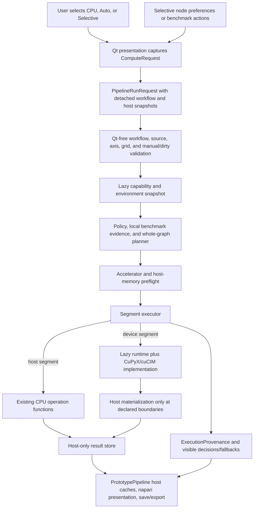

# Production GPU implementation plan

Date: 2026-07-15
Product-direction revision: 2026-07-27
Status: implementation-ready architecture and delivery plan; no production GPU
operation is enabled by this document.
Cross-platform review: 2026-07-15
cuCIM native-Windows evidence update: 2026-07-16
cuCIM Windows port-plan update: 2026-07-16

## Purpose and fixed constraints

This plan converts the GPU spike into reviewable production work without
changing current CPU results by accident. It is grounded in the current
`PrototypePipeline`, detached `PipelineRunRequest`, host-only interactive cache,
batch manifest, workflow v3, and generated-Python contracts.

The following constraints and approved product directions are non-negotiable:

- VIPP's base installation and CPU execution are supported on Windows, macOS,
  and Linux. NVIDIA GPU execution is supported only on native Windows and
  supported Linux distributions. macOS is CPU-only for the NVIDIA-only phase.
- The main toolbar exposes three execution modes: `CPU`, `Auto (best
  available)`, and `Selective`. New interactive sessions default to `Auto`.
  `Selective` exposes an authored per-node preference (`Auto`, `CPU`, `Best
  GPU`, an implementation library such as `CuPyX`/`cuCIM`, or an exact validated
  implementation) and the
  node/pipeline benchmark actions described below. Older workflows and callers
  remain CPU until they explicitly adopt the new execution contract.
- CuPy owns the first CUDA runtime/array substrate. CuPyX and cuCIM are
  implementation libraries that may share that substrate only when zero-copy
  array, stream, device, allocator, and lifetime interoperability is proved.
  cuCIM is admitted operation by operation, initially for high-value skimage
  functions. `cucim.clara` is temporarily outside the first compute milestone,
  but a time-boxed feature-complete Windows/Clara investigation is a named
  near-term deliverable rather than an indefinite omission. PyTorch remains out
  of the initial CUDA operation family; Metal/MPS and MLX are later Apple-
  accelerator research candidates behind the same provider contracts.
- The base installation, plugin discovery, workflow loading, generated Python,
  and CPU execution must work without importing an optional GPU package.
- `core/` remains free of Qt and napari imports. Qt presents decisions; it does
  not make implementation, fallback, memory, or scientific-parity decisions.
- Existing CPU functions in `core/operations.py` remain the scientific
  reference. A GPU path must not change an algorithm, default, boundary mode,
  dtype conversion, initialization, PSF rule, clipping rule, or axis meaning.
- A device array may exist only inside the runtime execution scope. It must not
  appear in `PrototypePipeline.outputs`, `node_outputs`, a `SourcePayload`, a
  napari layer, an exported result, or a batch writer.
- RTX 4050 measurements are evidence for ordering and feasibility, not a
  universal `Auto` policy. Unknown workload-policy regions resolve to CPU.
- GPU work is introduced behind contracts and promotion gates. The first
  headless vertical slice covers Subtract Background/Rolling-Ball Background,
  median, and 2D/3D Gaussian. Ordinary RL, RL-TV, Otsu, Canny, connected
  components, region measurements, and other reasonable nodes follow quickly
  in evidence-driven families.
- Capability declarations are dtype-explicit and designed for bool, common
  microscopy integers, float32, float64, and non-finite policies from the
  beginning. A provider may still expose only the dtype/parameter regions that
  have passed parity and memory gates; unsupported regions use a visible CPU
  decision or fallback rather than an implicit conversion.
- Benchmarking is transactional and scientific: it never runs writers or other
  side effects, never changes live caches until the user accepts a choice, and
  excludes an implementation immediately if the candidate output fails its
  parity policy.
- Existing unrelated working-tree changes, especially the current graph,
  parameter-visibility, toolbar, and axis-semantics work, must be preserved.

Delivery remains split into small reviewable passes. Phase 1 groups the
headless contracts, execution/benchmark substrate, reproducible developer
environments, and the first three operation families. Later phases add the
interactive controls, persistence/batch/export surfaces, deconvolution and
segmentation waves, broader node coverage, and release-grade platform gates.

### Cross-platform support contract

"Works on Windows, macOS, and Linux" applies to the VIPP application, saved
workflows, generated Python, and CPU results. It cannot mean NVIDIA GPU
execution on all three operating systems. NVIDIA's
[CUDA 10.2 release notes](https://docs.nvidia.com/cuda/archive/10.2/pdf/CUDA_Toolkit_Release_Notes.pdf)
state that 10.2 was the last toolkit release to support macOS, while this plan
uses current CuPy 14 with CUDA 12 or 13. Compiling CuPy, cuCIM, PyTorch CUDA
code, or a custom CUDA extension cannot restore a CUDA driver/runtime that
NVIDIA no longer supplies for macOS. If NVIDIA GPU execution on macOS is a
release requirement, this plan is a no-go rather than an implementation risk.

The supported product matrix is:

| Surface | Windows | Linux | macOS |
| --- | --- | --- | --- |
| Base VIPP install, import, CPU execution, workflows, batch, and generated Python | Required and tested | Required and tested | Required and tested |
| NVIDIA GPU execution | Native CuPy/CUDA path on validated x86-64 environments | CuPy/CUDA path on validated NVIDIA-supported glibc distributions and architectures | Not available; `Auto` uses CPU, Selective visible fallback uses CPU with a warning, and strict CUDA selection fails preflight |
| GPU package installation | Platform-marked optional extra | Platform-marked optional extra | CUDA packages are not resolved or installed |
| Saved implementation preferences | Open portably; resolve against the current environment and fallback policy | Open portably; resolve against the current environment and fallback policy | Open portably; CUDA preferences are unavailable and resolve/fail according to the recorded policy |
| Apple GPU research | Not applicable | Not applicable | M1 Max validation host; evaluate a Metal/MPS or MLX runtime after the CUDA substrate is stable, without promising parity or coverage before evidence exists |

This plan does not claim support for every Linux distribution. The release
matrix must name the tested glibc distributions and architectures. A platform
without a compatible wheel is supported for GPU use only after a reproducible
source build, real-device probe, scientific parity suite, and packaging smoke
test pass on that exact platform. Alpine/musl and other unvalidated targets are
CPU-only even if a local experimental build happens to succeed.

Dependency admission follows these rules:

1. Every base dependency must install and pass the CPU/package test matrix on
   Windows, macOS, and Linux for every supported Python version.
2. A CUDA dependency may be a platform-specific optional extra only when the
   base application neither imports nor requires it. The dependency must have a
   maintained wheel or a documented, CI-proven source build for each advertised
   Windows/Linux target.
3. A source-build claim is invalid when the underlying vendor runtime does not
   support the operating system. This explicitly rules out CUDA builds on
   current macOS.
4. A provider with a narrower binary-package matrix than CuPy may remain an
   evaluation candidate when upstream documents a source build. It becomes a
   production option only after reproducible builds, package artifacts, real-
   device probes, scientific parity, and operation-level value are shown
   on every Windows/Linux target where VIPP would advertise that provider.

Current provider audit:

| Library/runtime | Windows | Linux | macOS | Plan decision |
| --- | --- | --- | --- | --- |
| NumPy, SciPy, scikit-image | Existing CPU stack | Existing CPU stack | Existing CPU stack | Keep as the cross-platform scientific reference |
| CuPy/CuPyX 14 + CUDA 12/13 components | Official wheels; source build possible with a supported CUDA toolchain | Official x86-64/aarch64 wheels; source build possible on validated CUDA/glibc targets | No current CUDA runtime or CuPy wheel | Allow only as a lazy, platform-marked Windows/Linux optional provider |
| cuCIM/RAPIDS | No official wheel; pinned `v26.06.00` Python/skimage source wheel reproduced on one native-Windows RTX 5090 host with small downstream patches; native Clara I/O is not in that wheel and requires the separate Windows port | Official wheels and Ubuntu-tested source instructions; named target validation still required | No CUDA runtime | Continue as a narrow implementation-library candidate while the [Windows port plan](cucim-windows-port-plan.md) evaluates maintainable full packaging and Clara support; the current result advances but does not complete Pass 9 |
| PyTorch | Package available; CUDA builds available | Package available; CUDA builds available | Package available with CPU/Metal, not NVIDIA CUDA | Do not add it to the initial CUDA substrate: it is a second large runtime with unproved VIPP operation coverage. Retain MPS as one candidate for the separate Apple feasibility study |
| Apple Metal/MPS or MLX | Not applicable | Not applicable | Native Apple-silicon acceleration with unified memory is technically possible | Investigate after Phase 1 as a separate runtime provider; admit only operation families that preserve VIPP semantics and materially outperform the M1 Max CPU path |

Platform claims must be rechecked before changing dependency ranges or cutting
a GPU release. The primary sources are the
[CuPy installation matrix](https://docs.cupy.dev/en/stable/install.html),
[RAPIDS system requirements](https://docs.rapids.ai/install/),
[cuCIM source-build guide](https://github.com/rapidsai/cucim/blob/main/CONTRIBUTING.md#setting-up-your-build-environment),
[PyTorch local installation matrix](https://docs.pytorch.org/get-started/locally/),
the [PyTorch macOS Metal backend](https://docs.pytorch.org/docs/stable/notes/mps),
and [MLX unified-memory model](https://ml-explore.github.io/mlx/build/html/usage/unified_memory.html).

### Native-Windows cuCIM evidence snapshot

The 2026-07-15/16 follow-up completed the first native-Windows cuCIM sub-gate.
The full procedure, package audit, output schemas, timing ranges, and artifacts
are in the
[cuCIM Windows source evaluation](cucim-windows-source-evaluation.md).

No credible third-party Windows binary was found. The official PyPI 26.6.0
files are manylinux x86-64/aarch64 wheels, the RAPIDS conda and nightly channels
publish Linux packages, GitHub releases contain no Windows assets, and upstream
Windows compatibility issue 454 remains open. The audit also found no Windows-
named branch among the 83 current forks; that is supporting evidence, not a
guarantee that no private or obscure build exists.

The pinned source result was:

| Build item | Evidence |
| --- | --- |
| Source | cuCIM `v26.06.00`, commit `3c15781c207eab93a317dd9803a6e726fe01f7c4` |
| Artifact | `cucim_cu13-26.6.0-cp312-cp312-win_amd64.whl`, 8,654,879 bytes |
| Host | Windows 10, Python 3.12.9, RTX 5090 compute capability 12.0, CuPy 14.1.1, CUDA 13.3 compiler / 13.2 runtime |
| Available surface | `cucim.skimage` and `cucim.core` |
| Unavailable surface in this artifact | Native `cucim.clara/libcucim` whole-slide image I/O; feasibility and delivery are owned by the [Windows port plan](cucim-windows-port-plan.md) |
| Clean reproduction | Fresh clone/build/install plus Gaussian, rolling-ball, and labeling real-kernel probe passed |
| Selected upstream tests | Complete median file: 707 passed, 4 skipped; other selected operation tests: 172 passed, 8 skipped, 6 deselected |

The successful build used an NVCC 13.3 compiler with a 13.2 runtime. Keep that
as experimental evidence; before advertising the track, reproduce it with a
toolkit minor documented as supported by the selected CuPy release (currently
13.2 for the pinned CuPy 14.1.1 evidence) or obtain reviewed newer-version
support evidence.

The clean build required three downstream adaptations: put Git for Windows'
`which.exe` on `PATH` for `rapids-build-backend`; replace the materialized
relative `VERSION` symlink and include it in the wheel; and replace one
deprecated NumPy shape assignment in vendored padding code with `reshape` for
strict NumPy 2.5 compatibility. These are packaging/build-compatibility changes,
not image-processing formula changes. The reproducible builder is
[`scripts/build_cucim_windows.ps1`](../scripts/build_cucim_windows.ps1).

The synchronized RTX 5090 standard benchmark produced primitive-level
feasibility evidence. Times include one input and output transfer. A speedup
above 1 means cuCIM was faster than the named primitive baseline; none of these
rows is production-node admission.

| Primitive workload | Comparison baseline | cuCIM end-to-end speedup | Result |
| --- | --- | ---: | --- |
| Rolling ball 2D / 3D | scikit-image CPU primitive | **265.46x / 528.66x** | Fixture matched; advance to complete VIPP-adapter validation |
| Canny 2D | scikit-image CPU primitive | **17.03x** | Fixture matched; advance to complete VIPP-adapter validation |
| Region-properties table | scikit-image CPU primitive | **10.49x** | Fixture values matched; full VIPP schema/overflow adapter required |
| Connected components 2D / 3D | scikit-image CPU primitive | **2.87x / 2.84x** | Fixture values and `int32` output matched; advance to complete adapter validation |
| Otsu threshold 2D | scikit-image CPU primitive | **2.38x** | Fixture `float32` scalar matched; advance to VIPP histogram/mask validation |
| uint16 31x31 histogram median | CuPyX median | 1.42x | Exact primitive result; map the production-adapter crossover before Auto admission |
| Gaussian 2D / 3D | CuPyX Gaussian | 1.03x / 0.95x | Exact; keep CuPy |
| float32 5x5 median | CuPyX median | 1.08x | Exact; keep CuPy |
| Sobel / binary closing | normalized CuPyX composition | 0.98x / 1.01x | Equivalent; keep CuPy |
| Richardson-Lucy 2D / 3D | explicit CuPyX loop | 0.22x / 0.22x | Allclose but about 4.5x slower; keep explicit CuPy |

All 15 primitive benchmark fixtures passed the recorded numerical comparison.
The region-properties values matched but cuCIM returned narrower area, label,
and bounding-box dtypes than the scikit-image baseline table. The fast histogram median also
requires a dense rectangular footprint. Both constraints must remain explicit
support-policy checks rather than silent behavior changes.

This evidence changes cuCIM from “Windows feasibility unknown” to “promising
narrow Windows implementation-library candidate.” It does not admit a
production dependency or a VIPP node.
Pass 9 still requires supported-Linux builds, another Windows GPU tier, CUDA
policy, clean-install/JIT and memory measurements, cancellation behavior,
schema adapters, and optional-extra/CI maintenance. The upstream-versus-
downstream strategy and a bounded attempt to port native Clara are now specified
in the [cuCIM Windows port plan](cucim-windows-port-plan.md). macOS uses the CPU
path initially because it has no NVIDIA CUDA runtime while a separate Apple
Metal/MPS/MLX provider is investigated.

## 1. Target architecture

### 1.1 Components and ownership

The target keeps graph definition, scientific CPU functions, runtime/
implementation code,
execution policy, and UI presentation separate.

| Component | Proposed owner | Responsibility |
| --- | --- | --- |
| Compute request and result contracts | `core/compute.py` | Immutable `CPU`/`Auto`/`Selective` intent, per-node preferences, strict/visible fallback policy, selected device, precision policy, typed reason codes, and JSON-safe reports. |
| Operation implementation declarations | `core/compute_specs.py` | Immutable declarations associated with operation IDs. Each CPU/CuPy/cuCIM/future implementation declares its runtime, exact dtype/parameter region, parity, memory, progress, and benchmark contracts without importing optional packages. |
| Runtime and implementation registry | `core/compute_registry.py` | Lazy runtime descriptors, entry-point discovery, instance lifetime and capability probing, plus implementation lookup by stable ID. It distinguishes an array runtime (`numpy`, `cuda-cupy`, future `metal-*`) from an implementation library (`cpu`, `cupyx`, `cucim`). |
| Workload policy | `core/compute_policy.py` plus packaged JSON under `src/napari_vipp/compute_policies/` | Deterministic support and benefit decisions from workload, topology, environment, reviewed thresholds, and non-stale local benchmark records. CPU is conservative outside a validated region. |
| Graph planning | `core/device_execution.py` | Scheduled-node closure, implementation assignment, maximal same-runtime device segments, runtime-transition costs, boundary transfers, liveness, memory preflight, fallback planning, and execution reports. |
| CPU/GPU call preparation | a small extraction from `core/pipeline.py` into `core/node_execution.py` | Build validated operation inputs/kwargs and apply existing metadata transforms once, independent of the chosen implementation. The CPU path uses the same extraction. |
| Built-in CUDA/CuPy runtime | `core/gpu/cupy_runtime.py` | Lazy CuPy import, real device probe, device/context and private-pool scope, transfer/synchronization primitives, OOM classification, cleanup, environment identity, and verified sharing rules for cuCIM implementations. |
| GPU implementations | one family-owned module per implementation library under `core/gpu/` | Pure CuPyX or cuCIM operations accepting and returning runtime-owned device arrays. They mirror current CPU semantics and expose no UI behavior. |
| Benchmark and optimizer service | new `core/compute_benchmark.py` | Transactional node benchmarking, local fingerprinted result storage, parity-before-timing checks, cold/warm timing, and whole-pipeline assignment that includes transfers, residency, runtime switches, and memory. |
| Capability/policy diagnostics | `core/compute_diagnostics.py` | JSON-safe support report, installation diagnosis, policy explanation, memory snapshot, and recent execution/fallback information. |
| Single-run service | `core/execution.py` | Introduced as the mandatory headless/device execution entry in Pass 1, then made the only interactive application entry in Pass 4. It validates a detached workflow, plans, executes, and returns host outputs plus provenance. |
| Interactive presentation | a reusable controller under `ui/compute.py`, composed by `_widget.py` | Main-toolbar mode dropdown, Selective node preferences, node/pipeline benchmark actions, compact CPU/CuPy/cuCIM badges, RAM/accelerator-memory status, fallback display, and copyable install guidance. No provider import or policy logic. |
| Batch integration | `core/batch.py`, `core/batch_setup.py`, and existing `ui/batch*` adapters | Persist the run request, reuse the core execution service per item, checkpoint decisions in manifests, cancel safely, and clean runtime state at item/run boundaries. |
| Workflow and generated Python | `core/workflow.py`, `core/export.py` | Persist portable global mode and per-node preferences, not machine timings or resolved hardware; migrate v3 safely, expose explicit runtime overrides, and return/write provenance. |

`core/pipeline.py` is already large and has active unrelated changes. Accelerator
callables must not be added there. The preferred association is an immutable
side table in `core/compute_specs.py`, keyed by operation ID and validated
against `NODE_LIBRARY_BY_ID`. `OperationSpec` remains the source of graph and
scientific-call metadata; `compute_specs_for(operation_id)` is the source of
compute implementations. This avoids importing optional implementation code from the node
library and lets operation-family agents edit separate declaration blocks.

### 1.2 Core value objects

The public contracts should settle on these concepts before an operation is
promoted:

- `ComputeRequest`: global mode (`cpu`, `auto`, or `selective`), immutable
  node-ID-to-preference mapping, visible/strict fallback policy, selected
  runtime/device, precision-policy ID, workload-policy ID, accelerator-memory
  budget, and safety reserve. It has no Qt types.
- `NodeComputePreference`: `auto`, `cpu`, `best_gpu`, an implementation-library
  preference such as `cupyx`/`cucim`, or an advanced stable implementation ID.
  Preferences are retained while another global mode is active but ignored
  outside Selective.
- `ComputeEnvironment`: detected runtimes and implementation libraries,
  versions, driver/runtime, Python implementation/minor/ABI tag, device
  identity/class, discrete/unified memory topology, OS execution mode, and probe
  status.
- `OperationComputeSpec`: one immutable declared implementation and its runtime,
  public/input/internal dtypes, conversion policy, support/parity/memory/
  progress constraints, and stable implementation/library IDs.
- `ArrayFacts`: revision-keyed per-port facts needed by support/performance
  policy, including finite counts, min/max/range, label maximum/count,
  foreground density where relevant, strides/contiguity, and guarantees
  propagated by upstream contracts. Facts are complete for any scientific
  exclusion; sampled facts may inform performance only and are labelled.
- `WorkloadDescriptor`: operation, resolved dimensions, shapes, dtypes,
  parameters, `ArrayFacts`, topology/transfer facts, device/host tiers, and
  available memory, including the cost of any required fact scan.
- `BenchmarkRecord`: environment/workload fingerprints, candidates, cold and
  warm synchronized samples, parity result, memory observations, expiry rules,
  and artifact/policy versions. Raw timings are local environment data.
- `NodeExecutionDecision`: global mode, node preference, resolved runtime and
  implementation, policy/benchmark record, reason code/text, estimate, and
  whether a fallback occurred.
- `ExecutionSegment`: a host node or a maximal connected same-runtime device
  sub-DAG with
  entry/exit ports, retained ports, liveness counts, and a memory estimate.
- `ExecutionPlan`: immutable ordered segments plus environment and decisions.
- `ExecutionProvenance`: run-level environment and per-node records, cache-key
  digests, fallback events, warnings, and cleanup outcome.

`PipelineRunRequest` gains a `compute_request` value. `PipelineRunResult` gains
an `execution_report`; errors become typed internally but retain the current
user-facing `error` string for compatibility. No request or result contains a
device array.

### 1.3 Control and data flow


```mermaid
flowchart TD
    U["User selects CPU, Auto, or Selective"] --> UI["Qt presentation captures ComputeRequest"]
    S["Selective node preferences or benchmark actions"] --> UI
    UI --> R["PipelineRunRequest with detached workflow and host snapshots"]
    R --> V["Qt-free workflow, source, axis, grid, and manual/dirty validation"]
    V --> C["Lazy capability and environment snapshot"]
    C --> P["Policy, local benchmark evidence, and whole-graph planner"]
    P --> M["Accelerator and host-memory preflight"]
    M --> E["Segment executor"]
    E -->|"host segment"| CPU["Existing CPU operation functions"]
    E -->|"device segment"| GPU["Lazy runtime plus CuPyX/cuCIM implementation"]
    GPU --> B["Host materialization only at declared boundaries"]
    CPU --> H["Host-only result store"]
    B --> H
    H --> O["PrototypePipeline host caches, napari presentation, save/export"]
    E --> PR["ExecutionProvenance and visible decisions/fallbacks"]
    PR --> O
```

Preflight is complete before a scientific or side-effecting node runs. A strict
Selective preference that cannot be honored therefore fails without partial
graph execution. Device segments are execution transactions: device values and
provisional host copies are committed to the public host result store only
after the whole segment succeeds. This makes one-time CPU retry after a GPU OOM
safe and prevents duplicate side effects.

## 2. Backend semantics

### 2.1 User-visible meanings

| Toolbar mode | Exact behavior |
| --- | --- |
| `CPU` | Do not discover, probe, or import an accelerator runtime for execution. Every scientific operation uses the current CPU implementation. This is the compatibility/reproduction mode and the migration result for workflow v3. |
| `Auto (best available)` | Default for new interactive sessions. Lazily discover usable implementations and choose CPU, CuPyX, cuCIM, or a future validated provider per node while optimizing the complete scheduled graph. The choice includes transfer/runtime-switch cost, device residency, memory, cold-start state, and confidence. CPU is a normal Auto decision, not fallback. |
| `Selective` | Show a compute preference for every implemented node: `Auto`, `CPU`, `Best GPU`, an implementation-library choice such as `CuPyX` or `cuCIM`, and an advanced exact implementation choice when more than one exists. Unimplemented nodes remain visibly CPU. Preferences are planned together, so the UI may explain that a locally faster node would make the complete pipeline slower by forcing a transfer/runtime boundary. |

New sessions default to Auto even when no accelerator package is installed. In
that environment Auto runs normally on CPU, the toolbar status says that GPU
acceleration is not installed, and diagnostics offer one copyable command for
the compatible optional extra. Absence of an optional package is not an error.

`Auto` CPU selection and runtime fallback have different machine-readable
states. Use `decision_kind=policy_cpu` for the former and
`decision_kind=fallback_cpu` plus `fallback_reason` for the latter. The spike's
current `BackendSelection.fell_back=True` for an unsupported Auto operation and
its eager capability detection before an explicit CPU decision are corrected
during Pass 0.

### 2.2 Selective choices and fallback

`ComputeRequest.node_preferences` is a validated immutable mapping keyed by
stable node ID. It is active only in Selective mode but retained when the user
temporarily changes global mode. A node preference may be:

- `auto`: use the whole-graph optimizer;
- `cpu`: require the scientific reference implementation;
- `best_gpu`: require the fastest validated GPU candidate without forcing the
  user to know whether CuPyX or cuCIM is preferable;
- `library:<id>`: choose the best validated implementation from that library,
  for example `cupyx` or `cucim`; or
- `implementation:<stable-id>`: advanced exact pin used for reproduction or an
  accepted benchmark result.

Interactive Selective mode defaults to **visible fallback** for usability. If a
forced `best_gpu`, library, or exact-implementation choice is unavailable,
unsupported for the actual dtype/parameters, or encounters a classified OOM,
the planner may choose CPU once and
must show a persistent node badge and run-level warning. An advanced **Strict
selected implementations** switch changes the same request to fail complete
preflight instead. Batch, headless, and generated callers can select either
policy explicitly. Invalid parameters, axis/grid errors, parity failures,
unclassified runtime errors, and writer errors never become fallbacks.
Selective `auto` choosing CPU is a normal policy result, not fallback.

### 2.3 Mixed graphs and preflight

- `CPU`: never mixed.
- `Auto`: mixed graphs are expected and partitioned at operation, support,
  benefit, runtime, or memory boundaries.
- `Selective`: authored node preferences are constraints on a whole-graph plan,
  not independent wrappers. Compatible CuPyX and cuCIM implementations may stay
  in one CUDA/CuPy segment only after their zero-copy interoperability contract
  passes; otherwise a runtime/library transition is costed as a boundary.
- Skipped manual nodes are not scheduled. A cached skipped-manual output is a
  host boundary. A manual node explicitly selected for calculation is included
  in preflight and benchmarking.
- A side-effecting `Save Image` or batch publication node is never part of a
  device segment and cannot run until all required compute preflight succeeds.

Fallback is permitted only for enumerated cases: implementation unavailable
before launch, unsupported declared region, memory preflight, and runtime-
classified OOM. A fallback never silently changes the stored preference and one
item's fallback never changes later batch items.

### 2.4 Persistence and portability

Compute intent belongs in workflow JSON once the headless execution, UI, cache,
and provenance contracts are stable. Pass 4 introduces the minimal workflow v4
compute block together with the public controls so accepted benchmark choices
survive reopening; Pass 8 extends the same frozen schema into generated Python,
CLI, batch/hash integration, and export sidecars. Workflow v4 adds:

```json
"execution": {
  "compute": {
    "mode": "auto",
    "fallback_policy": "visible",
    "node_preferences": {
      "median_filter_1": "implementation:vipp.cupy.median_filter"
    },
    "precision_policy": "scientific-default-v1",
    "workload_policy": "vipp-best-available-v1"
  }
}
```

Device index, exact device identity, memory cap, driver, and resolved decisions
are runtime environment, not authored workflow intent, and are not stored here.
Benchmark samples, predicted times, and a machine-derived winner are also not
portable workflow data. When a user accepts a benchmark result, only the stable
node preference is saved; the local benchmark record remains in a fingerprinted
machine cache and becomes stale when inputs/parameters, VIPP, implementation,
runtime, Python implementation/minor/ABI, driver, or device identity changes,
with the separate node/pipeline
scopes defined in section 5.3.
Workflow v3 is safely migrated to the v4 CPU default because v3 could only run
the current CPU path; v1/v2 remain rejected for the existing scientific-schema
reasons.

Opening a workflow with CUDA preferences on CPU-only or Apple-only hardware
preserves the authored preferences and shows their unavailable status. Auto runs
on CPU. Selective visible-fallback mode runs on CPU with explicit warnings;
strict mode fails preflight. A session override does not mutate the document;
"Use CPU and save" or accepting new benchmark choices does. Generated Python
uses embedded intent unless the caller supplies an explicit override. Batch
config records the effective request so replay cannot inherit a different UI
preference.

Workflow loading validates node IDs and preference syntax without importing an
optional library. Unknown or currently unavailable stable implementation IDs
are preserved so a portable workflow does not lose intent; preflight, not
deserialization, explains availability. An exact implementation pin is stronger
intent, not a guarantee of bit-for-bit reproduction without the recorded
version/environment/provenance.

Deleting a node removes its authored preference. Graph duplicate/copy-paste
remaps and copies the authored preference to each new node ID, but never local
benchmark evidence, planned/used decisions, caches, or hardware state. `Paste
parameters` remains scientific-parameter-only and does not replace the target's
compute preference; a future explicitly named `Paste all node settings` action
would be required to do that.

The canonical scientific workflow hash includes authored compute intent after
v4. It never includes a resolved implementation, device, or policy result. Those belong
to execution provenance.

### 2.5 Consequences across execution surfaces

| Surface | Consequence of the compute contract |
| --- | --- |
| Interactive run | The session request is captured in every synchronous or background `PipelineRunRequest`; stale-run rejection compares graph/source plus compute mode, fallback, node preferences, and policy fingerprints, and discards provenance with a stale result. |
| Cache | Every output-port record carries scientific result identity plus separate request/decision provenance. Only the actual implementation and result-affecting semantics key values; global mode, preference, fallback, and benchmark evidence explain the decision but do not invalidate an otherwise identical result. An exact pin cannot consume another implementation's entry. |
| Batch | `BatchConfig` records the effective override; each item is replanned against current free memory but the request is unchanged. A fallback on one item does not silently rewrite later items to CPU. |
| Generated Python | Embedded workflow intent is the default. Function/CLI override is explicit, returned in provenance, and does not mutate `_WORKFLOW_JSON`. |
| Reproducibility | `CPU` is portable and stable. Auto is intentionally hardware-dependent. Selective exact pins express stronger intent but may be unavailable elsewhere. Policy, environment, actual decisions, fallback records, and implementation versions are required to reproduce a result. |

## 3. Operation capability model

### 3.1 Immutable declaration

The declaration should be data, not code. A representative contract is:

```python
@dataclass(frozen=True, slots=True)
class OperationComputeSpec:
    operation_id: str
    runtime_id: str                         # "cpu-numpy" or "cuda-cupy"
    implementation_library_id: str          # "cpu", "cupyx", or "cucim"
    implementation_id: str                  # "vipp.cupy.median_filter"
    implementation_version: str             # "1"
    supported_spatial_dims: frozenset[int]  # {2} or {2, 3}
    input_contract_ids: tuple[tuple[str, str], ...]
    output_contract_ids: tuple[tuple[str, str], ...]
    array_domain: str                        # host-numpy/cuda-cupy/...
    admission_tier: str                      # developer_hidden/public_selective/public_auto_candidate
    validated_environment_policy_id: str     # OS/Python/runtime/library ranges
    parameter_policy_id: str                # exact range/mode validator
    parity_policy_id: str
    progress_granularity: str               # segment/kernel/iteration
    cancellation_granularity: str           # before-after-kernel/iteration
    supports_device_residency: bool
    temporary_memory_model_id: str
    workload_policy_id: str
    boundary_policy_id: str
    precision_policy_ids: tuple[str, ...]
    limitations: tuple[str, ...] = ()
```

Each referenced `ComputePortContract` declares the port name and value kind
(`array`, `scalar`, `table`, or another typed state), accepted public dtypes/
schema, value-domain facts, internal and accumulation dtype, output dtype/schema
rule, conversion/rounding/overflow policy, and non-finite policy. This per-port
model is mandatory for multi-input, dtype-changing, and table-producing nodes;
a coarse operation-wide dtype tuple is prohibited.

Admission is an explicit lifecycle. `developer_hidden` is available only to an
explicit headless developer request and is excluded from ordinary UI, workflow,
Auto, and Selective discovery. `public_selective` has passed scientific and
operational gates. `public_auto_candidate` may additionally be considered by
Auto, but only inside its validated environment/workload policy. An internal
`allow_experimental=True` test/developer flag is never serialized into workflow
JSON or exposed as a normal user setting.

Parameter support is resolved by a named pure validator in the policy layer,
not an arbitrary callable stored in `pipeline.py`. The validator returns a
typed support result with a stable reason code. Examples include odd median
sizes within the validated range, exact Gaussian sigma handling, RL spatial
rank, PSF rank, iteration range, normalization/clipping modes, and RL-TV
regularization parameters.

Declarations are narrower than library API availability but the contract is
not float32-specific:

- Subtract Background/Rolling-Ball Background: preserve current smoothing,
  light-background inversion, 2D/3D block/channel semantics, clipping, and
  public dtype restoration. Target `uint8`, `uint16`, `float32`, and `float64`
  independently; bool and non-finite cases remain CPU until proved.
- Median: current slice-wise YX semantics, odd validated kernel sizes,
  explicit/scalar channel behavior, reflect boundary, and separate declarations
  for each validated integer/float dtype region.
- Gaussian: separate 2D slice-wise and 3D declarations, exact sigma tuples,
  reflect boundary, zero-sigma behavior, excluded channel axes, and explicit
  native/public dtype behavior.
- RL/RL-TV: current float32 working/output semantics, 2D and 3D spatial blocks,
  matching PSF rank/grid, and all current public parameter modes only after each
  is tested.

Bool, additional integer/float regions, non-finite behavior, new boundary modes,
fast math, and dynamic/multi-output device implementations stay unsupported
until separately promoted. Architecture, registry, benchmark, memory, cache,
and provenance tests must nevertheless exercise declarations for all dtype
classes so later coverage does not require a redesign. An implementation may
not advertise a dtype or parameter merely because an optional library accepts
it.

### 3.2 Lazy implementation registry

`core/compute_registry.py` contains separate runtime and implementation-library
descriptors: stable ID, display name, import string, supported OS family,
array/device domain, interoperability claims, and optional entry-point origin.
It does not import an implementation module at registry construction. Built-in
implementation mappings use import strings:

```text
vipp.cupy.median_filter -> napari_vipp.core.gpu.cupy_median:median_filter
vipp.cucim.subtract_background -> napari_vipp.core.gpu.cucim_background:subtract_background
```

The registry loads a runtime/library only after request resolution says it may
be used. A CPU request never calls accelerator discovery or
`importlib.import_module` for CuPy/cuCIM. Third-party discovery uses separate
entry-point groups such as `napari_vipp.compute_runtimes` and
`napari_vipp.compute_implementations`; discovery failures become diagnostic records,
not plugin-import failures. Runtime, library, and implementation IDs are stable
cache/provenance identifiers; display names are not. cuCIM may participate in a
CUDA/CuPy-resident segment without a transfer only after tests prove it accepts
the runtime-owned array on the same device/stream and obeys allocator/lifetime
rules; a library name alone never authorizes zero-copy sharing.

Registry startup validates these invariants without loading optional runtimes or
implementations:

1. every declaration references an existing operation ID;
2. `(runtime_id, implementation_id, implementation_version)` is unique;
3. every named parity, parameter, memory, boundary, precision, and workload
   policy exists;
4. no production declaration exists without its promotion tests and policy
   record;
5. no accelerator module is imported while `napari_vipp` or the npe2 manifest is
   imported.

### 3.3 Capability detection lifecycle

Detection has two phases. Descriptor discovery lists built-in and entry-point
runtimes/libraries without importing them. A probe runs only when the UI asks
for accelerator status or an Auto/Selective request needs it. The CuPy probe records every visible
device, then for the selected device creates a context, checks driver/runtime
identity and free/total memory, imports each required CuPyX submodule, executes
and synchronizes a real one-element kernel, and tears down the probe allocation.
Import success alone is never availability.

Reports distinguish runtime/library availability from operation promotion. A usable
CuPy installation can report zero supported VIPP operations. Supported IDs are
derived from validated `OperationComputeSpec` records, not supplied by the UI.
Probe results are cached by process/environment fingerprint, including Python
implementation/minor/ABI, and can be refreshed
after installation or a provider failure. A CPU request neither discovers entry
points nor probes/imports CuPy during execution.

Implementation-library health is probed separately and lazily. The developer
cuCIM probe verifies the pinned build digest, required submodules, one real
operation kernel, same-device/stream behavior, allocator/lifetime compatibility,
and zero-copy exchange with runtime-owned CuPy arrays. A healthy CuPy runtime
does not imply healthy cuCIM, and a failed library probe cannot poison CuPyX
implementations.

## 4. Device-resident graph execution

### 4.1 Planning model

Planning starts after source snapshots, graph restoration, dirty-closure, and
manual-node selection are known. It plans only nodes that this run will execute.
Each output port is the unit of storage and liveness.

A GPU segment is the maximal connected sub-DAG of scheduled nodes that:

- resolved to the same runtime, array/device domain, and device;
- have compatible validated implementations and precision policies;
- can exchange resident arrays;
- fit as a unit under the memory policy; and
- contain no source, writer, manual-skip, or other declared host/side-effect
  boundary. Host table inputs are boundaries. A validated device-side
  measurement may terminate a segment by converting its private device result
  through a typed host-table finalizer; public `TableState` never resides on the
  accelerator.

"Maximal" is topological, not merely a consecutive list. A segment can contain
a branch and later join. A CPU node or different runtime/device splits GPU
regions. Different implementation libraries do not split a region when their
declared and tested array-domain interoperability allows zero-copy sharing;
otherwise the planner inserts and costs the required boundary.

### 4.2 Internal array ownership

`DeviceValue` is an internal, non-public record owned by the segment executor:

```text
(runtime instance, device id, opaque runtime array, shape, dtype,
 output-port key, remaining device consumers)
```

The opaque array is never placed in `PrototypePipeline`. The segment's private
`ExecutionValueStore` may hold:

- a host value;
- a device value;
- both temporarily when a branch or retained output needs host materialization;
- the existing `ImageState`/`TableState`; and
- the cache/provenance record.

Public commit stores only the host value and state. All accepted interactive
cache entries remain host-owned in passes 0-10. Device arrays are not retained
across separate interactive runs because the current detached worker may not
reuse a stable execution thread/context and stale-run rejection must remain
simple. Dirty partial recalculation can reuse a clean cached host output; that
output is transferred once if it enters a new GPU segment.

### 4.3 Boundary rules and edge cases

- **Source:** one H2D copy per distinct source/output entering a segment. Aliased
  fan-out reuses the same device value.
- **Consecutive supported operations:** keep each output resident until its last
  device consumer completes.
- **CPU boundary:** materialize the required port once, synchronize it, and keep
  the device copy only if another device consumer remains.
- **Multi-input:** a GPU node can join resident inputs; host/cached inputs are
  copied at segment entry. All inputs must pass operation support and grid
  validation before any transfer. The image and PSF are distinct live inputs.
- **Branch/fan-out:** consumer counts cover every source port. A GPU-to-CPU and
  GPU-to-GPU fork creates one host copy and one continuing resident reference.
- **Multiple outputs:** plan, count, transfer, retain, and release each output
  port independently. Initial promoted operations are single-output; generic
  multi-output support is nevertheless tested with a fake runtime.
- **Scalar/table output:** a device implementation may compute these values but
  must terminate or materialize at a typed host finalizer that restores the
  declared scalar/table schema, units, ordering, and overflow policy before
  public commit. Downstream host consumers see only the existing host state.
- **Cached upstream output:** it is a host entry boundary. Its cache record is
  validated before transfer. Device identity from an older run is irrelevant.
- **Skipped manual node:** its valid/stale cached host output is a boundary. A
  manual node selected to calculate can join a GPU segment if promoted.
- **Retained/selected/pinned/preview output:** add its output port to the host
  materialization set. Copy it without breaking downstream residency. napari
  receives the existing detached host copy behavior.
- **Batch output/save:** always host-materialize before the existing staging and
  source-reverification sequence. Publication remains outside GPU scope.
- **Across batch items:** per-item sources, intermediates, and outputs are never
  retained. A fixed immutable source such as a shared PSF may remain resident in
  a batch-scope constant cache only when its exact source revision/cache key,
  runtime/device, dtype/shape, and read-only contract are unchanged, its bytes
  are reserved in every item's memory estimate, and no implementation mutates
  inputs. Release all such constants on cancel, runtime/library error, source refresh,
  or batch end.
- **Cancellation:** stop launching new work, synchronize already submitted work,
  release all private values, and return only after cleanup. Never commit a
  canceled segment.
- **Dirty recalculation:** clean cached host ports remain committed; only the
  planned dirty closure gets new decisions/cache keys. A canceled or failed
  clone never replaces live host caches.

### 4.4 Segment-planning pseudocode

```python
def plan_run(pipeline, run_scope, compute_request, environment, cached_records):
    scheduled = resolve_dirty_and_manual_scope(pipeline, run_scope, cached_records)
    descriptors = infer_workloads_without_executing_nodes(pipeline, scheduled)

    decisions = {}
    for node_id in topological_order(scheduled):
        node = pipeline.nodes[node_id]
        if is_host_infrastructure(node):
            decisions[node_id] = host_boundary("declared_host_boundary")
            continue

        candidates = validate_declared_candidates(
            node, descriptors[node_id], environment, compute_request
        )
        decisions[node_id] = candidate_decision_set(
            compute_request.mode,
            compute_request.preference_for(node_id),
            candidates,
        )

    # Auto and Selective are graph-global: include transfers, residency,
    # branches/joins, host materialization, memory, and authored constraints.
    decisions = solve_graph_assignment(
        pipeline, scheduled, descriptors, decisions, environment
    )

    failures = unhonored_strict_selective_preferences(decisions, compute_request)
    if failures:
        raise ComputePreflightError(all_failures=failures)

    regions = maximal_connected_gpu_subdags(pipeline, scheduled, decisions)
    segments = split_regions_until_memory_estimates_fit(regions, descriptors)
    ordered = topologically_order_host_nodes_and_segments(segments, scheduled)
    return ExecutionPlan(ordered, decisions, environment)
```

`infer_workloads_without_executing_nodes` uses source/cached shapes and pure
shape/dtype propagation. If an output shape cannot be known until execution,
Auto resolves that node to CPU. A Selective GPU requirement reports an
unsupported-dynamic-shape reason unless the declaration provides a safe
upper-bound model.

Support policies may also require complete `ArrayFacts`. Compute them lazily
from revision-keyed source/cached host arrays, or propagate a guarantee from a
validated upstream implementation. Their scan/transfer cost enters Auto and
benchmark estimates. A sampled scan may tune a cost model but never proves a
scientific value-domain restriction. If a required complete fact for an
intermediate cannot be known safely before execution, Auto chooses CPU and a
forced Selective choice reports the typed unsupported reason; it does not launch
speculatively and silently fall back after observing the values.

### 4.5 Execution pseudocode

```python
def execute_plan(plan, pipeline, host_cache, cancel):
    store = ExecutionValueStore.from_host_cache(host_cache)
    provenance = ExecutionProvenance.start(plan)
    try:
        for unit in plan.units:
            cancel.check()
            if unit.is_host:
                prepared = prepare_node_call(pipeline, unit.node_id, store.host_inputs)
                output = call_existing_cpu_function(prepared)
                store.commit_host(finalize_node_result(prepared, output))
                provenance.complete_host(unit)
                continue

            try:
                provisional = execute_gpu_segment_transaction(
                    unit, pipeline, store, cancel, provenance
                )
            except RuntimeOutOfMemory as oom:
                cleanup_and_synchronize_runtime(unit.runtime)
                if not may_retry_once(plan.request, unit, oom, provenance):
                    raise
                provisional = execute_segment_on_cpu_transaction(
                    unit, pipeline, store, cancel
                )
                provenance.record_fallback(unit, "runtime_oom")
            store.commit_host_only(provisional)
    finally:
        store.release_all_device_values()
        synchronize_and_apply_pool_policy(plan)
    return materialize_pipeline_host_result(store), provenance.finish()


def execute_gpu_segment_transaction(segment, pipeline, committed_store, cancel, prov):
    private = SegmentStore()
    runtime = registry.runtime(segment.runtime_id)
    with runtime.execution_scope(segment.device, segment.memory_policy):
        preflight_live_memory(segment, runtime.memory_snapshot())
        for entry_port in segment.host_entries:
            cancel.check()
            private.put_device(entry_port, runtime.to_device(committed_store.host(entry_port)))
            prov.transfer(entry_port, "host_to_device")

        for node_id in segment.topological_nodes:
            cancel.check()
            prepared = prepare_node_call(pipeline, node_id, private.inputs(node_id))
            device_output = registry.call(segment.implementation(node_id), prepared)
            runtime.operation_checkpoint(segment.progress_granularity(node_id), cancel)
            private.put_outputs(node_id, device_output)
            private.release_dead_values()

        for port in segment.host_outputs | segment.retained_outputs:
            cancel.check()
            private.put_provisional_host(port, runtime.to_host(private.device(port)))
            prov.transfer(port, "device_to_host")
        runtime.synchronize()
        cancel.check()
        return private.finalize_host_results_and_states()
```

## 5. Workload selection policy

### 5.1 Policy inputs

Every Auto decision uses a `WorkloadDescriptor` containing at least:

- operation and implementation ID/version;
- resolved 2D/3D spatial mode and complete array rank;
- input/output shape, element count, and dtype;
- strides/contiguity plus complete or explicitly sampled finite fraction,
  min/max/range, foreground density, and label count/maximum where the
  operation's support or cost depends on them;
- kernel size, sigma tuple, PSF shape, and iterations where relevant;
- all parameters that change work or memory;
- number and identity of resident GPU predecessors/successors;
- distinct H2D and D2H boundaries predicted for the candidate segment;
- whether an output must be retained, previewed, pinned, or saved;
- selected device tier and exact available memory snapshot;
- runtime, implementation-library/version, CUDA-major family, OS mode, Python
  implementation/minor/ABI tag, and driver;
- host tier or local host calibration, because CPU speed changes crossover;
- policy record ID/version and whether the descriptor is inside its validated
  interpolation bounds; and
- the measured/predicted cost of required host/device fact scans.

### 5.2 Threshold generation and storage

Extend `scripts/benchmark_gpu.py` into a matrix harness rather than converting
its RTX 4050 values into constants. For each promoted implementation, collect
warm, synchronized CPU time, resident GPU time, H2D/D2H time, end-to-end time,
peak live/pool memory, and parity over a factorial or space-filling matrix of:

- small through large 2D and 3D shapes;
- supported dtypes;
- kernel/PSF sizes and iteration counts;
- isolated node and representative resident chains;
- Windows native, Linux, and WSL2 where supported;
- CUDA 12 and CUDA 13 environments;
- multiple host/device performance tiers, including the minimum supported VRAM.

Use held-out workloads to fit and validate a simple explainable model or
piecewise threshold. Store reviewed records as versioned package data, not in
Python conditionals. A record includes runtime/library/implementation version
ranges, admitted Python implementation/minor/ABI, OS/runtime class, host/device
tier, feature bounds, predicted CPU/GPU/transfer cost coefficients or
breakpoints, required minimum speedup, confidence, and
benchmark artifact digests. Raw results remain in `docs/benchmarks/`; shipped
policy records are the reviewed derivative.

Device tiers should be based on a short, deterministic startup/transfer/compute
microprofile plus compute capability and VRAM class, not model-name matching.
The microprofile contains no user image data and its local result is cached by
runtime/device fingerprint. If the profile is missing, stale, or
outside a shipped policy's validated bounds, Auto chooses CPU. Timing, tier,
policy ID, and decision enter benchmark identity/provenance, not scientific
result identity.

### 5.3 On-demand node and pipeline benchmarking

Selective mode exposes `Benchmark node` only when the selected node has at
least two validated candidates for its resolved inputs and parameters. The
main-toolbar `Optimize pipeline` action is visible only in Selective mode and
only after enough source/cached metadata exists to construct workload
descriptors.

Benchmarking follows these rules:

1. Use the exact current parameters and resolved input shape/dtype/axis/grid
   contract. Benchmarking a representative crop is allowed only as an explicitly
   labelled quick estimate and never silently replaces an exact full-workload
   record.
2. Run the existing CPU implementation once outside timed rounds as the
   scientific reference, then validate each admissible implementation in an
   isolated transaction. A failed candidate is quarantined for that fingerprint
   and cannot be timed/selected. Benchmarking may only evaluate an already
   promoted dtype/parameter support region; passing on one user's input never
   expands a declaration.
3. Record cold-start/JIT time separately. After warmup, randomize paired CPU and
   candidate order for at least seven synchronized rounds; extend adaptively to
   15 or 21 rounds near a decision threshold or under high variance. Report the
   paired median ratio and a versioned 95% paired-bootstrap lower confidence
   bound, plus end-to-end, resident, transfer, fact-scan, and peak-memory
   measures. The bootstrap method/seed and outlier policy are benchmark-policy
   data, not ad hoc UI behavior.
4. Do not execute source readers twice unnecessarily, writers, `Batch Output`,
   publication, or any other side effect. Do not replace live caches/history or
   node preferences until the user accepts the result. Support cancellation, a
   visible/configurable time budget, and
   release every device value on all exits. Before presenting or applying a
   result, recheck the detached graph/source/compute-intent fingerprint and
   discard it if the live state changed.
5. Cache the local record by workflow/node/workload, source revision or safe
   descriptor, parameters, VIPP/implementation/runtime versions, Python
   implementation/minor/ABI tag, driver, device, and memory-topology
   fingerprint. Mark it stale after any relevant change.
6. `Use fastest` writes only a stable node preference. The UI retains the full
   local evidence for explanation but workflow JSON never stores raw timings,
   exact hardware, or an automatically resolved implementation.

Staleness has two scopes. A node record is invalidated by its operation,
parameters, resolved input revision/shape/dtype/axes/content facts, relevant
layout, implementation/dependency/runtime versions, Python implementation/
minor/ABI, driver/device, or memory-topology changes. A pipeline proposal also
invalidates on graph topology,
scheduled/manual scope, retained/selected/pinned/preview host materializations,
memory cap/reserve, global mode/fallback, or authored node constraints. An
accepted implementation preference remains authored when evidence becomes
stale, but loses every `fastest`/`optimal` claim and offers `Rebenchmark`.

Whole-pipeline optimization is not a loop that independently chooses the
fastest implementation for each node. It reuses or collects candidate timings,
then solves a constrained graph assignment that includes H2D/D2H transfers,
same-runtime residency, CuPyX/cuCIM interoperability, branches/joins, required
host materializations, memory/liveness, and side-effect boundaries. It may
therefore choose a slightly slower implementation for one node to make the
complete pipeline faster. The proposed assignment and expected total are shown
before `Apply choices`; an optional final end-to-end validation can confirm the
winner without publishing outputs.

When measured candidates are within the noise floor (initially the greater of
5% or 10 ms for the measured unit), prefer the current valid choice; otherwise
prefer CPU for an isolated node or the choice that preserves a faster resident
pipeline segment. These thresholds are versioned policy, not UI literals.

### 5.4 Deterministic conservative algorithm

1. Reject GPU for unsupported dimension, dtype, parameter, precision, provider,
   boundary, or finite-value requirement.
2. Reject GPU for an absent/mismatched policy record or an out-of-domain
   descriptor.
3. Predict total segment cost, including distinct transfers and required host
   materializations—not only kernel time.
4. For automatic, non-benchmarked selection, require the lower confidence bound
   to predict at least 1.20x end-to-end speedup and at least 20 ms absolute
   savings for the complete candidate segment. These conservative defaults are
   versioned and may change only with reviewed cross-device evidence.
5. Form maximal candidate segments, recompute transfer counts, and demote
   segments whose end-to-end prediction no longer meets the gate. Repeat until
   stable; ties resolve to CPU.
6. Run memory preflight. Auto may demote a segment or split it at the least
   costly boundary; it must record that memory caused the CPU decision.

Selective provider/implementation pins ignore the Auto performance threshold
but never ignore support, scientific parity, or memory constraints. An accepted
local benchmark may choose a smaller but statistically clear win because it
measured the actual workload and environment.

## 6. GPU memory management

### 6.1 Discrete and unified memory topology

The existing host-RAM cache guard continues to own host arrays. On a discrete
CUDA device, accelerator policy is a separate `AcceleratorMemoryPolicy` shown
as VRAM beside RAM in the UI and never folded into `_pipeline_cache_nbytes`.
Host output materialization still counts toward the RAM guard; a run can pass
one guard and fail the other.

A future Apple Metal/MPS or MLX runtime must declare `memory_topology=unified`.
CPU and GPU then share one physical pool: VIPP must not display RAM plus VRAM as
if they were additive, and must not apply two independent caps. The accelerator
runtime reports its allocations/working-set recommendation while the platform
memory service reports system pressure; the
planner coordinates host cache, device working set, and safety reserve under a
single budget. Until an Apple provider passes its own gates, macOS shows RAM and
`Apple GPU acceleration not enabled`, not invented VRAM.

Recommended initial defaults, subject to empirical tuning before public release, are:

- set the configured runtime-managed allocation cap to 80% of device memory;
- keep `max(512 MiB, 10% of total device memory)` free as a device-wide safety
  reserve;
- also honor current device-wide free bytes, which accounts for other
  processes; and
- refuse preflight unless the conservative incremental peak fits both the
  runtime-pool headroom and device-wide headroom.

For discrete memory, take one synchronized snapshot immediately before
preflight and compute two independent headrooms:

```text
pool_headroom = max(0, configured_pool_cap - current_runtime_managed_bytes)
device_headroom = max(0, device_wide_free - safety_reserve)
```

The candidate's **incremental runtime-managed peak** must fit `pool_headroom`;
its **incremental total-device peak**, including new out-of-pool library/context
workspace and transfer staging, must fit `device_headroom`. Already-live VIPP
pool bytes and already-live out-of-pool bytes are already reflected in the
current counters/free snapshot and must not be subtracted a second time. A
total-at-peak model is acceptable only if it is first converted to these
incremental quantities against the same snapshot.

The UI permits a percentage or absolute cap but not less than the runtime's
documented minimum. The effective cap, reserve, topology, and pressure snapshot
are provenance fields. Discrete and unified defaults are separate reviewed
policies; the CUDA values above must not be copied blindly to unified memory.

### 6.2 Estimation and liveness

`MemoryEstimate` includes unique entry inputs, each live output, retained
device values at branches, operation temporaries, library workspace, transfer
staging, host materializations, and a calibrated uncertainty/fragmentation
margin. The segment planner computes port-level last use and a peak over the
topological schedule. Unified estimates additionally count host/device aliases
and copy-on-write behavior without double-counting a proven shared allocation.

Named implementation memory models cover at least:

- median/Gaussian: input, output, CuPyX workspace upper bound by rank/dtype/
  kernel, and branch-retained values;
- RL: observed image, normalized image, estimate, blur, ratio, correction, PSF,
  mirrored PSF, output, and convolution workspace;
- RL-TV: all RL buffers plus per-axis gradients, norm, normalized components,
  divergence, denominator, and stack/workspace behavior.

Unknown implementation workspace is measured across the declared support matrix
and stored with a safety multiplier. A model that cannot establish a safe upper
bound cannot be offered as a Selective GPU choice and causes Auto to choose CPU.

### 6.3 CuPy pool policy

Use a VIPP-owned CuPy `MemoryPool` within the CUDA runtime execution scope,
prefer a thread-local `cupy.cuda.using_allocator(...)` scope where supported,
and restore prior allocator state on exit. Set its hard limit to the effective
pool cap. Do not empty a process-global pool used by unrelated code. Initial
transfers are synchronous and do not introduce a long-lived pinned-host pool;
an optimized pinned pool requires separate host-memory accounting later.

The CuPy pool limit is not a complete VRAM limit. CUDA contexts, cuFFT/cuDNN or
other library handles, JIT modules, staging buffers, and native cuCIM allocations
may be outside it. Capture device-wide free/total before and after probe/run,
record VIPP pool live/reserved bytes, estimate a calibrated out-of-pool delta,
and include that delta plus margin in preflight and post-run leak checks.

Within a successful batch, free arrays at each item's liveness boundaries but
allow the VIPP pool to retain free blocks for reuse while it remains below the
cap. At item end, synchronize and prove that no live per-item device values
remain. Only the explicitly accounted immutable batch constants described above
may survive. Free cached pool blocks and batch constants on classified OOM,
when the cap is exceeded or reduced, on runtime teardown, and at batch end—not
after every node.

### 6.4 OOM and cleanup

- Catch only runtime-classified allocation OOM. Do not substring-match every
  CUDA error.
- Best-effort synchronize, drop all segment references, free VIPP-pool blocks,
  and capture estimate/free/cap/pool state.
- `Auto` retries the failed segment once on CPU. A Selective GPU requirement
  retries only under visible fallback; strict selection fails. Mark the segment
  as already retried to prevent loops.
- Retry uses committed host boundary inputs and commits no failed GPU output.
- If cleanup or synchronization reports a second runtime error, fail the run
  and mark the runtime unhealthy until capability refresh.
- Batch `finally` cleanup runs before staging/publication status is finalized.
  One failed item cannot leave device references reachable by the next item.

## 7. Cache identity and provenance

### 7.1 Cache records

The current cache is structural and host-only. Add a record beside every cached
output port so dirty-run hydration can prove scientific identity and request
admissibility. Keep three concepts separate:

1. `ScientificResultKey`: what actually produced these values;
2. `CacheAdmissibility`: whether the current request may reuse that actual
   implementation; and
3. `BenchmarkRecordKey`: machine/workload timing evidence from section 5.3.

The scientific result key is a canonical digest of:

- upstream source revision or upstream output-port cache keys;
- operation ID and canonical public parameters;
- actual runtime/library and implementation ID/version;
- normalized result-affecting dependency fingerprint, including relevant
  NumPy/SciPy/scikit-image/CuPy/cuCIM versions and any patched-wheel build
  digest; alternatively an implementation contract must bump its version for
  every supported dependency-range change;
- public/internal dtype, conversion, non-finite, precision, and accumulation
  policy IDs;
- parity-policy ID and any authorized equivalence group;
- only runtime/device properties declared scientifically result-affecting by the
  implementation contract; and
- relevant axis/grid metadata and existing operation/cache identity inputs.

Global mode, node preference, fallback reason, workload policy, benchmark
timings, transfer count, exact device, and driver normally belong to decision
provenance and the separate benchmark key—not result identity. Thus an Auto→CPU
result and explicit-CPU result may reuse the same scientific cache entry. A
current exact implementation pin rejects a cache produced by another
implementation even when both passed tolerance parity; Auto/Selective `auto`
may reuse only an implementation its current plan independently admits.

`CacheAdmissibility` is evaluated after current planning, never inferred from
the old cache entry: a `cpu` preference accepts CPU; `best_gpu` accepts a GPU
implementation chosen by the current graph plan and cannot consume CPU merely
because it is cached; a library pin accepts that library only; and an exact pin
accepts only that implementation or an authorized equivalence group. A cached
CPU fallback becomes reusable only after the current run independently reaches
the same valid visible-fallback decision. Strict selection never consumes it.

Human reason text is never hashed. Cached host arrays from the current pre-GPU
runtime receive CPU records when hydrated, or are conservatively invalidated if
their source/parameter identity cannot be reconstructed. Duplicate nodes copy
authored preferences but never copy local benchmark evidence.

CPU and GPU cache entries are separate by default, including median. A parity
policy may later publish a `cache_equivalence_group`, but only after bitwise
equivalence is proved over every supported dtype/parameter/boundary region and
reviewed explicitly. Tolerance-based parity never authorizes cache sharing.

### 7.2 Provenance schema

`ExecutionProvenance` records:

- request intent, effective session override, and fallback permission;
- capability/environment snapshot, runtime/library/driver, Python
  implementation/minor/ABI tag, device class, discrete/unified memory topology,
  memory policy, and policy IDs;
- per node: implementation, precision, support/policy decision, reason,
  transfers, estimate, actual runtime/library/implementation, fallback,
  progress granularity, cache hit/miss/key digest, and parity-policy ID;
- per-port public/internal/output dtype or table schema, conversion/rounding/
  overflow and non-finite policies, and observed/propagated `ArrayFacts`;
- result-affecting dependency/build fingerprint, estimated versus measured peak
  memory (pool and out-of-pool), and candidate quarantine details;
- benchmark source (`shipped-policy`, `local-node`, `local-pipeline`, or none),
  fingerprint/digest, staleness state, and whether the user accepted the choice;
- segment boundaries and materializations;
- OOM/runtime/library errors, retry count, cancellation point, and cleanup result;
- VIPP and CPU scientific dependency versions.

Integration behavior is exact:

- `PipelineRunResult.execution_report` carries the report to the widget.
- `PrototypePipeline` gains host-only per-port cache/provenance mappings when a
  result is accepted. Stale worker results remain discarded wholesale.
- `ImageState.history` keeps its current scientific operation descriptions;
  structured compute provenance is associated separately so display history is
  not polluted with hardware text.
- Undo/redo and workflow JSON store authored intent, not the last resolved run.
- Batch manifests add run-level compute environment/policy and item-level node
  decisions/fallbacks; each output records the provenance digest that produced
  it.
- Generated `PipelineResults` exposes `.execution_report` and
  `.output_provenance`.
- Standalone exported/saved results write an atomic
  `<output-name>.vipp-provenance.json` sidecar by default; formats with a stable
  metadata field may mirror a digest, but the JSON sidecar is authoritative.
- A diagnostic export contains the capability report, installation diagnosis,
  policy records used, memory snapshot, and recent decision/error codes, but no
  array data or raw device serial number.

## 8. Progress and cancellation

Extend progress from `(node, current, total, message)` to a backward-compatible
typed update that can also carry phase (`preflight`, `transfer`, `kernel`,
`iteration`, `materialize`, `cleanup`), segment ID, and indeterminate state. The
Qt worker continues to forward only data.

Exact operation behavior:

- **RL and RL-TV:** check cancellation before each iteration, launch the
  iteration's kernels, synchronize once at the iteration checkpoint, check
  again, then report completed progress. For leading non-spatial blocks, total
  remains `block_count * iterations`, matching current CPU behavior. A reported
  iteration is complete on the device, not merely queued.
- **Gaussian and median:** check before transfer, immediately before kernel
  launch, and after synchronization. The provider kernels are monolithic. Do
  not claim or display mid-kernel cancellation.
- **Transfers:** report start/completion by distinct boundary value. A transfer
  is complete only after the required stream synchronization.
- **Multi-node segment:** display overall node/segment position plus the active
  node phase. Determinate iteration progress takes precedence; monolithic work
  remains indeterminate.
- **Batch:** item progress contains nested segment/node/iteration detail. Batch
  cancellation stops starting new items and signals the current item.
- **Asynchronous cancellation:** changing the graph sets the existing event.
  The UI says "Cancel requested—waiting for current GPU step" while a
  monolithic kernel is outstanding. The result is not returned until streams
  are synchronized and device references are released.

Cancellation is not an error and does not trigger CPU fallback. A canceled
segment commits no new host output. Existing clean caches remain intact.

## 9. Packaging and environment support

### 9.1 Optional extras

Add no GPU dependency to base requirements. Add mutually exclusive extras:

```toml
gpu-cuda12 = [
    "cupy-cuda12x[ctk]>=14,<15; platform_system == 'Windows' or platform_system == 'Linux'",
]
gpu-cuda13 = [
    "cupy-cuda13x[ctk]>=14,<15; platform_system == 'Windows' or platform_system == 'Linux'",
]
```

VIPP's base package metadata accepts Python 3.12 and newer, but the initial
**admitted GPU matrix is CPython 3.12 only**. The setup scripts default to 3.12
and refuse another minor unless a developer explicitly opts into an unsupported
probe. Diagnostics report that state, and no public GPU implementation appears
as available in Auto or Selective—including library or exact pins—on an
unvalidated Python implementation/minor/ABI. Visible fallback uses CPU with the
specific matrix reason; strict selection fails preflight. Only the explicit
headless developer-experimental path may probe such an environment, and it
cannot create public admission evidence by itself. Expand the advertised GPU
matrix one Python minor at a time only after clean resolution, import, kernel,
parity, memory, and cleanup tests on each claimed OS/CUDA pair. The extras may
remain mechanically resolvable on another base-compatible Python, but
resolution alone is not a support claim.

Documentation must say never to install both CuPy CUDA-major distributions in
one environment. The supported path uses `[ctk]` CUDA component wheels and
still requires a compatible NVIDIA driver. A driver-only wheel can work for a
subset but is not the supported VIPP install because missing component DLLs/
shared libraries can surface only when another CuPyX module loads.

The environment markers keep CUDA distributions out of macOS resolution. They
do not imply that `pip install napari-vipp[gpu-cuda12]` enables a GPU on macOS;
the UI and user guide must identify CUDA as unavailable and use CPU until a
separate Apple provider is admitted, without offering a CUDA install/repair
command there. Before each release, build an isolated environment
for every supported OS/Python pair, resolve the base package, and prove that the
macOS dependency graph contains no `cupy`, `cupyx`, or NVIDIA CUDA component.
For advertised Windows/Linux GPU targets, resolve the selected extra from a
clean environment rather than relying on a developer machine's CUDA state.

### 9.2 Reproducible development and user installation

Phase 1 adds supported setup scripts rather than a single cross-platform
`requirements.txt`, because CUDA-major and OS packages are intentionally
different:

- `scripts/setup_gpu_dev.ps1 -CudaMajor 13` for the primary native-Windows RTX
  5090 development environment;
- `scripts/setup_gpu_dev.ps1 -CudaMajor 12` and a shell equivalent for the
  compatibility tracks;
- `scripts/setup_gpu_dev.sh --cuda-major 13` and `--cuda-major 12` for each
  validated native-Linux track, using distinct environments;
- versioned constraint/lock inputs for each tested CUDA major plus the project
  `dev` dependencies; and
- a real-kernel/provider diagnostic command that exits nonzero when the
  environment is incomplete.

The scripts create a dedicated Python 3.12 virtual environment, never modify the
global interpreter, never install both CuPy CUDA-major distributions, and print
the exact environment and probe result. CUDA 13 is the first local development
track; CUDA 12 compatibility is required before public release. README commands
remain available for users who prefer manual setup.

For nontechnical users, the first public UX is guided installation: diagnostics
select exactly one compatible extra and present a copy button, short explanation,
restart requirement, and a verification action. A future `Install acceleration`
button may automate this only in a VIPP-owned/managed environment with explicit
confirmation, progress/logging, rollback guidance, and application restart. It
must not run `pip` silently inside an arbitrary active napari environment.

No Apple accelerator extra is named until an MPS/Metal or MLX provider passes
operation-level parity, packaging, memory, and performance gates on the M1 Max.

### 9.3 Platform behavior

- **CPU-only Windows/Linux/macOS:** base install, plugin import, workflow load,
  generated Python, and CPU execution work. Capability says GPU unavailable
  without an import exception.
- **macOS:** always reports `platform_unsupported` for the NVIDIA provider.
  `Auto` selects CPU as a normal policy decision. An unavailable CUDA choice in
  Selective mode follows visible/strict fallback policy; diagnostics do not show
  a CUDA install command or attempt a source build. Apple acceleration remains a
  separately labelled research path, not an implied CUDA replacement.
- **Native Windows x86-64:** supported for CuPy after import, device enumeration,
  context creation, one real kernel, and required CuPyX module probes pass.
  Diagnostics distinguish missing package, incompatible wheel, driver failure,
  missing runtime component, no device, and kernel-probe failure.
- **Linux:** supported only for the named NVIDIA/CUDA-compatible glibc
  distributions and architectures in the release matrix, using the same probe
  and both CUDA-major CI tracks. Container use must expose a compatible
  driver/device. An unvalidated distribution remains CPU-only; local source
  compilation does not expand the published support matrix.
- **WSL2:** report WSL explicitly in provenance and diagnostics; use Linux
  wheels and document host-driver prerequisites. WSL2 is useful secondary
  coverage, not a substitute for the required native-Windows CuPy path.
- **Incompatible environments:** never surface a raw import traceback as the
  primary message. Show the classified cause, selected extra, installed package
  versions, and a copyable install/repair command. Raw CUDA details remain in
  expandable diagnostics.
- **CI without GPUs:** do not install GPU extras for required CPU jobs. Mock
  provider tests exercise selection, segmentation, cleanup, and import safety.
- **Plugin discovery:** npe2 validation and `import napari_vipp` must prove that
  `cupy`, `cupyx`, and optional implementation modules are absent from
  `sys.modules`.

Phase 1 may register and exercise a hidden/developer-only cuCIM implementation
against the pinned source build so Subtract Background can prove the
multi-library architecture. Do not publish a cuCIM user extra or advertise its
operations before the packaging/admission pass. The
[native-Windows source evaluation](cucim-windows-source-evaluation.md) now
provides a reproducible `v26.06.00` CPython 3.12 `win_amd64` skimage wheel,
selected upstream tests, and primitive-level operation benchmarks. Rolling ball,
Canny, labeling, Otsu, and region properties showed promising primitive speed;
the measurements did not reproduce every VIPP wrapper behavior and therefore do
not constitute production-node parity or promotion. Gaussian, ordinary median,
Sobel, binary morphology, and cuCIM Richardson-Lucy did not justify replacing
their CuPy paths in the measured fixtures. The build required small downstream
packaging/NumPy adaptations and excludes native Clara I/O. The admission pass
must still
validate supported Linux targets, another Windows tier, memory, cancellation,
clean-install/JIT cost, packaging/CI maintenance, and region-table schema
adaptation. cuCIM implementations use the CUDA/CuPy runtime array domain when
verified; their optional package lifecycle remains independently removable.
macOS remains ineligible for cuCIM CUDA because source compilation cannot supply
the missing runtime.

The [cuCIM Windows port plan](cucim-windows-port-plan.md) is the delivery plan
for making those Windows artifacts maintainable and for attempting native
Clara/`CuImage` support. It deliberately runs alongside this provider-admission
plan: successful packaging does not waive operation parity, memory,
cancellation, provenance, or benefit gates. A feature-completeness/Clara review
starts soon after the first headless compute slice and records continue/defer/
stop evidence; implementation remains outside Phase 1 unless it becomes a
prerequisite for a VIPP I/O requirement.

## 10. UI/UX plan

### 10.1 Global controls

Add one global `Compute` selector (`CPU`, `Auto (best available)`, `Selective`)
to the main toolbar/settings and batch setup summary. New sessions default to
Auto; v3 workflows initially restore their historical CPU intent until the user
chooses otherwise. Add adjacent compact status such as `Auto · RTX 5090`,
`Auto · CPU (GPU not installed)`, or `Selective · 3 choices`. If multiple usable
devices exist, an advanced device selector may choose the run device, but its
index is session state rather than portable workflow intent.

In the current responsive toolbar the compact selector belongs immediately
before Settings and is mirrored in the Settings overflow menu so it remains
reachable at narrow widths. Compute controls must not displace the existing
preview/zoom state or make the main toolbar wrap unpredictably.

`Optimize pipeline` appears beside the selector only in Selective mode. It is
disabled with an explanation until the scheduled graph and workload descriptors
are known. An advanced `Strict selected implementations` switch changes visible
fallback into fail-closed preflight. The ordinary interactive default keeps
fallback enabled and conspicuous.

### 10.2 Node and run explanations

The inspector Compute section is read-only in CPU/Auto mode. In Selective mode,
implemented nodes gain a preference dropdown and eligible nodes gain `Benchmark
node`. Unimplemented scientific nodes show CPU without a fake selector;
source/writer infrastructure is marked `Host` or left unbadged.
The dropdown offers `Auto`, `CPU`, `Best GPU`, and each validated library/exact
implementation relevant to that node.
The section can report:

- `Will run with CuPy (GPU)` or `cuCIM (GPU)` with runtime/device and predicted
  benefit;
- `Will run on CPU` with one primary reason such as small workload, unsupported
  dtype, no validated threshold, memory cap, unsupported operation, or missing
  dependency;
- `Choice pending; input not available yet` before shape/dtype are known;
- `Selected implementation unavailable` with exact dtype/parameter/package/
  platform reason and fallback/repair action;
- `Fallback used` with reason and a link to run details.

Every calculated graph card may use one small header pill beside its title:
`CPU`, `GPU · CuPy`, `GPU · cuCIM`, or `Fallback · CPU`. The existing preview
corner remains available for processing state. Before calculation the pill is visually
distinct and says `Planned`; after an accepted run it says/represents `Used`.
Tooltips expose the device, implementation version, policy/benchmark source,
and reason. Eligibility alone must never look like actual execution. Unsupported
graph regions can be highlighted in a preflight explanation view; the default
graph remains uncluttered.

The run summary must let a user answer directly:

- **Which implementation will this node use?** Show CPU/CuPy/cuCIM, runtime,
  device, preference source, and segment.
- **Why did it run on CPU?** Show the stable reason translated to plain text.
- **Was fallback used?** Show a persistent run-level warning and affected nodes.
- **Is the result still valid?** State the promoted parity policy and that CPU
  fallback used the reference implementation; distinguish this from a failed or
  canceled result.
- **What should I install?** Recommend exactly one matching extra and explain
  that a supported NVIDIA driver is still required.

### 10.3 Benchmark presentation

`Benchmark node` shows candidates, validation status, cold time, warm robust
median/range, peak accelerator memory, and whether transfers were included. The
result has `Use fastest`, `Keep current`, and `View details`; it never changes a
preference merely because the benchmark finished. `Use fastest` is one undoable
authored-preference edit. If its local evidence later becomes stale, the choice
remains active but the `fastest` label is removed and `Rebenchmark` is offered.

`Optimize pipeline` shows the current and proposed implementation assignment,
estimated/measured total, transfer/runtime boundaries, peak memory, stale or
estimated nodes, and any excluded candidate. `Apply choices` is a separate
confirmation and one undoable action. Forced CPU/Best GPU/library/exact choices
are constraints; the optimizer never replaces them unless the user explicitly
selects and confirms an override scope. If the globally optimal plan chooses a slower isolated node to
preserve residency, the explanation states that plainly. Benchmark progress is
cancellable and never publishes a writer/batch output.

### 10.4 Errors, memory, and progress

- Preflight OOM: show estimate, usable memory under cap/reserve, and options to
  reduce workload, lower retained outputs, adjust cap, use Auto/CPU, or enable
  visible fallback.
- Runtime OOM with fallback: show `GPU ran out of memory; this segment was
  recomputed on CPU` and record it. Without fallback, no partial result is
  presented as current.
- On discrete CUDA hardware, host cache/RAM and accelerator pool/VRAM appear as
  separate rows in one Execution/Memory panel. Show device-wide free/total,
  VIPP live and pool-reserved bytes, effective cap/reserve, predicted peak, and
  measured out-of-pool delta. On unified-memory hardware,
  show one shared/unified-memory row plus the provider allocation/working-set
  budget; never add RAM and nominal VRAM together.
- During monolithic kernels, progress remains indeterminate and cancellation
  wording is honest. RL/RL-TV show iteration progress.
- Batch workspace shows requested mode, device, current item/node, fallback
  count, and manifest link. One item fallback does not silently change later
  items; each is planned from the same request and current memory snapshot.

## 11. Scientific parity framework

### 11.1 Common rules and metrics

The CPU pipeline path—not an independently simplified benchmark function—is
the reference. Tests call through the same prepared-node and metadata/grid
contracts used by production. GPU acceleration must preserve shape, dtype,
axis/channel semantics, output state, and all public defaults.

For arrays `reference` and `candidate`:

```text
max_abs = max(abs(candidate - reference))
NRMSE = ||candidate - reference||2 /
        max(||reference||2, sqrt(N) * absolute_floor)
```

Also report mean absolute difference, finite/non-finite masks, min/max, and
operation-specific scientific metrics. Tolerance checks require both NRMSE and
maximum-absolute gates; a good aggregate cannot hide a local defect.

Common fixture requirements:

- deterministic seeds and read-only inputs;
- zeros, constants, impulses, ramps, high dynamic range, boundary-touching
  structures, signed values, and finite-value extremes;
- NaN, +Inf, and -Inf behavior matching the CPU path or explicit exclusion from
  GPU support after a complete (not sampled) preflight check;
- scalar arrays whose trailing dimension is 3/4, explicit RGB/RGBA channel
  axes, CZYX/TCZYX, and reordered explicit axes;
- 2D/3D minimum, representative, and extreme supported shapes/parameters;
- deterministic synthetic ground truth plus representative calibrated real
  scientific datasets;
- repeatability across two runs and all supported provider/runtime tracks.

The only initial precision policy is `scientific-default-v1`: no TF32, reduced
precision, mixed precision, fast-math algorithm switch, or changed accumulation
policy. RL/RL-TV retain their current float32 working/output and float64 PSF-sum
normalization behavior. Additional precision modes require separate visible
intent, cache identity, parity policy, and reviewed scientific evidence.

Every implementation declares scientific dtype/value contracts per input and
output port, not one coarse `supported_dtypes` tuple. The declaration includes
accepted public dtypes, value-domain constraints, internal/accumulation dtype,
output-dtype rule, conversion/rounding/overflow policy, and a non-finite policy
(`preserve`, `clean exactly`, `reject`, or `CPU decision`). This is required for
multi-input RL, labels-plus-intensity operations, and dtype-changing outputs.

### 11.2 Operation policies

#### Rolling-Ball/Subtract Background — `background-*-v1`

- Implement and test both nodes because they share the expensive background
  estimator. The production adapter—not raw `skimage.restoration.rolling_ball`
  or a benchmark-only approximation—is the CPU reference.
- Preserve the default 3× smoothing and `disable_smoothing`, light-background
  inversion, `clip_negative`, 2D/3D spatial blocks, leading/channel axes, bool
  identity/zero behavior, non-finite behavior, and `_restore_numeric_dtype`
  rounding/clipping exactly.
- Target `uint8`, `uint16`, `float32`, and `float64` independently. Integer
  promoted regions require exact public output. Float policies require exact
  non-finite masks plus versioned local/aggregate tolerances.
- The existing cuCIM results are primitive feasibility/performance evidence
  only: they omit important VIPP wrapper semantics. Promotion requires the
  prepared production-node path and complete adapter benchmark/parity matrix.
- Prefer a cuCIM implementation when admitted; retain an extension point for a
  custom CuPy implementation if it is easier to package or wins on a validated
  workload. The CUDA/CuPy array runtime remains common to both.

#### Median — dtype-specific `median-cupy-*-v1`

- Initial targets: `uint8`, `uint16`, finite `float32`, and `float64`, current
  slice-wise YX semantics, odd declared sizes in the validated range, current
  channel-axis handling, and current reflect boundary convention. Promote each
  dtype independently.
- Required parity: identical dtype/shape and exact finite values for every
  promoted integer or float case because median selects existing samples; a
  tolerance may not hide a different rank/boundary result. Check signed-zero
  bits explicitly. Do not treat the spike's two exact results as proof for all
  cases.
- Explicitly test repeated values/ties, signed zero, extrema, each boundary,
  leading stack axes, channels, and every promoted odd kernel size.
- Float non-finite inputs and bool resolve to CPU until exact behavior is
  validated.

#### Gaussian — dtype-specific `gaussian-cupy-*-v1`

- Preserve `scipy.ndimage.gaussian_filter` default reflect boundary, sigma=0
  copy behavior, slice-wise YX axes, 3D active-axis selection, excluded channel
  axis, output dtype, and current bool conversion (bool is not initially
  promoted).
- The float32 gates are NRMSE `<= 2e-6` and
  `max_abs <= 1e-6 + 5e-6 * max(abs(reference))`, plus exact shape/dtype/state.
- Target `uint8`, `uint16`, `float32`, and `float64` independently. Integer/bool
  promotion requires exact public output after the current dtype behavior;
  float64 gets its own tighter evidence-based tolerance and never inherits the
  float32 gate by default.
- Test zero/anisotropic/maximum sigma, narrow axes, impulses at every boundary,
  leading blocks, explicit channel axes, and scalar trailing 3/4 axes.
- Non-finite and unpromoted dtype regions remain CPU until separately validated.

#### Otsu — `otsu-*-v1`

- Reproduce VIPP's complete finite-value histogram, bin/count policy, integer
  offset/range preservation, bool identity, slice/stack scope, and final mask;
  raw `cucim.skimage.filters.threshold_otsu` scalar parity is insufficient.
- Compare the final public dtype/mask exactly and record the threshold only as
  intermediate provenance. Empty/all-non-finite and constant regions follow the
  CPU error/result contract exactly.

#### Canny — `canny-*-v1`

- Preserve VIPP's BT.601 channel reduction, plane-wise spatial semantics,
  ordered low/high quantile thresholds with `use_quantiles=True`, sigma/boundary
  behavior, leading blocks/channels, and exact boolean output. Adding an
  absolute-threshold mode would be separate scientific and schema work.
- Promote only complete parameter regions whose final edge mask is exactly
  equal; a raw default cuCIM Canny fixture cannot establish this contract.

#### Connected components — `connected-components-*-v1`

- Preserve the current SciPy connectivity structure, independent leading-block
  labeling, foreground rules, `int32` public output, and overflow/error policy.
- Require identical public label IDs/order. If a provider emits an equivalent
  partition with different IDs, apply and time a deterministic canonicalizer;
  partition equivalence alone is not sufficient for downstream measurements.

#### Measurements — `measurements-*-v1`

- A GPU implementation may terminate a device segment at a typed host-table
  finalizer. It must reproduce exact `TableData` column names/order, public
  scalar/storage types, row ordering, calibration/units, selected intensity and
  extended-property modes, missing-value policy, and label/count overflow
  behavior.
- Value parity for a small `regionprops_table` subset is feasibility evidence
  only. Production promotion covers every advertised schema and downstream
  table contract.

#### Ordinary Richardson–Lucy — `rl-cupy-f32-v1`

- Mirror the production prepared pipeline path: constant 0.5 initialization,
  zero-extension `same` convolution, PSF cleaning and optional float64-sum
  normalization, `filter_epsilon`, input/output clipping, input-scale
  preservation, per-block 2D/3D behavior, and float32 output.
- Freeze the prepared pipeline/native loop as the authoritative reference for
  UI, headless workflow, batch, generated Python, and GPU parity. Preserve the
  legacy direct helper's scikit-image behavior when `progress is None` as a
  separately tested API until a versioned migration deliberately unifies it;
  Pass 6 must not silently move a caller between the two semantics.
- Initial numerical gates: NRMSE `<= 5e-6` and
  `max_abs <= 2e-5 * max(input_finite_peak, 1.0)` for deterministic arrays;
  MSE, flux, and point/line/dim-feature recovery must differ by no more than
  0.5% relative or 0.5 percentage point, whichever is stricter.
- Test 2D/3D, leading blocks, iterations 1/2/25 and 500 on a small fixture, PSF
  sizes/support, normalized and deliberately unnormalized valid PSFs, parameter
  extremes, zeros, negative clipping modes, and cleaned NaN/Inf inputs.

#### RL-TV — `rl-tv-cupy-f32-v1`

- Preserve the current formula, minus sign, denominator placement/floor,
  central-difference `np.gradient` convention, zero-extension convolution,
  constant initialization, epsilon behavior, clipping, and lack of physical
  spacing in the TV stencil. Acceleration may not introduce reflect padding,
  observed initialization, an adjoint stencil, implicit PSF preparation, or new
  defaults.
- With `tv_regularization=0`, GPU RL-TV must meet the same GPU/CPU RL gates and
  stay within `1e-6 * max(input_peak, 1)` maximum absolute difference from the
  corresponding ordinary GPU RL path.
- Use the existing deterministic phantom harness and preserve its production
  checks: finite/non-negative output, denominator-floor diagnostics, feature
  retention, PSF centering/sampling sensitivity, 2D/3D boundary structures, and
  current default behavior.
- Use the RL numerical gates above plus no more than 0.5 percentage point change
  in point, thin-line, or dim-line recovery and no more than 0.5% relative
  change in MSE/border MSE/flux versus CPU for promoted fixtures.
- Real-data gate: bead data and at least three calibrated biological datasets
  spanning sparse points, dim structures near bright signal, anisotropic 3D,
  and boundary objects, with blinded review and no systematic loss.

Operation tolerances are versioned policy data. Relaxing one is a scientific
change requiring evidence and review, not a test-maintenance edit.

## 12. Testing and CI matrix

### 12.1 Required checks on every PR

- Full CPU-only test suite with no GPU packages installed on native Windows,
  macOS, and Linux. Each OS builds the wheel, installs it into a clean
  environment, validates the napari manifest, imports the plugin and generated
  Python, and runs the tests.
- Dependency-resolution assertions prove that the macOS base package and
  platform-marked GPU extras resolve without installing CuPy or NVIDIA CUDA
  components. Windows/Linux GPU-extra resolution is checked in isolated
  scheduled environments for every supported Python/CUDA-major pair.
- `test_plugin_contract.py`, npe2 validation, generated script import, and a
  subprocess assertion that CuPy/CuPyX/optional modules were not imported.
- Compute-contract parsing/JSON round trips for CPU/Auto/Selective, retained
  per-node preferences, visible/strict fallback, benchmark fingerprints, and
  stable reason-code tests.
- Mock capability/runtime/library tests for absent package, failed import, no device,
  driver/runtime mismatch, failed real-kernel probe, multiple devices, and
  unhealthy provider refresh.
- Fake-device planner tests for linear, mixed, branch, fan-out, join,
  multi-input, multi-output, cached boundary, skipped/manual, retained/pinned,
  dirty-subgraph, same-runtime CuPyX/cuCIM residency, cross-runtime boundaries,
  and unavailable strict Selective choices. The fake array is opaque and raises
  if ordinary NumPy code coerces it outside the runtime.
- Revision-keyed `ArrayFacts` tests cover complete versus sampled facts,
  propagation, invalidation, scan-cost accounting, non-finite exclusion,
  content-sensitive policies, and conservative CPU decisions when facts cannot
  be proven before execution.
- Benchmark tests use an injected deterministic clock/cost model, not sleeps.
  Cover parity-failing candidate quarantine, randomized paired samples and the
  versioned confidence calculation, node/pipeline staleness scopes,
  cancellation/time budget, no writer/cache mutation, local node choice, and a
  whole-graph case where independent node winners lose to a resident plan.
- Deterministic memory/liveness estimates, cap/reserve failures, classified OOM,
  one-time retry, no retry loop, unclassified-error failure, and cleanup in
  success/error/cancel paths, for discrete and simulated unified memory.
- CPU regression tests proving the prepared-node/executor refactor produces the
  same arrays, metadata, progress, cache pruning, manual state, and errors.
- Workflow/generated-code/batch tests appropriate to the active pass, including
  workflow-v4 migration in Pass 4 and generated/batch provenance hashes in
  Pass 8.
- Ruff and architecture-boundary checks.

These tests use a fake runtime or NumPy-backed device adapter. They validate
control flow, not scientific CuPy parity.

### 12.2 Scheduled/manual real-GPU validation

| Dimension | Minimum matrix |
| --- | --- |
| CPU/package OS | Native Windows, macOS, and Linux required on every PR; include the supported macOS architectures in release CI. |
| Real NVIDIA GPU OS | Native Windows and supported Linux scheduled; WSL2 manual/release candidate until a stable runner exists; macOS explicitly excluded because current CUDA has no macOS target. |
| CUDA major | Separate CUDA 12 and CUDA 13 environments; never both CuPy wheels together. |
| Runtime/library | Supported CuPy major and lockfile endpoints; every advertised cuCIM build digest and required module/interoperability probe. |
| Packaging | Clean base and wheel install on all three OS families; clean platform-marked extra resolution on all three; real CuPy import/kernel/submodule probe on every advertised Windows/Linux target. |
| Device tier | Minimum supported VRAM/tier, a mid-tier device, and a higher-tier device; include one laptop/WDDM system. |
| Initial available hosts | Native Windows/CUDA 13 RTX 5090 primary; at least one Windows RTX 40-series laptop secondary; Ubuntu 22.04/24.04 x86-64 native before Linux advertisement; WSL2 secondary; M1 Max CPU/package and later Metal feasibility. |
| Scientific parity | Every promoted operation, dtype, dimension, parameter boundary, deterministic fixture, and real-data gate. |
| Performance | Cold diagnostic separately; randomized warm synchronized end-to-end and resident-chain runs with robust medians/confidence; production-node adapters rather than raw optional-library primitives. |
| Memory | Peak measurements, near-cap runs, branch/fan-out, intentional preflight failure, real OOM recovery, and post-item leak checks. |
| Cancellation | RL/RL-TV iteration stop, monolithic wait-and-cleanup, transfer boundary, segment, and batch item. |

Every PR remains mergeable from CPU-only required checks. Scheduled GPU jobs
gate operation promotion and releases, not ordinary documentation/UI PRs.
Stable dedicated hosts compare robust medians against a rolling reviewed
baseline; performance regressions alert at 15% and block promotion/release only
after rerun excludes thermal or shared-host noise. Scientific parity failures
always block.

## 13. Implementation passes

Each pass is a separately reviewable integration unit made from the coherent
commits in section 14; a PR is optional when requested. Every pass has a rollback
that leaves the CPU path usable. File lists are ownership boundaries, not blanket
permission to rewrite adjacent code.

### Delivery phase map

- **Phase 1 — headless foundation and first vertical slice:** Passes 0-3.
  Freeze CPU/Auto/Selective and benchmark contracts; unify headless/device
  execution behind one Qt-free service; build the fake-tested device-resident
  runtime; create the
  reproducible CUDA 13 development environment/doctor path; and implement
  Rolling-Ball/Subtract Background, median, and 2D/3D Gaussian. No toolbar,
  workflow-schema, batch, or generated-Python behavior changes yet.
- **Phase 2 — interactive use and deconvolution:** Pass 4 plus the RL/RL-TV
  operation work in Passes 6-7. Add toolbar mode, Selective node choices,
  badges, benchmark UI, diagnostics/install guidance, RAM/VRAM presentation,
  the minimal workflow v4 compute-intent block plus canonical hash and atomic
  reader/writer preservation so accepted choices persist, and
  a small explicitly scoped wave of inexpensive residency-bridge nodes in
  parallel where file ownership is disjoint.
- **Phase 3 — segmentation/measurement wave and cuCIM completeness review:**
  Otsu, Canny, connected components, then production-schema measurements;
  time-box the full cuCIM/Clara Windows investigation and Apple M1 Max provider
  feasibility.
- **Phase 4 — remaining durable execution surfaces:** Passes 5 and 8 add batch,
  generated Python/CLI overrides, effective-config/artifact hash and provenance
  integration, and export sidecars using the already frozen workflow v4 compute
  block and canonical hash.
- **Phase 5 — broad reasonable-node coverage and release hardening:** Passes
  9-10 promote remaining filtering, pointwise operations, morphology,
  segmentation, label cleanup, colocalization, and other families where a
  runtime/library implementation is scientifically faithful and operationally useful.

Phase 1 is complete only when all of these are true:

- headless contracts support CPU/Auto/Selective, `best_gpu`, library/exact
  per-node preferences, visible/strict fallback, multiple implementation
  candidates, and same-runtime CuPyX/cuCIM interoperability;
- old callers remain CPU-compatible and CPU execution imports no accelerator;
- every real headless/device run uses one Qt-free execution service, and the
  existing synchronous and worker application paths have explicit CPU
  behavioral-parity coverage; Pass 4, not Phase 1, routes those interactive
  application paths through the service;
- an opaque fake runtime executes transactional segments across linear,
  branching, joining, cached/manual, cancel, OOM, and fallback cases without a
  device value escaping;
- initial production adapters have explicit per-port dtype/parameter policies,
  with `uint8`, `uint16`, and float32 treated as first-class microscopy targets
  and float64 promoted only under its own evidence;
- every advertised region passes production-CPU parity, read-only input,
  memory, cleanup, cancellation, and provenance tests; unsupported regions make
  typed CPU decisions with no silent lossy cast;
- real RTX 5090 execution passes at least one finite-float32 region for each of
  `rolling_ball_background`, `subtract_background`, `median_filter`,
  `gaussian_blur`, and `gaussian_blur_3d`; Phase 1 cannot complete by advertising
  zero regions, while integer/float64 promotion remains independently gated;
- headless node benchmarking validates parity before timing, and the pipeline
  optimizer demonstrates one H2D and one D2H transfer for a compatible
  Background → Gaussian → Median CUDA/CuPy chain under the explicit Phase 1
  developer-experimental flag;
- result-cache identity and benchmark-profile identity are separate, and
  benchmarking mutates neither live output nor scientific caches;
- a dedicated CUDA 13/Python 3.12 environment can be recreated and passes the
  doctor/probe plus RTX 5090 parity/smoke/benchmark suite, including measured
  peak/pool/out-of-pool memory, post-run live-allocation checks, and one real
  classified-OOM cleanup/recovery smoke; the checksum-recorded cuCIM wheel is
  installed/probed in this same VIPP environment; at least one RTX
  40-series laptop supplies secondary evidence before Phase 2 Auto policy is
  presented as broadly calibrated; and
- cuCIM background remains explicitly experimental/unavailable wherever its
  package is not validated; no capability is falsely advertised.

### Pass 0 — Contract stabilization

**Depends on:** nothing.
**Owns:** `core/compute.py`; new `core/compute_specs.py` and
`core/compute_policy.py` contract shells; `test_compute.py`; new focused
`_tests/test_compute_specs.py` and `_tests/test_compute_policy.py`; this
plan/spike documentation updates. Avoid `pipeline.py`
unless a tiny read-only association helper is indispensable, because it has
active unrelated edits.

**Public contracts:** `ComputeRequest`, `ComputeEnvironment`, support/decision
reason enums, `OperationComputeSpec`, `WorkloadDescriptor`, `MemoryEstimate`,
`NodeComputePreference`, `BenchmarkRecord`, `NodeExecutionDecision`,
`ExecutionPlan`, `ScientificResultKey`, `CacheAdmissibility`,
`BenchmarkRecordKey`, and transient `ExecutionReport` data shells, JSON
serialization, and CPU/Auto/Selective semantics. Separate runtime/array domain
from implementation library and model per-port public/internal dtype/non-finite
policies. Add no accelerator callables and advertise zero production GPU
operations.

**Tests/documentation:** strict parsing, immutable/JSON-safe values, retained
node preferences, Auto CPU is not fallback, visible/strict Selective behavior,
stale benchmark fingerprints, declaration validation, and import safety. Fix
the spike so CPU resolves before capability detection and imports no optional
package. Update architecture docs to point to the new contracts.

**Migration:** preserve compatibility helpers around the spike's
`BackendCapability`/`select_compute_backend` only if callers/tests need them;
mark them as operation-local spike APIs. No workflow or batch schema change.

**Acceptance/rollback:** full CPU suite and plugin import pass without CuPy;
capability list remains empty. Rollback removes new unused contracts without
affecting execution. **Still disabled:** all GPU execution and UI controls.

**Parallelism:** after its contracts are merged/frozen, Pass 1 substrate, Pass
2 background science fixtures/adapter work, and Pass 9 platform validation can
start in parallel with disjoint files.

### Pass 1 — Headless execution, benchmarking, and development substrate

**Depends on:** Pass 0.
**Owns:** new `core/compute_registry.py`, `core/device_execution.py`,
`core/node_execution.py`, `core/compute_benchmark.py`,
`core/compute_diagnostics.py`, `core/gpu/__init__.py`, and
`core/gpu/cupy_runtime.py`; new focused registry/device/node/benchmark/
diagnostic tests; minimal coordinated changes in `core/pipeline.py` and
`core/execution.py`; and reproducible developer setup/doctor scripts plus
Python-3.12 CUDA-13/CUDA-12 constraint files. No production operation is owned
by this pass.

**Public contracts:** a runtime/array-domain protocol distinct from
implementation-library adapters; lazy CUDA/CuPy discovery; opaque device
values; segment/liveness and memory plans; private pool scope; transfer,
synchronization, cleanup, and prepared-node call/finalization seams; a Qt-free
node benchmark service; a graph-global assignment optimizer; transient per-node
decision/fallback/provenance reports; and headless result-cache admissibility.
Make every real device execution use this service in Pass 1 and prove
`PrototypePipeline.run()` CPU behavioral parity; Pass 4 then routes every
interactive path through it. The setup tool
has an explicit developer-only option to install a locally built, checksum-
recorded cuCIM wheel into the same VIPP environment; it never mistakes the
build script's temporary environment for the application environment.

**Tests/documentation:** an opaque fake runtime covers linear graphs, branches,
joins, multi-input/output nodes, cached/manual/retained values, cancellation,
OOM, one-retry fallback, and cleanup. Deterministic injected clocks and cost
models test node and pipeline selection without sleeps. Benchmark transactions
cannot publish output, mutate scientific caches, execute writers, or retain
device values. CPU regression covers arrays, metadata, dirty-cache hydration,
progress, pruning, and import without any optional accelerator package.

**Migration:** `PipelineRunRequest.compute_request` defaults to CPU so existing
headless callers behave identically. Auto is the default only for new
interactive sessions once Pass 4 supplies the UI. No workflow or batch schema
changes in this pass.

**Acceptance/rollback:** fake-runtime execution and benchmark/optimizer tests
pass, no device object reaches a public cache, and the dedicated CUDA 13/Python
3.12 environment can run a real CuPy kernel and diagnostic probe on the RTX
5090. The setup refuses mixed CuPy CUDA-major packages and provides exact repair
commands. Rollback selects the established CPU executor. **Still disabled:**
production GPU operations, toolbar controls, workflow/batch persistence, and
managed package installation.

**Parallelism:** setup/diagnostic work and fake-runtime work may overlap Pass 2
science-fixture work after Pass 0 with disjoint ownership. Only one agent edits
`pipeline.py` or `execution.py`.

### Pass 2 — Rolling-Ball and Subtract Background

**Depends on:** Pass 0 contracts; integration depends on Pass 1.
**Owns:** new `core/gpu/cucim_background.py`; background declarations in
`core/compute_specs.py`; operation-specific dtype, value, memory, and parity
policies; new `test_gpu_background.py`; and production-adapter benchmark
evidence. The CPU operations and base dependencies remain unchanged. The cuCIM
adapter stays developer-only until its packaging gate passes. This pass owns the
integration between the pinned builder's emitted wheel and Pass 1's explicit
experimental-wheel setup/doctor path.

**Public contracts:** separately versioned implementations for
`rolling_ball_background` and `subtract_background`, both using the pinned
cuCIM primitive through the common CuPy array domain. The adapter must preserve
VIPP's complete public behavior: optional 3x smoothing, light-background
inversion, clipping/subtraction, block and channel iteration, non-finite policy,
progress, dtype restoration, and metadata—not merely match a raw cuCIM call.
The support contract is per input/output port and initially targets validated
`uint8`, `uint16`, and float32 regions; float64 is admitted only under separate
evidence.

**Tests/documentation:** production CPU parity across dark/light background,
smoothing on/off, 2D/3D leading blocks, RGB/channel handling, radius boundaries,
non-finite values, read-only input, public dtype/shape, cancellation boundaries,
memory estimates, missing-cuCIM decisions, and one wider real microscopy set.
Raw primitive benchmark results are labelled feasibility evidence and cannot
stand in for these adapter tests.

**Migration:** none. Existing workflows remain CPU by default. Only an explicit
headless developer request with `allow_experimental=True` may exercise the
`developer_hidden` cuCIM implementation; ordinary Auto/Selective requests do
not discover it.

**Acceptance/rollback:** every advertised dtype/parameter region clears the
scientific, memory, cleanup, cancellation, and provenance gates. The results may
qualify it for later `public_selective` and `public_auto_candidate` promotion,
but the developer-hidden tier remains decisive until the packaging gate passes;
Auto-performance evidence never bypasses exposure. Rollback removes only the
background declarations/adapter. The production-adapter tests must run from the
same dedicated VIPP environment into which the recorded wheel was installed,
not only the builder's temporary venv. **Still disabled:** public GPU controls
and a public cuCIM installation extra.

**Parallelism:** fixtures and adapter code can overlap Pass 1 in new files;
declaration/integration waits for Pass 1. One owner edits `compute_specs.py`.

### Pass 3 — Median, Gaussian, and the first headless optimizer

**Depends on:** Pass 1. Median/Gaussian implementation proceeds independently
of experimental cuCIM packaging; only the combined resident-chain test waits for
Pass 2.
**Owns:** new `core/gpu/cupy_median.py` and `core/gpu/cupy_gaussian.py`;
median/Gaussian declaration and policy blocks; `core/compute_policy.py`;
versioned packaged policy records; generalized benchmark matrices; and focused
GPU filter and optimizer tests.

**Public contracts:** CuPyX implementations for `median_filter`,
`gaussian_blur`, and `gaussian_blur_3d`; distinct 2D slice-wise and true-3D
Gaussian IDs; per-port dtype/value policies; versioned host/device tier records;
and deterministic Auto/Selective planning. `uint8`, `uint16`, and float32 are
first-class validation targets. Median requires exact production parity in each
advertised region; Gaussian uses its reviewed operation-specific tolerances.
Float64 and non-finite behavior remain explicit per-operation regions, never an
implicit cast.

**Tests/documentation:** median kernel/footprint, channel/axis/boundary and dtype
matrices; Gaussian zero/anisotropic sigma, 2D/3D axes, dtype and tolerance
matrices; small-workload CPU selection; resident-neighbor GPU selection;
unknown-policy CPU selection; stale local benchmark handling; policy artifact
digests; and real-device cold, warm, transfer, resident, and peak-memory data.
The pipeline optimizer must prefer a single-transfer
Background → Gaussian → Median CUDA segment when that is globally fastest, even
when an isolated-node winner differs.

**Migration:** none. Auto/Selective can be passed only as headless runtime
requests until Pass 4; raw benchmark evidence is local and no workflow schema
changes.

**Acceptance/rollback:** scientifically valid implementations appear as
Selective candidates within the explicit Phase 1 developer request regardless
of the Auto threshold; their public exposure still requires the packaging tier.
Developer Auto calibration considers only validated regions whose complete
segment clears the lower-confidence 1.20x and 20-ms gate, or a valid local
benchmark shows a statistically clear win. Small,
unknown, or out-of-domain work remains CPU. Rollback removes filter declarations
and policy records while leaving the substrate/background adapter intact.
**Still disabled:** public toolbar/node controls, batch GPU, RL, and RL-TV.

**Parallelism:** median and Gaussian science/adapter work can proceed in
parallel in separate modules; one integrator owns shared declarations/policy and
benchmark collection can run independently on named hardware.

### Pass 4 — Interactive compute controls, cache identity, and provenance

**Depends on:** Passes 1-3.
**Owns:** `core/execution.py`, persistent interactive cache/provenance mappings
on top of the transient headless records from Passes 0-1,
`ui/compute.py`, `ui/workers.py`, composition-only edits in `_widget.py` and
`_graph.py`; the compute-intent-only workflow v4 change in `core/workflow.py`
and its canonical workflow-hash/goldens/tests; minimal compatibility edits in
every existing workflow reader/writer (including batch, generated Python, and
export paths) so they parse and preserve the v4 block while still forcing CPU;
and focused execution/diagnostic/widget/graph tests. Coordinate carefully with
unrelated UI work and give each large composition file one owner.

**Public contracts and UI:** `PipelineRunResult.execution_report`, actual-
implementation host cache records, a session `ComputeRequest`, and one execution
service for formerly synchronous and background paths. Add a compact toolbar
selector immediately before Settings with `CPU`, `Auto`, and `Selective`; new
interactive sessions default to Auto, and the selector is mirrored in Settings
when the toolbar collapses. `Optimize pipeline…` exists only in Selective mode.
The inspector Compute group offers `Auto`, `CPU`, `Best GPU`, library-level, and
exact-implementation preferences where implemented, plus `Benchmark node…`.
`Use fastest` and `Apply choices` each create one undoable authored-intent edit.
Forced CPU/Best GPU/library/exact preferences are optimizer constraints and are
never silently replaced; an explicit user-approved override scope is required.

**Presentation:** each processing-node header has a compact planned/used pill
such as `CPU`, `GPU · CuPy`, `GPU · cuCIM`, or amber `CPU fallback`; host-only
infrastructure is labelled `Host` or left unbadged. Planned and actual states
are visually distinct and become stale on relevant edits. Run details explain
the selected runtime/library/device, benchmark source, fallback, and repair
action. Diagnostics provide safe copyable install commands, never silently run
pip, and show system RAM plus dedicated VRAM on discrete devices or one shared
memory budget on unified-memory devices.

**Tests/documentation:** scientific result identity is based on the actual
implementation/version and scientific semantics, not global mode, fallback
policy, device index, or raw benchmark timing. Benchmark-profile identity is
separate. Test Auto ↔ Selective reuse of identical actual CPU results, stale-run
rejection after preference changes; CPU, `best_gpu`, library, exact-pin, and
independently re-resolved fallback cache admissibility; node deletion/
duplication; one-step optimizer
and node-benchmark undo, workflow v4 round trips/migration, canonical workflow
hash changes when authored compute intent changes, preservation through every
existing reader/writer while external execution remains CPU-only, narrow-toolbar
behavior, selected/pinned/preview host materialization,
visible unavailable/OOM fallback, strict preflight, install guidance, CPU-only
UI, and honest cancellation.

**Migration:** bump workflow to v4 here. Missing/v3 execution intent becomes CPU
to preserve historical behavior; newly authored workflows/sessions default to
Auto. Store only global intent, fallback, and accepted stable node preferences;
local benchmark evidence and resolved hardware remain local. Existing headless
callers retain CPU defaults and host caches without reconstructable records are
invalidated once. Land the v4 parser, serializer, canonical hash, and round-trip
preservation in all existing consumers atomically. Until their later integration
passes, batch/generated/export consumers preserve the block but explicitly force
CPU and do not reinterpret or discard the authored intent.

**Acceptance/rollback:** the user can see what was planned, what actually ran,
why, what was benchmarked, whether evidence is stale, and how to repair a missing
dependency; accepted choices survive save/reopen while raw evidence does not
enter the workflow. No device value reaches napari. Rollback hides controls and
forces CPU through the same execution service, but retains the v4 parser,
canonical hash, and cross-consumer round-trip so already-saved workflows remain
readable. **Still disabled:** batch GPU, generated/CLI compute overrides, export
sidecars, and unimplemented node families.

**Parallelism:** UI tests can begin against fake reports while provenance is
built. Only one agent edits `_widget.py`; only one edits `_graph.py`.

### Pass 5 — Batch execution

**Depends on:** Pass 4.
**Owns:** `core/batch.py`, `core/batch_setup.py`, batch manifest/config versions,
`ui/batch.py`, `ui/batch_controller.py`, `ui/batch_navigator.py`, and focused
changes in `_tests/test_batch.py`, `_tests/test_batch_setup.py`,
`_tests/test_batch_controller.py`, and `_tests/test_batch_navigator.py`, plus
batch docs. It calls `core/execution.py` but does not redesign it.

**Public contracts:** effective global mode, fallback policy, and authored
per-node preferences in `BatchConfig`; run/item/node actual compute provenance
in `BatchManifest`; cancel token; nested progress; runtime batch scope and item
cleanup.

**Tests/documentation:** multi-item residency/pool reuse without cross-item
arrays; item cleanup on success/error/cancel/OOM; one-time visible CPU retry;
manifest fallback records; source identity re-verification immediately before
atomic publication; attached batch-config/hash replay; partial-output and
continue-on-error behavior; and CPU-only replay. A fully skipped item must not
discover, import, initialize, or probe an accelerator. Representative benchmark
choices are labelled estimates because per-item shape/dtype may differ; every
item still preflights its actual workload.

**Migration:** bump batch config/manifest schema deliberately. Old configs map
to CPU because that preserves their only former behavior; old manifests remain
read-only artifacts. Authored compute intent participates in the attached
configuration/history hash, but local timings and resolved hardware do not. Do
not change workflow schema.

**Acceptance/rollback:** every item has zero live device values after cleanup;
all v0.12 staged-write, source-identity, skip, attached-config/hash, and atomic
promotion guarantees still pass; and the runner replays its recorded request.
Rollback forces CPU and continues producing the new manifest fields. **Still
disabled:** generated/CLI/export integration until Pass 8.

**Parallelism:** batch UI can be developed against fake core records with
separate owners, but `core/batch.py` has one owner. Can overlap Pass 6's CuPy RL
algorithm tests after Pass 4 if no shared files are edited.

### Pass 6 — Ordinary Richardson–Lucy

**Depends on:** Passes 1, 4, and the batch cleanup contract if batch exposure is
included.
**Owns:** new `core/gpu/cupy_rl.py`; RL declaration/policy blocks; RL-specific
memory model; new `_tests/test_gpu_rl.py`; focused additions to
`_tests/test_operations.py` and `_tests/test_execution.py`, plus
`_tests/test_batch.py` only after Pass 5; benchmark artifacts. CPU algorithm edits are prohibited
unless a separate reviewed contract test exposes an existing inconsistency.

**Public contracts:** `vipp.cupy.richardson_lucy` version 1, iteration checkpoint
protocol, RL memory estimate, and `rl-cupy-f32-v1` parity policy.

**Tests/documentation:** exact current parameters, PSF/grid checks, 2D/3D and
leading blocks, iteration extremes, negative/non-finite behavior, scale
preservation, per-iteration progress/cancel/sync, OOM retry, real-data parity/
performance, and batch cleanup when batch exposure is enabled.

**Migration:** none; declarations only widen runtime capability.

**Acceptance/rollback:** every advertised Selective region passes scientific,
memory, cleanup, and iteration-progress gates; Auto regions additionally clear
the section 5.4 end-to-end benefit rule using the production adapter. No
parameter is hard-coded from the spike. Rollback removes the RL declaration.
**Still disabled:** RL-TV and any new RL initialization/boundary/default.

**Parallelism:** algorithm/parity work can overlap Pass 5 batch work after Pass
4 with disjoint files; final batch tests wait for Pass 5. One owner controls
shared RL provider primitives.

### Pass 7 — RL-TV

**Depends on:** Pass 6 and the existing RL-TV validation baseline.
**Owns:** new `core/gpu/cupy_rl_tv.py` (or an RL-TV-only extension of a shared
RL provider module owned by this agent); RL-TV declarations/policies/memory
model; new `_tests/test_gpu_rl_tv.py`; focused additions to
`_tests/test_rl_tv_validation.py`, `scripts/validate_rl_tv_phantoms.py`, its
results, and documentation.

**Public contracts:** `vipp.cupy.richardson_lucy_tv` version 1,
`rl-tv-cupy-f32-v1`, floor-activation diagnostics, and the existing iteration
checkpoint protocol.

**Tests/documentation:** lambda-zero equivalence, current TV sign/stencil/
epsilon/floor semantics, phantom feature retention, PSF/grid behavior,
2D/3D/iteration extremes, real calibrated datasets, progress/cancel, memory,
OOM, and batch cleanup when batch exposure is enabled.

**Migration:** none. Do not change shipped examples, defaults, formula,
initialization, padding, PSF preparation, or TV spacing.

**Acceptance/rollback:** all numerical/feature, memory, cleanup, and truthful
iteration gates hold in every Selective region; Auto regions also clear the
section 5.4 end-to-end benefit rule. Real-data review is signed off. Rollback
removes only RL-TV capability. **Still disabled:** alternative TV stencils,
observed initialization, reflect padding, and fast precision.

**Parallelism:** dataset preparation and blinded review can begin earlier; code
integration waits for Pass 6 and has one owner for shared RL files.

### Pass 8 — Generated Python and cross-surface persistence

**Depends on:** Passes 4-7 and stable batch request/provenance contracts.
**Owns:** integration-only changes around the frozen Pass 4 workflow-v4 compute
block in `core/workflow.py`; `core/export.py`; export/generated tests; focused
workflow and batch tests; effective batch-config/generated-artifact hash and
provenance integration; and examples/docs that explicitly choose intent. Do not
add unrelated graph schema changes.

**Public contracts:** `run_pipeline(..., compute_request=None)`; CLI
mode/fallback/node-preference
overrides; `PipelineResults.execution_report`; and a provenance-sidecar helper.

**Tests/documentation:** reuse Pass 4's v4 round-trip/migration goldens;
unavailable implementation IDs remain import-safe; Auto remains portable on
CPU-only hosts; strict versus visible fallback is identical across surfaces;
session/CLI overrides do not mutate embedded JSON; Pass 4's canonical workflow
hash remains authoritative while batch-config/generated-artifact hashes respond
deliberately to effective overrides; generated version lock;
CPU-only generated import; and cache/provenance parity between UI, headless,
batch, and generated runs.

**Migration:** no new workflow-schema bump. Pass 4 already migrates v3 to v4 and
stores accepted stable preferences only. Batch config records its effective
override and own config hash; generated Python embeds the same portable v4 block.

**Acceptance/rollback:** exported and batch runs reproduce authored request
semantics and record actual resolution; old migrated CPU workflows execute
unchanged; and a stale benchmark never remains labelled optimal. Rollback keeps
the Pass 4 v4 parser/UI persistence and forces CPU only in the disabled external
surfaces.

**Parallelism:** generated-Python work can begin against the frozen Pass 4 v4
fixture, but one owner coordinates integration-only `workflow.py` and hash edits.

### Pass 9 — Cross-platform packaging and provider-completeness gates

**Progress evidence:** the native-Windows cuCIM skimage sub-gate has a
reproducible build, selected upstream tests, and primitive benchmarks in
[the source evaluation](cucim-windows-source-evaluation.md). Those results prove
feasibility, not VIPP-node parity. Pass 9 remains open for production adapters,
Linux/multi-device evidence, distribution, and feature completeness. The
separate [Windows port plan](cucim-windows-port-plan.md) owns the upstream-
tracking fork and eventual native C++/Clara work; this pass decides what VIPP
can honestly install and advertise.

**Depends on:** Pass 0 contracts and the proposed optional-extra metadata;
otherwise independent of production operation promotion.
**Owns:** GPU-extra environment markers in `pyproject.toml`, cross-platform CI
jobs, provider/package probe scripts, supported-platform documentation,
isolated cuCIM build/benchmark artifacts, and machine-readable clean-environment
resolution/probe evidence. It does not own workflow schemas or enable a
scientific operation merely because cuCIM builds.

**Public contracts:** Python 3.12/CUDA 13 as the primary native-Windows
development track; a separately validated CUDA 12 track before public release;
named native-Linux distribution/architecture coverage; WSL2 documented as a
separate Linux deployment rather than a repair path for native napari; no CUDA
dependency resolution on macOS; provider-neutral diagnostics; and explicit
promote/defer/reject results for each CuPyX/cuCIM implementation region.

**Tests/documentation:** clean base-wheel build/install/import/npe2/generated-
Python and CPU suites on native Windows, macOS, and Linux; CUDA-13 RTX 5090 and
RTX 40-series laptop probes; CUDA-12 native Windows/Linux probes; Ubuntu
22.04/24.04 x86-64 evidence before Linux advertisement; and WSL2 secondary
evidence. Each CUDA track installs exactly one compatible CuPy distribution and
runs required CuPyX modules. macOS packaging resolves no CUDA packages. A
time-boxed M1 Max Metal/MPS/MLX feasibility study reports candidate operations,
array bridges, unified-memory accounting, packaging, and parity requirements;
until a provider passes them, macOS uses the CPU path without being described as
intrinsically GPU-incapable.

Clone cuCIM at a pinned revision on every advertised target, build installable
artifacts, run relevant upstream and VIPP-adapter tests, and benchmark only
justified candidates. Soon after Phase 1, perform a named full-feature review of
`cucim.clara/libcucim` rather than treating a skimage-only build as the desired
end state. Prefer a feature-complete, maintainable cuCIM integration; keep the
Clara work outside Phase 1 while its scope and upstream path are established.

**Migration:** none; packaging metadata changes only optional dependency
resolution.

**Acceptance/rollback:** all three base OS jobs pass and every advertised CUDA
environment installs from a clean environment and passes its doctor. A CUDA
target without a wheel or reproducible supported build is removed from the
published matrix. Each cuCIM operation requires a reproducible package plus the
common scientific, memory, cancellation, maintenance, and Selective/Auto gates;
one fast primitive cannot admit the whole library. A narrower OS/provider matrix
must be explicit. Rollback removes cuCIM independently and can remove CUDA
extras/install UX while retaining the portable CPU base. **Still disabled:**
every unvalidated OS/distribution/architecture/provider, including Apple GPU
execution until its own provider gate passes.

**Parallelism:** CI and packaging files have one owner. cuCIM build/benchmark
evidence and other clean-environment probes can run in parallel with Passes 1-8
after Pass 0 when they use disjoint artifacts.

### Pass 10 — Segmentation, measurement, and broad node promotion

**Depends on:** Passes 1-4 plus operation-specific scientific evidence for
implementation work. A family may be researched and validated before Pass 9 is
complete, but public advertisement requires its relevant Pass 9 runtime/library/
platform packaging gate. Batch/workflow/generated integration waits for Passes
5 and 8 rather than blocking the core operation adapter.
**Owns:** one operation family per sub-pass/PR, with its own provider module,
declaration, memory/workload/parity policy, tests, benchmark artifacts, and docs.

**Public contracts:** no new generic contract unless an operation proves the
existing one insufficient. A small Phase 2 bridge wave covers only inexpensive
pointwise/arithmetic/mask operations needed to preserve useful residency. The
Phase 3 scientific wave is Otsu, Canny, connected components, and production-
schema measurements. Phase 5 then adds remaining filters, morphology,
segmentation, label cleanup, colocalization, and other reasonable nodes. For
each node, benchmark all scientifically admitted CuPyX, cuCIM, and future
runtime/library implementations rather than assuming one library is universally best.
No family is promoted by provider API similarity alone.

**Tests/documentation:** full common promotion gate plus operation-specific
scientific fixtures, mixed-graph/batch/export integration, performance,
cancellation granularity, and memory.

**Migration:** normally none. A new parameter, algorithm, or precision mode is
separate scientific/schema work.

**Acceptance/rollback:** each Selective candidate meets parity, bounded-memory,
cleanup, provenance, packaging, and CI requirements. Auto additionally requires
section 5.4 evidence for the complete segment. A GPU residency bridge may remain
a Selective candidate even when its isolated kernel is slower, because the
whole-pipeline optimizer may prove that avoiding transfers is globally faster.
Rollback deletes only that declaration/policy. **Still disabled:** all
unpromoted dtype/parameter regions and operations.

**Parallelism:** multiple operation-family agents may work concurrently only
after declaration/policy files are split into family-owned modules or a single
registry integrator serializes their small shared-map edits.

### 13.1 Critical path and safe parallel work

```text
Pass 0 contracts
  -> Pass 1 headless execution/benchmark/dev substrate
      -> Pass 2 Background/Subtract Background
          -> Pass 3 Median/Gaussian/headless optimizer
              -> Pass 4 toolbar + Selective node/pipeline UX
                  -> Pass 6 RL -> Pass 7 RL-TV
                  -> Pass 10 Otsu/Canny/labels/measurements and bridges
                  -> Pass 5 batch
                      -> Pass 8 generated Python/cross-surface persistence
                          -> Pass 10 remaining reasonable-node families

Pass 9 packaging/provider validation starts after Pass 0 and runs alongside the
feature passes. Its CUDA matrix must pass before public CUDA extras ship. Its
cuCIM completeness and Apple-provider investigations independently promote,
defer, or reject those surfaces without blocking the portable CPU application.
```

Safe parallelism is evidence/UI-fixture work with disjoint files. Shared core
registries, `pipeline.py`, `execution.py`, `_widget.py`, `batch.py`, and
`workflow.py` each have one active owner. A registry integrator should merge
family declarations after parallel agents finish rather than allowing several
agents to edit the same tuple/map.

## 14. Implementation execution rules

The numbered passes above are the authoritative work orders. Generate a fresh,
pass-specific task from those contracts when implementation starts; do not reuse
the pre-2026-07-27 global-only prompts because they predate Selective mode,
per-node choices, and the runtime/library split.

For every implementation pass:

1. Inspect the branch status, current diffs, architecture tests, and directly
   affected CPU functions before editing. Preserve unrelated user work.
2. Assign one owner to each shared registry and each large composition file.
   Parallel agents may own disjoint implementation modules, fixtures, benchmarks, and
   platform evidence; the designated integrator serializes shared-map edits.
3. Preserve the CPU function's parameters, defaults, axes, boundaries, dtype,
   scaling, metadata, progress, and errors. A matching optional-library primitive
   is evidence only until the complete VIPP adapter passes parity.
4. Keep optional accelerator discovery lazy. CPU mode and fully skipped batch
   work must not import or initialize an accelerator.
5. Admit a candidate to Selective only after scientific, memory, cleanup, and
   cancellation gates. Admit it to Auto only after the separate end-to-end
   policy gate or valid local evidence.
6. Use deterministic fake runtimes/clocks for required tests and named real GPU
   hosts for promotion evidence. Report unsupported dtype/parameter regions
   explicitly.
7. Benchmark transactionally: no writer, publication, history, live cache, or
   preference mutation before user acceptance. Store stable choices in authored
   configuration; keep raw timings and hardware fingerprints local.
8. Run focused tests, CPU-only import/architecture checks, Ruff, and the feasible
   full suite before integration. Run real-device parity/benchmark jobs whenever
   the pass advertises hardware support.
9. Commit each coherent reviewed feature on
   `codex/gpu-cross-platform-support` with a narrow message, then push the branch
   after checks pass. The designated integrator alone commits/pushes shared
   multi-agent work; never force-push or mix unrelated changes.

### Phase 1 integration sequence

- **Commit A — contracts:** CPU/Auto/Selective, node preferences, fallback,
  runtime/library/implementation, dtype/value, decision, and benchmark records.
- **Commit B — CPU execution seam:** unified Qt-free prepared-node/execution
  service with byte/state-for-state CPU compatibility.
- **Commit C — fake runtime/planner:** opaque device values, segmentation,
  liveness, memory, cancellation, OOM/fallback, the generic transactional node-
  benchmark and graph-optimizer services, and deterministic fake tests.
- **Commit D — CUDA development runtime:** lazy CuPy runtime, diagnostics/doctor,
  private-pool/out-of-pool accounting, and reproducible CUDA 13/12 setup.
- **Commit E — background:** production-faithful Rolling-Ball and Subtract
  Background adapter with experimental cuCIM admission.
- **Commit F — median:** CuPyX median declarations, exact parity matrix, memory,
  and real-device evidence.
- **Commit G — Gaussian:** CuPyX 2D/3D Gaussian declarations, tolerance matrix,
  memory, and real-device evidence.
- **Commit H — operation-candidate benchmarking:** wire the production adapters
  into the already fake-tested parity-before-timing service, then collect local
  fingerprints/staleness and real-candidate evidence.
- **Commit I — pipeline optimizer/integration:** graph-global assignment,
  one-transfer Background → Gaussian → Median acceptance, and complete Phase 1
  headless provenance/cache-admissibility tests.

Stop after each commit if CPU behavior changes, a device value escapes, parity
is unexplained, cleanup is incomplete, or the environment cannot be reproduced.

## 15. Recorded product decisions and remaining gates

The 2026-07-27 product direction resolves the interaction model. The remaining
items below are empirical release gates or deliberately deferred product choices,
not reasons to redesign Phase 1.

| ID | Decision | Recorded direction | Remaining gate |
| --- | --- | --- | --- |
| D1 | Compute intent | Global modes are CPU, Auto, and Selective; Auto is the new-session default. Selective provides per-node Auto/CPU/Best GPU/library/exact choices. | Freeze JSON-safe contracts in Pass 0. |
| D2 | Fallback | Auto choosing CPU normally is not fallback. Selective uses visible CPU fallback by default; a strict option fails closed. | Finalize which typed reasons are retryable before Pass 1. |
| D3 | OOM | Auto may clean and retry one affected transactional segment once on CPU and must report it. Selective follows visible/strict policy. | Validate no partial commit, leak, or duplicate side effect. |
| D4 | Persistence | Workflow v4 stores global intent, fallback, and authored node preferences; v3 migrates to CPU. Pass 4 atomically updates the canonical workflow hash and every existing reader/writer preserves the block while unsupported surfaces force CPU. Resolved hardware and timings stay local. | Complete GPU activation, effective override hashes, and provenance for generated/batch/export surfaces in Passes 5 and 8. |
| D5 | Installation UX | Start with provider-aware diagnostics and a safe copyable command. A later in-app installer requires explicit consent, an isolated supported environment, progress, verification, and restart; never mutate an arbitrary napari environment silently. | Validate CUDA-13 and CUDA-12 packages before publishing extras or commands. |
| D6 | Result caching | Key results by actual implementation/version and scientific semantics. Identical actual CPU execution may be reused across Auto/Selective; different implementations remain separate unless a reviewed bitwise-equivalence group exists. | Prove stale-run and exact-pin behavior in Pass 4. |
| D7 | Initial hardware | CUDA acceleration targets validated native Windows and Linux first, including RTX 5090 and RTX 40-series laptops. WSL2 is a separate Linux deployment. macOS uses CPU initially while M1 Max Metal/MPS/MLX support is investigated. | Name public OS/Python/CUDA/device tiers only after clean-host evidence. |
| D8 | Performance | Selective admission is scientific/operational. Non-benchmarked Auto requires a lower-confidence 1.20x end-to-end prediction and 20-ms saving; local winners need a clear result beyond the greater of 5% or 10 ms. | Recalibrate only from reviewed multi-device production-adapter evidence. |
| D9 | CI | Every PR keeps CPU/package checks on Windows, macOS, and Linux. Scheduled real-GPU jobs cover Windows CUDA 13 and native Linux CUDA 12/13; releases expand the matrix. | Secure stable GPU hosts and define maintenance ownership before public promotion. |
| D10 | Device identity | Exact device/driver/runtime belongs in local benchmark identity and run provenance, not scientific result identity unless it changes semantics. Portable artifacts use descriptive tiers and privacy-preserving identifiers. | Review the provenance schema in Pass 4. |
| D11 | Memory | Discrete CUDA starts with an 80% cap and `max(512 MiB, 10%)` reserve, separate from host RAM. Unified-memory providers use one shared budget and never add RAM plus nominal VRAM. | Tune on the 5090, laptop GPUs, and M1 Max before broad defaults ship. |
| D12 | Sidecars | Recommended: atomic `.vipp-provenance.json` beside standalone exports; batch keeps equivalent data in its manifest. | Confirm the default before Pass 8 because it creates an additional file. |
| D13 | Precision | Ship strict scientific-default behavior only; no global fast/mixed-precision control. | Add any relaxed precision only as operation-specific, versioned evidence-backed work. |
| D14 | Cross-platform meaning | VIPP remains supported on Windows, macOS, and Linux. CUDA is only one provider; lack of CUDA on macOS does not preclude a later Apple GPU provider. | Apple feasibility and packaging have their own gate; never imply NVIDIA code runs on macOS. |
| D15 | cuCIM/Clara | Use cuCIM operation-by-operation and keep CuPy independent. Clara is outside Phase 1 but must receive a named near-term feature-completeness/upstream review; the desired end state is not a permanently hobbled skimage-only fork. | Reproducible target packages, VIPP-adapter parity, Linux evidence, and a maintainable Clara decision. |
| D16 | Benchmark persistence | Benchmarking proposes choices transactionally. Workflows store only user-accepted stable preferences; raw timings/hardware remain local and visibly become stale. | Finalize invalidation fingerprints and local record migration in Passes 0-4. |
| D17 | Phase 1 scope | Headless contracts/substrate/setup plus Background, Subtract Background, median, and 2D/3D Gaussian; no production toolbar, batch, workflow, or managed installer yet. | User go-ahead starts implementation. |

### Principal risks and mitigations

- **Execution refactor changes CPU behavior.** Make CPU parity the Pass 1 gate,
  retain a CPU-only rollback, and extract call preparation/finalization before
  provider logic.
- **Asynchronous work appears complete too early.** Synchronize at timing,
  iteration, transfer, commit, cancellation, and cleanup boundaries.
- **Memory estimates undercount hidden workspace.** Use provider-specific
  measured upper bounds with margin, a private hard-capped pool, and actual-OOM
  recovery.
- **Auto decisions vary across machines.** Ship versioned validated records,
  use conservative out-of-domain CPU behavior, and record every descriptor and
  policy decision.
- **An isolated-node winner makes the pipeline slower.** Optimize the whole
  graph with transfer, residency, branch, host-materialization, and memory costs;
  never greedily concatenate node winners.
- **Benchmarking perturbs results or measures thermal noise.** Run candidates in
  side-effect-free transactions, synchronize timed boundaries, separate cold and
  warm samples, randomize order, expose variance, and keep the current choice
  inside the versioned noise floor.
- **Accepted evidence becomes stale.** Retain the authored preference but stop
  claiming it is optimal after graph, parameter, input, device, driver, runtime,
  or implementation changes; offer a clear rebenchmark action.
- **Fallback masks defects.** Retry only classified unavailable/support/OOM
  cases; unclassified provider or scientific errors fail.
- **Device arrays leak through branching or stale workers.** Keep them in a
  transactional private store, host-materialize public outputs, and assert zero
  device values at every segment/item/run exit.
- **Tolerance drift hides scientific changes.** Version parity policies, require
  local and aggregate gates, preserve real-data fixtures, and review any relaxed
  threshold as a scientific change.
- **A fast library primitive is not the VIPP node.** Benchmark the complete
  adapter, including dtype restoration, non-finite handling, blocks/channels,
  metadata, smoothing, clipping, and transfers.
- **Installation guidance damages an existing environment.** Detect the current
  platform/runtime first, prefer a dedicated environment, never install two CuPy
  CUDA-major distributions together, and reserve future managed installs for
  explicit consent plus verification/restart.
- **Concurrent agents collide in large files.** Assign one owner to shared core
  registries and each of `pipeline.py`, `_widget.py`, `batch.py`, and
  `workflow.py`; split operation-family declarations before parallel promotion.

## Handoff summary

1. **Product model:** CPU, Auto, and Selective are distinct global modes. Auto is
   the default; Selective adds per-node preferences, node benchmarking, and a
   graph-global `Optimize pipeline…` action.
2. **Architecture:** one Qt-free execution service plans immutable decisions,
   executes transactional host/device segments through lazy runtimes and
   implementation libraries, keeps public caches host-only, and returns actual
   implementation provenance.
3. **Phase 1:** contracts -> fake/lazy-CUDA substrate and reproducible dev setup
   -> production-faithful Background/Subtract Background -> CuPyX median and
   Gaussian -> headless node benchmark and whole-pipeline optimizer. Stop for the
   user's go-ahead before implementation.
4. **Next wave:** toolbar/inspector/badges/install guidance and RAM/VRAM display;
   minimal workflow-v4 persistence for accepted choices; RL then RL-TV; Otsu,
   Canny, connected components, measurements, residency bridges, and broad
   reasonable-node promotion; batch/generated/CLI/export integration follows.
5. **Admission rule:** scientific validity, memory, cancellation, cleanup, and
   packaging admit a Selective candidate. Auto additionally needs conservative
   whole-segment performance evidence. Primitive benchmarks alone admit nothing.
6. **Platform direction:** portable CPU support remains Windows/macOS/Linux;
   CUDA targets validated Windows/Linux first. M1 Max Metal/MPS/MLX feasibility
   is a named near-term investigation with unified-memory semantics. cuCIM's
   skimage work continues, while Clara/full feature completeness is reviewed
   soon after Phase 1.
7. **Delivery discipline:** implement reviewable coherent commits on
   `codex/gpu-cross-platform-support`, validate before each push, and keep the
   remote development branch current without mixing unrelated work.
