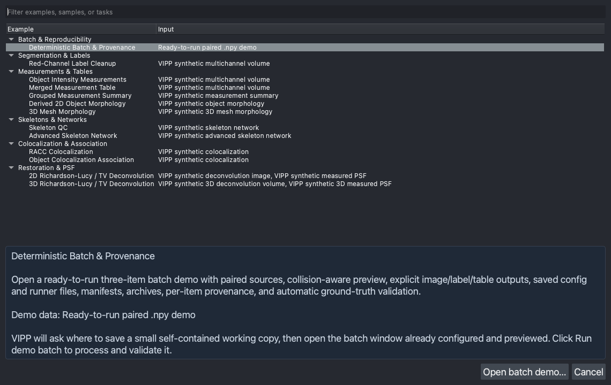
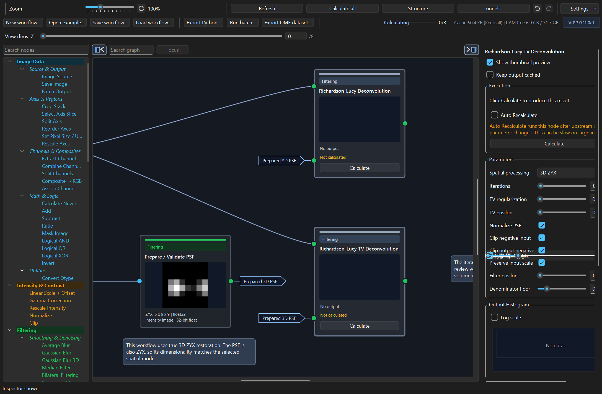
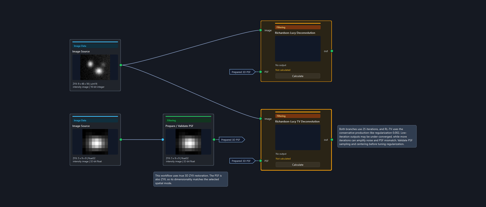
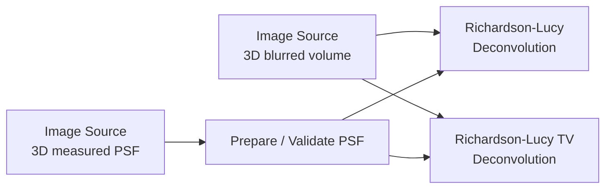
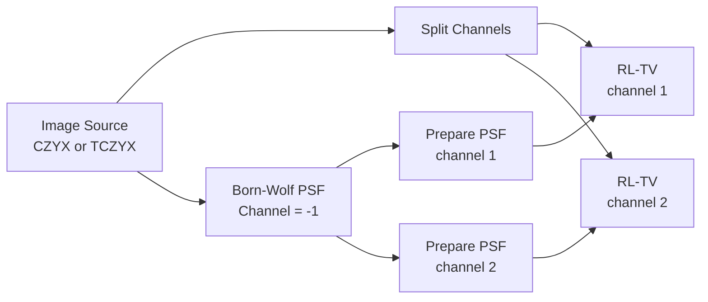

# VIPP User Guide

Last reviewed: 2026-07-11

This guide is written for people building visual image-processing workflows in
VIPP. It focuses on how to use the graph, how to choose the right controls, and
how to avoid common analysis mistakes.

VIPP is still alpha software. Treat results as inspectable analysis outputs,
not publication-ready measurements, until the workflow has been validated for
your data and acquisition settings.

## Quick Start

The fastest way to understand VIPP is to open a bundled example. The examples
use packaged synthetic data, so they do not require external files.

1. Click `Open example...`.
2. Pick a workflow from the grouped chooser.
3. Review the graph from left to right.
4. Select nodes to inspect parameters, output metadata, histograms, and manual
   calculation controls.
5. Use `Save workflow...` once the graph is worth keeping.



Good first examples:

| Goal | Example |
| --- | --- |
| Segment a fluorescence channel | `Red-Channel Label Cleanup` |
| Measure labels with intensity | `Object Intensity Measurements` |
| Review 3D morphology | `3D Mesh Morphology` |
| Try PSF-aware restoration | `3D Richardson-Lucy / TV Deconvolution` |
| Review colocalization outputs | `RACC Colocalization` |
| Audit skeleton/network measurements | `Skeleton QC` |
| Explore collection batch processing and provenance | `Deterministic Batch & Provenance` |

## The Workspace

The VIPP dock has four working areas:

| Area | Purpose |
| --- | --- |
| Toolbar | Workflow loading, export, preview settings, dimension controls, background progress, and graph tools. |
| Palette | Searchable node library grouped by task. |
| Graph canvas | Typed node graph where outputs connect to compatible inputs. |
| Inspector | Parameters, execution controls, metadata, histograms, and table previews for the selected node. |



Graph direction is usually left to right: sources on the left, processing in
the middle, analysis or saved outputs on the right. Node cards show a compact
thumbnail, axis/dtype metadata, execution status, and typed input/output ports.

## Core Concepts

### Images, Masks, Labels, And Tables

VIPP distinguishes common data roles:

| Role | Typical use |
| --- | --- |
| `image` | Intensity images, restored images, RGB views, PSFs, projections. |
| `mask` | Binary foreground/background masks. |
| `labels` | Integer object labels where `0` is background. |
| `table` | Measurements, colocalization metrics, summaries, and provenance-like outputs. |

Typed ports prevent many accidental connections. For example, a label
measurement node expects labels, while a filtering node usually expects an
image or array.

### Metadata Matters

VIPP tracks semantic axes, physical scale, units, channel names/colours,
source identity, and operation history where possible. This metadata drives:

- `View dims` mapping across nodes that drop or rescale axes;
- channel-aware operations such as `Split Channels` and `Extract Channel`;
- physical measurements such as mesh surface area and volume;
- PSF generation from acquisition metadata;
- graph behavior and output metadata for supported saved datasets.

Always inspect the selected node's `Output Metadata` table when a workflow
depends on axis order, channel identity, scale, or acquisition settings.

### Automatic Threshold Histograms

Otsu, Triangle, Yen, Isodata, and Minimum calculate their cutoff from every
finite pixel in the selected scope. VIPP does not silently sample a large image
or substitute a lower-resolution preview. `Stack histogram` fits one cutoff to
the complete stack; `Slice histogram` fits each processed YX plane separately.

The histogram resolution follows the input dtype:

| Input | Threshold histogram |
| --- | --- |
| Boolean | Already a binary segmentation, so VIPP preserves it unchanged instead of fitting another threshold. The inspector uses 0.5 only as a conventional dividing marker. |
| Integer | One bin per native integer level between the finite minimum and maximum. `Float histogram bins` is ignored. |
| Floating point | The explicit `Float histogram bins` value, from 2 to 65,536; default 256. |

An integer range wider than 65,536 levels is rejected rather than silently
rebinned. Add `Convert Dtype` or `Rescale Intensity` when such data should be
compressed intentionally. `Float histogram bins` is saved in workflow JSON
because changing it can change a floating-point threshold. Li Threshold instead
uses all finite raw values directly and therefore has no bin control. For
integer Li inputs, VIPP preserves exact native offsets but rejects a relative
intensity span wider than 2^53, which cannot be represented faithfully by Li's
float64 iteration; convert or rescale deliberately in that exceptional case.

`Minimum Threshold` exposes `Maximum smoothing iterations`. It repeatedly
smooths the exact histogram until two peaks remain, following the
scikit-image method. If two peaks cannot be found within the declared limit,
the node reports the failure; it does not silently substitute another
threshold.

NaN, positive infinity, and negative infinity are excluded from cutoff fitting
and become background in the resulting mask. Large calculations use bounded
chunks and background workers to control memory and keep the interface
responsive; chunking does not change which pixels contribute. An empty input or
an input with no finite pixels reports an error instead of inventing a cutoff.

For manual guides, dragging a Binary Threshold, either Hysteresis guide, or an
explicit Rescale/Clip cutoff reuses the already calculated input distribution.
Only the guide moves immediately and the node output is queued for
recalculation; VIPP does not rescan unchanged input pixels. The output
histogram still refreshes after that output changes, as it should. Parameters
that change a computed guide, such as floating-point histogram bins, refresh
that guide independently while retaining the displayed counts. A replacement
connected input array, a different slice, or a different histogram scope still
calculates a new distribution because the inspected population has genuinely
changed.

### Rescale Intensity Cutoffs

`Rescale Intensity` makes the cutoff source explicit:

| `Input cutoffs` | Behavior |
| --- | --- |
| `Percentiles (exact)` | Default for new nodes. `Low percentile` and `High percentile` are calculated from every finite input value; the value fields do not override them. |
| `Explicit values` | `Low value` and `High value` are used directly; the percentile fields do not override them. |

There is no size-dependent percentile sample. Large percentile calculations are
backgrounded but still use all finite values. The selected mode is saved in
workflow JSON.

`Clip Intensity` uses the same explicit-mode principle. New nodes default to
`Data range`, which leaves the input range unchanged until explicit bounds are
chosen; `Values` applies `Minimum` and `Maximum`.

Integer data retains native-level meaning in both nodes. Integer percentiles
are calculated from exact order statistics, including the fractional
interpolation between neighbouring ranked levels, and Rescale performs its
arithmetic after subtracting a native integer origin. This preserves adjacent
int64/uint64 values even near their dtype limits. Integer Clip uses whole-number
bounds and clamps without a float conversion; use `Convert Dtype` first when a
fractional clipping bound is scientifically intended.

Rescaling still needs floating-point ratio arithmetic. An active integer input
or output interval wider than 2^53 levels is therefore rejected because
float64 cannot distinguish every level in that interval. Also, the GUI's
floating-point spin boxes cannot identify adjacent absolute values above 2^53.
For those exceptional wide-integer datasets, use exact integer literals in an
exported/workflow definition, use percentile cutoffs, or deliberately convert
the dtype. int64/uint64 Rescale outputs default safely to `0..1` instead of an
imprecise float representation of the full dtype maximum.

The input-histogram slice/stack selector changes the distribution drawn for
inspection. A percentile-mode Rescale marker and a data-range Clip marker still
describe the complete connected input, because that is the data those node
modes actually process.

## Toolbar Controls

### Preview

`Preview` controls graph-card thumbnails:

| Mode | Use |
| --- | --- |
| `Slice` | Show the current T/Z/C position. Best for interactive review. |
| `MIP` | Show a maximum projection. Useful for sparse 3D objects or PSFs. |
| `Off` | Disable thumbnails. Useful for very large workflows or slow previews. |

The preview mode affects graph thumbnails, not the napari layer view.

### Contrast And Contrast Range

`Contrast` chooses the intensity mapping:

| Contrast | Meaning |
| --- | --- |
| `Percentile` | Robust display range. Good default for most microscopy images. |
| `Min-max` | Use observed minimum and maximum. Useful when outliers are meaningful. |
| `Raw` | Use raw values relative to the selected range. Useful for normalized floats and PSFs. |

`Contrast Range` chooses where that range is measured:

| Range | Meaning |
| --- | --- |
| `Stack` | Cache one range for the node output, then reuse it while moving through slices. Best for stable brightness across Z/T/C. |
| `Slice` | Recompute display scaling from the currently viewed slice. Useful when individual slices are very different. |

For large volumes, prefer `Stack` once the cache is built. VIPP calculates stack
thumbnail limits in the background and reuses them while the node output remains
unchanged.

`Auto contrast` in the selected-node inspector is also display-only. It derives
its limits from every finite input value (RGB images use luminance and ignore an
RGBA alpha channel). Large calculations run in the background; no sampled
percentile is substituted.

When VIPP adds a large calculated output to napari for inspection or pinning, it
uses safe provisional display limits immediately and replaces them with exact
finite extrema once a background calculation finishes. If you adjust the layer
contrast manually while that calculation is pending, VIPP preserves your
choice. Neither provisional nor exact display limits change graph data.

### View Dims

When the selected or pinned image has non-XY axes such as `T`, `Z`, or `C`,
VIPP shows a `View dims` bar above the graph. These sliders choose the position
used for thumbnails, slice histograms, and current-view metadata. They are also useful when napari's
own Z slider is hidden in 3D view.

For downstream nodes whose axis length differs from the source image, such as
after `Rescale Axes`, VIPP shows the node's local range and maps it to the
equivalent relative napari position. For nodes that drop an axis, such as
`Split Channels`, VIPP still maps the remaining axes back to their original
source dimensions.

### Link Napari/VIPP Sliders

The Settings menu contains `Link napari/VIPP sliders`.

| Setting | Behavior |
| --- | --- |
| On | Napari dimension sliders and VIPP `View dims` sliders stay synchronized. Moving either one updates thumbnails, histograms, and current-view metadata. |
| Off | Napari scrubbing updates only the napari viewer. VIPP `View dims` keeps a separate position for graph thumbnails and inspector summaries. |

Use `On` for normal work. Use `Off` when scrubbing large napari layers would
make the whole graph refresh too often.

### Background Execution

`Run all in BG` controls whether normal pipeline recomputes run in background
mode.

| Setting | Behavior |
| --- | --- |
| Off | Automatic mode: known slower operations and image updates of at least 32 MiB or four million values run in the background; smaller edits remain inline. |
| On | Every graph recompute runs in the background. |

Background execution shows progress in the toolbar. If parameters change while
a calculation is running, VIPP rejects its stale result and queues the latest
request. Cancellation is cooperative: VIPP can stop between supported work
units, but it cannot interrupt a NumPy, SciPy, or scikit-image call already in
progress. CPU use may therefore continue briefly after `Cancel` is clicked.

The same responsiveness rule applies to inspector diagnostics. Large stack
histograms and automatic-threshold markers are calculated away from the UI
thread, display `calculating...` briefly, and are cached for repeated views.
Inspector histograms count all finite pixels in their selected slice or stack;
they do not switch to a hidden sample for large inputs.

### Cache And Memory

The Settings menu also exposes `Cache mode`, `Auto memory guard`, and
`Cache limit`.

| Mode | Use |
| --- | --- |
| `Keep all` | Current default. Fastest repeated inspection, highest memory use. |
| `Smart interactive cache` | Recommended for large graphs. Keeps useful branch outputs while pruning safer intermediates. |
| `Low-memory mode` | Recomputes more often to reduce cached array memory. |

Mark important nodes with `Keep output cached` in the inspector when they
should survive Smart or Low-memory pruning. See
[cache-and-memory.md](cache-and-memory.md) for detailed memory policy.

## Building A Graph

### Add And Connect Nodes

1. Search the palette or browse a category.
2. Add a node by clicking the palette item.
3. Drag from an output port to a compatible input port.
4. Select the node and set parameters in the inspector.

VIPP rejects incompatible port types and cycles. When a node can be inserted on
an existing wire in more than one way, VIPP asks which input/output mapping to
use.

### Search And Focus

Use `Search graph` above the canvas to find nodes, operation IDs, named
tunnels, and `Batch Output` tags. Press Enter or click `Focus` to move through
matches. Tunnel matches reveal the source and subscribers.

### Named Port Tunnels

Named tunnels are hidden wires for outputs reused many times. They keep dense
graphs readable without changing calculation semantics.

Create a tunnel:

1. Right-click an output port.
2. Choose `Create output tunnel...`.
3. Give it a short name such as `DAPI`, `Mask`, `Reference`, or `Prepared PSF`.

Use a tunnel:

1. Right-click a compatible input port.
2. Choose `Use tunnel`.
3. Select the named source.

The `Tunnels...` toolbar button opens a manager where you can filter, focus,
rename, or delete tunnels.

### Graph Notes

Right-click a node and choose `Add note` to attach a movable annotation. Notes
are saved in workflow JSON, move with their node during layout changes, and are
included in undo/redo. Use them for:

- parameter rationale;
- known caveats;
- branch interpretation;
- review reminders.

Notes do not execute and do not affect outputs.

## Workflow Save, Load, And Export

### Save Workflow JSON

`Save workflow...` writes the graph, parameters, connections, positions, named
tunnels, graph notes, and selected inspector state.

Workflow JSON does not embed cached image pixels or tables. When a saved
workflow is loaded, VIPP rebuilds the graph from sources and node settings.

VIPP `0.11.0a3` writes workflow schema version 2. Version 1 workflows are
intentionally rejected because silently inventing the newly explicit threshold,
rescale, and clip settings could change scientific results. Keep a `0.11.0a2`
environment to run an older workflow unchanged, or use its JSON as a reference
while recreating and saving the graph in the current release. Do not change the
JSON version number alone; version 2 requires the new scientific parameters.

VIPP stores optional UI state under `metadata.vipp`; this state affects how the
workflow reopens, not how it calculates:

```json
{
  "metadata": {
    "vipp": {
      "inspector": {
        "selected_node_id": "richardson_lucy_tv_deconvolution_1",
        "right_panel_visible": true
      },
      "thumbnails": {
        "disabled_node_ids": ["input_2"]
      }
    }
  }
}
```

### Export Python

`Export Python...` writes a headless script that imports the same pure operation
functions used by the graph. Use it when a workflow should be reviewed,
versioned, or run outside the GUI.

Typical exported scripts follow this shape:

```python
from napari_vipp.core.operations import gaussian_blur, otsu_threshold

def run_pipeline(src_input):
    v_input = src_input
    v_gaussian = gaussian_blur(v_input, sigma=1.2)
    v_threshold = otsu_threshold(v_gaussian)
    return {
        "input": v_input,
        "gaussian": v_gaussian,
        "threshold": v_threshold,
    }
```

The full export also includes shared VIPP image I/O, a simple single-source
folder helper, and a command-line entry point. It is a standalone code export,
not the saved-configuration batch runner. Manual nodes calculate normally in
exported runs. The script contains the resolved parameters stored on the graph,
but it does not reproduce interactive caches or the full runtime `ImageState`
metadata propagation. Its folder helper binds the first image source;
workflows with additional independent sources need manual source binding in
the script. A batch-created `vipp_batch_pipeline.py` instead defaults to its
sibling batch config, resolves the workflow recorded by that config, and
delegates to the shared batch core.

### Batch Output Basics

For a deterministic end-to-end check, select `Deterministic Batch & Provenance`
under `Open example...` and click `Open batch demo...`. VIPP explains that the
demo needs a writable working copy, then asks where to save it; it creates a new
uniquely named directory and never overwrites an earlier one. The collection
window opens with the bundled two-source workflow and portable config already
loaded. The interactive graph automatically calculates and displays the first
paired 8 x 8 field, while the collection window shows a collision-aware plan
for all three pairs. A highlighted guide summarizes the demonstrated features
and the next step is explicit: click `Run demo batch` to write nine outputs and
validate the scientific results and provenance. The same example remains
available through `Run batch...` -> `Open batch demo...`.

Loading the demo replaces the current graph, so VIPP asks for confirmation
first; save any graph changes you want to keep. The working copy is kept in the
location you choose so its config, runner, results, manifests, and sidecars can
be inspected after the run.

The generated bundle includes the two NumPy input collections,
`vipp_batch_workflow.json`, `vipp_batch_config.json`,
`vipp_batch_pipeline.py`, `vipp_batch_ground_truth.json`, and an empty `results`
folder. A successful run writes nine outputs: combined images, overlap labels,
and overlap-measurement tables. The exact decoded arrays and object rows are
recorded in the ground-truth file. The first run uses `Error`; use `Skip` or
`Overwrite` deliberately when testing replay behavior. A demo run also checks
the input hashes, exact outputs, workflow/config binding, runtime versions,
latest/archive manifests, and finalized item sidecars, then reports the result
in the batch summary.

Add `Batch Output` nodes to mark exactly which image, labels, mask, RGB, or
table outputs should be saved during batch execution. If no `Batch Output`
nodes are present, VIPP still falls back to terminal graph outputs for
compatibility, but the batch dialog warns that the saved-output intent is not
explicit. A terminal with multiple output ports cannot use this fallback. Add
`Batch Output` nodes before saving a reproducible batch configuration.

Use clear tags, because they become output identifiers:

```text
labels_cleaned
rl_tv_restored
object_measurements
colocalization_metrics
```

The batch dialog supports local folder bindings, sorted positional pairing of
multiple sources, and a non-executing preview. `Save config...` writes a
versioned `vipp_batch_config.json`; `Load config...` restores its source
bindings, output folder, default format, existing-file policy, continuation
behavior, required workflow companion, and optional runner choice, and validates
the resolved output declarations against the current graph. The saved workflow
and config carry enough information to reproduce which outputs are selected and
how their file names are planned. A workflow-hash mismatch is reported rather
than silently running a different graph under an old configuration.

Choose the existing-file policy deliberately:

| Policy | Behavior |
| --- | --- |
| `Error` | Treat a planned path that already exists as a collision and require it to be resolved before the batch proceeds. |
| `Skip` | Leave the existing file unchanged and record the output as skipped. |
| `Overwrite` | Replace the existing destination. |

An explicit overwrite choice on a `Batch Output` node takes precedence over
the batch default. `Preview batch` uses the same deterministic pairing and
output-planning rules as execution and shows existing-path collisions before
expensive processing starts. `Run` performs a fresh preflight to detect changes
since that preview.

A dialog-started run writes `vipp_batch_config.json` beside the outputs; a
headless replay uses its existing config and workflow paths. Every execution
writes `vipp_batch_manifest.json` beside the outputs. The manifest records the
workflow and config hashes, VIPP and runtime package versions, input identity
and available source metadata, every planned output path/policy, and
per-item/output status. It embeds the canonical config and scientific graph;
run-id archives preserve prior runs, while small per-item sidecars are updated
during execution. Output records use `pending`,
`completed`, `skipped`, or `failed`; item records additionally use `running`
and `partial`. An item failure is recorded without discarding successful
outputs from the same or earlier items, and later items continue to run by
default. The final summary separates completed, partial, skipped, and failed
items.

## Manual Calculation Nodes

Some nodes intentionally do not recalculate on every parameter change. They
show an `Execution` panel with `Calculate` or `Recalculate`.

Manual/cached nodes include measurement, mesh, skeleton, colocalization, and
deconvolution operations such as:

- `Measure Objects`
- `Measure Objects + Intensity`
- `Measure 3D Mesh Morphology`
- `Analyze Skeleton`
- `Colocalization Metrics`
- `RACC Index`
- `Richardson-Lucy Deconvolution`
- `Richardson-Lucy TV Deconvolution`

Status colours:

| Colour | Meaning |
| --- | --- |
| Gray | Not calculated. |
| Green | Calculated and current. |
| Orange | Cached result is stale. |
| Red | Calculation failed. |

`Calculate all` recalculates every manual node that is not current. `Auto
Recalculate` can be enabled per manual node, but use it only when the node is
fast enough for the current image size.

## Example Workflow: 3D PSF-Aware Deconvolution

The `3D Richardson-Lucy / TV Deconvolution` example is the recommended
restoration starting point when the source is a fluorescence z-stack. Use the
2D example when planes should be restored independently.



The workflow structure is:



Review sequence:

1. Open `Open example... -> Restoration & PSF -> 3D Richardson-Lucy / TV
   Deconvolution`.
2. Select the PSF source and inspect its axes. It should be `ZYX`.
3. Select `Prepare / Validate PSF` and confirm the output is `float32`, odd
   shaped, centered, and normalized.
4. Select `Richardson-Lucy Deconvolution` and click `Calculate`.
5. Select `Richardson-Lucy TV Deconvolution` and click `Calculate`.
6. Compare thumbnails, inspect outputs in napari, and check metadata.

Use ordinary RL as a comparator. Use RL-TV when ordinary RL sharpens noise too
strongly.

## Restoration And PSF Workflows

PSF-aware deconvolution lives under `Filtering -> Restoration & PSF`. The first
supported path is explicit: the image and the PSF are separate graph images,
and the PSF is prepared before it is reused.

### Measured PSF Workflow

Use this for bead PSFs or externally generated PSFs.

1. Add an `Image Source` for the microscopy image.
2. Add another `Image Source` for the measured PSF image.
3. Connect the PSF source to `Prepare / Validate PSF`.
4. Connect the microscopy image to the deconvolution node's `Image` input.
5. Connect the prepared PSF to the deconvolution node's `PSF` input.
6. Choose `2D YX` or `3D ZYX`.
7. Click `Calculate`.

Recommended PSF preparation:

| Parameter | Starting point | Notes |
| --- | --- | --- |
| `Center mode` | `Peak` | Good for generated or clean bead PSFs. |
| `Clip negatives` | On | RL requires non-negative PSFs. |
| `Normalize sum` | On | Keep on for deconvolution. |
| `Force odd shape` | On | Gives the PSF a central sample. |
| `Crop empty border` | Off first | Enable only when a measured PSF has clear empty padding. |

### Generated Born-Wolf PSF Workflow

`Born-Wolf PSF` generates scalar 2D or 3D PSFs from connected image metadata or
manual optical parameters.

Use `Auto from metadata` when acquisition metadata contains:

- emission wavelength;
- objective numerical aperture;
- refractive index;
- XY pixel size;
- Z step for 3D;
- channel wavelength metadata when generating channel-specific PSFs.

When auto is on, disabled inputs show the resolved values. Missing required
values are marked red and the node does not calculate until metadata is
available or auto is turned off. Manual mode enables exact numeric inputs with
non-zero defaults.

For multi-channel images, `Channel = -1` generates one output port per metadata
channel, such as `488 PSF` and `561 PSF`. For a single channel, set `Channel`
to that index.

### Channel-Specific Deconvolution

Use one deconvolution branch per fluorescence channel:



Do not connect a multi-channel PSF stack directly into one deconvolution node.
Each Richardson-Lucy node expects one scalar 2D or 3D PSF matching its selected
spatial mode.

### Richardson-Lucy Parameters

| Parameter | Guidance |
| --- | --- |
| `Spatial processing` | Use `3D ZYX` for true volumetric restoration. Use `2D YX` when each plane should be restored independently. |
| `Iterations` | Start low. Increase only after checking noise and edges. |
| `Normalize PSF` | Keep on unless you have a specific reason. |
| `Clip negative input` | Usually on for microscopy intensity images. |
| `Clip output negative` | Usually on. |
| `Preserve input scale` | Keeps output intensities near the input scale after internal normalization. |

RL-TV adds:

| Parameter | Guidance |
| --- | --- |
| `TV regularization` | Higher values suppress noise more strongly but can flatten fine structure. |
| `TV epsilon` | Numerical stability term. Leave at default unless testing. |
| `Denominator floor` | Stabilizes the TV denominator. Leave at default for first pass. |

### Restoration Caveats

- PSF dimensionality must match the selected spatial mode: 2D PSF for `2D YX`,
  3D PSF for `3D ZYX`.
- Deconvolution outputs are `float32`.
- Output metadata follows the image input, not the PSF input.
- PSFs are normalized defensively inside deconvolution even when the preparation
  node is skipped.
- The current boundary policy uses same-size convolution behavior. Edges can
  show artifacts; crop or interpret borders carefully.
- GPU acceleration, blind deconvolution, spatially variant PSFs, and formal
  reference comparisons are later scope.

## Axis And Channel Workflows

### Split Channels

Use `Split Channels` when the input has a semantic channel axis, such as OME
`C` metadata, VIPP sample metadata, `Combine Channels` output, or a conventional
RGB/RGBA channel-last image. The node creates one graph output port per
channel.

VIPP chooses one of those ports for the node's presentation surfaces. If the
downstream graph uses exactly one distinct `Split Channels` output, that output
drives the node thumbnail and, when the split node is selected, its napari
inspect or pinned layer, histogram, output metadata, `View dims`, and
`Save selected output...`. Several branches may consume that same port; it
still counts as one distinct output. If no output is connected, or two or more
different channel outputs are used, these surfaces fall back to the saved
`Thumbnail channel` setting.

This automatic presentation choice does not change `Thumbnail channel`, rewire
the graph, or alter any channel array delivered to downstream nodes. Select a
downstream branch itself when you want to inspect that branch's processed
result.

### Extract Channel

Use `Extract Channel` when you need one channel as a normal image branch. The
node respects semantic axis metadata, so a `ZCYX` image extracts from the `C`
axis rather than behaving like a napari slider.

### Split Axis

Use `Split Axis` for non-channel axes such as timepoints, Z slices, or a
leading custom axis. This keeps accidental Z/time splitting separate from
fluorescence channel splitting.

## Object, Mesh, And Table Workflows

Use `Measure Objects` for standard region/object measurements from a label
image. Use `Measure Objects + Intensity` when a separate intensity image should
be measured per object.

Use `Measure 3D Mesh Morphology` only for true 3D label images. It extracts
per-object surfaces with marching cubes, applies carried Z/Y/X scale metadata,
and reports mesh surface area, mesh volume, sphericity, 3D solidity,
convex-hull metrics, and status/error columns for objects that are too small or
geometrically invalid. The node is manual/cached because these calculations are
more expensive than ordinary regionprops.

Reference workflow:

```text
examples/synthetic-3d-mesh-morphology.json
```

The broader object, mesh, skeleton, and table-composition contract is documented
in [measurement-workflows.md](measurement-workflows.md).

## Colocalization And Association

Colocalization nodes live under `Colocalization & Spatial Analysis`. Connect
two same-shaped channel images, usually from `Split Channels`, into the named
`Channel 1 image` and `Channel 2 image` ports.

Manual thresholds are normalized `0..255` values. VIPP jointly scales the two
input channels into this range before calculating metrics, scatter views,
colocalized-voxel images, or RACC. `Costes auto` writes calculated thresholds
back into the controls so the values remain visible.

When a colocalization threshold node is selected, the inspector shows a scatter
density panel with threshold guide lines. Dragging a guide switches the node to
manual thresholds and updates the corresponding threshold value. Masked
variants add a third `ROI mask` input.

The 255 x 255 scatter-density grid and its ROI/colocalized counts include every
ROI voxel.
Large inputs are accumulated in bounded chunks on a background worker; VIPP
does not substitute a sampled scatter view. The inspector result is cached and
discarded if its inputs or thresholds become stale.

Reference workflows:

```text
examples/synthetic-colocalization-racc.json
examples/synthetic-object-colocalization-association.json
```

For method details and caveats, see
[colocalization-method-notes.md](colocalization-method-notes.md).

## Skeleton Analysis

Skeleton/network nodes are documented in
[skeleton-nodes.md](skeleton-nodes.md). In brief:

| Node | Use |
| --- | --- |
| `Measure Skeleton Branches` | Detailed branch rows. |
| `Summarize Skeleton Branches` | Branch-length/tortuosity summaries and branch-type fractions. |
| `Measure Overall Skeleton Network` | Whole-network graph metrics from a skeleton mask. |

Reference workflows:

```text
examples/synthetic-skeleton-qc.json
examples/synthetic-advanced-skeleton-network.json
```

## Large Data Tips

For large z-stacks or long workflows:

1. Set `Preview` to `Slice` or `Off`.
2. Use `Contrast Range = Stack` once the range cache has been built.
3. Turn `Link napari/VIPP sliders` off when napari scrubbing should not refresh
   all graph thumbnails.
4. Use `Run all in BG` when many edits trigger slow recomputation.
5. Use `Smart interactive cache` or `Low-memory mode`.
6. Mark expensive stable intermediates with `Keep output cached`.

For OME-Zarr data, VIPP can read local 0.4/0.5 stores, but most operations are
still eager once they execute. Very large analysis workflows should be designed
deliberately: restrict outputs, cache only important nodes, and avoid
unnecessary full-volume branches.

## Troubleshooting

| Symptom | Check |
| --- | --- |
| Thumbnail brightness changes while scrubbing Z | Set `Contrast Range` to `Stack`. |
| Napari Z scrubbing refreshes too much of the graph | Turn off `Link napari/VIPP sliders`. |
| A manual node says `Not calculated` | Select it and click `Calculate`, or use `Calculate all`. |
| A manual node is orange/stale | Upstream data or parameters changed. Click `Recalculate`. |
| Deconvolution refuses the PSF | Check 2D/3D PSF dimensionality against `Spatial processing`. |
| Born-Wolf PSF auto fields are red | Metadata is missing. Supply manual values or load a source with richer acquisition metadata. |
| Output looks over-sharpened | Reduce RL iterations or increase RL-TV regularization slightly. |
| Edges look unreliable after deconvolution | Crop margins or interpret borders cautiously. |
| Batch saves the wrong output | Add explicit `Batch Output` nodes with clear tags. |

## Related Guides

- [io-user-guide.md](io-user-guide.md): import/export behavior and optional
  microscope readers.
- [cache-and-memory.md](cache-and-memory.md): cache modes and memory guard.
- [measurement-workflows.md](measurement-workflows.md): object/mesh/table
  workflow contracts.
- [skeleton-nodes.md](skeleton-nodes.md): skeleton and network analysis.
- [psf-and-deconvolution-plan.md](psf-and-deconvolution-plan.md): restoration
  implementation notes and deferred scope.
- [../examples/README.md](../examples/README.md): bundled workflow index.
