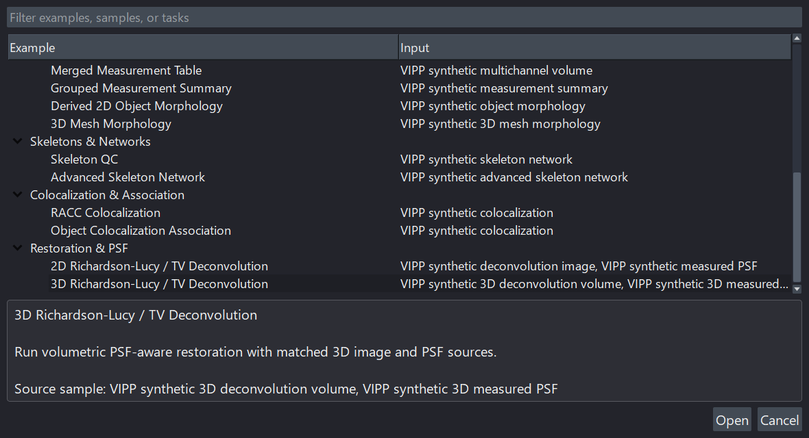
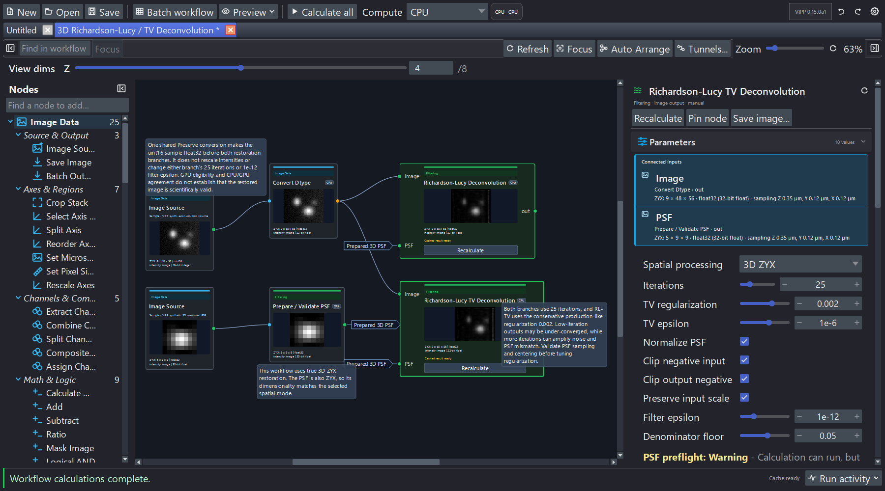
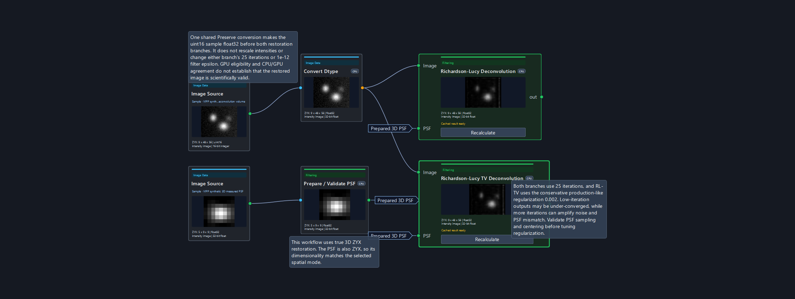
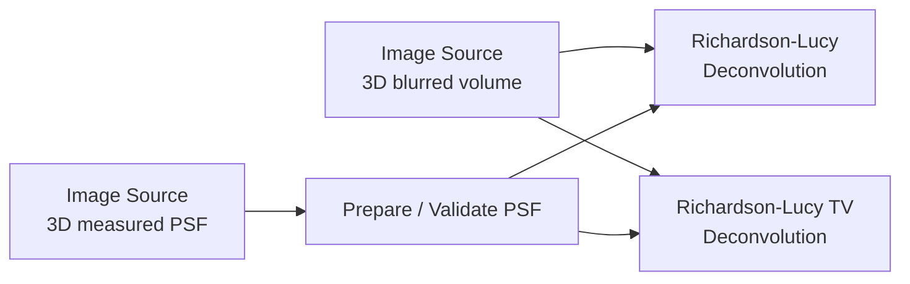
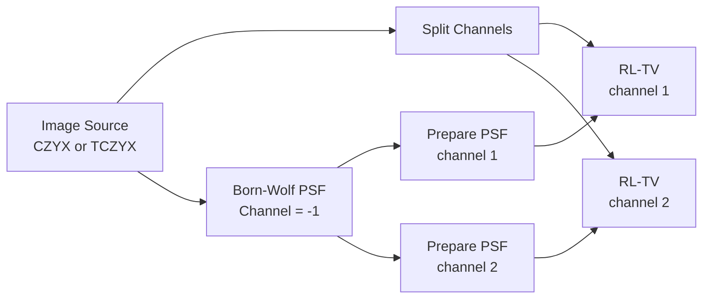

# VIPP User Guide

Last reviewed: 2026-07-28

This guide is written for people building visual image-processing workflows in
VIPP. It focuses on how to use the graph, how to choose the right controls, and
how to avoid common analysis mistakes.

VIPP is still alpha software. Treat results as inspectable analysis outputs,
not publication-ready measurements, until the workflow has been validated for
your data and acquisition settings.

## Quick Start

The fastest way to understand VIPP is to open a bundled example. The examples
use packaged synthetic data, so they do not require external files.

1. Click `Open example...`.
2. Pick a workflow from the grouped chooser.
3. Review the graph from left to right.
4. Select nodes to inspect parameters, output metadata, histograms, and manual
   calculation controls.
5. Use `Save workflow...` once the graph is worth keeping.



Good first examples:

| Goal | Example |
| --- | --- |
| Segment a fluorescence channel | `Red-Channel Label Cleanup` |
| Measure labels with intensity | `Object Intensity Measurements` |
| Review 3D morphology | `3D Mesh Morphology` |
| Try PSF-aware restoration | `3D Richardson-Lucy / TV Deconvolution` |
| Review colocalization outputs | `RACC Colocalization` |
| Audit skeleton/network measurements | `Skeleton QC` |
| Explore collection batch processing and provenance | `Deterministic Batch & Provenance` |

## The Workspace

The VIPP dock has four working areas:

| Area | Purpose |
| --- | --- |
| Toolbar | Workflow loading, export, preview settings, dimension controls, background progress, and graph tools. |
| Palette | Searchable node library grouped by task. |
| Graph canvas | Typed node graph where outputs connect to compatible inputs. |
| Inspector | Parameters, execution controls, metadata, histograms, and table previews for the selected node. |



Graph direction is usually left to right: sources on the left, processing in
the middle, analysis or saved outputs on the right. Node cards show a compact
thumbnail, axis/dtype metadata, execution status, and typed input/output ports.

The toolbar `Settings` menu controls persistent port names with three modes:
`Ambiguous only` labels every port on nodes with multiple inputs or outputs,
`Show all` labels every existing port, and `Hide all` shows ports without names.
`Ambiguous only` is the default. Visible labels widen the card to reserve clear
left and right gutters; unusually long names are shortened visually and retain
their complete name as a tooltip. Changing the mode preserves manual node
positions. If wider cards overlap, VIPP reports it in the status line; use
`Auto structure graph` to reflow the graph using the new card sizes.

### Compute Policy And Benchmarking (Development Branch)

The compute selector in the main toolbar has four policies. New sessions use
`Auto` by default.

| Policy | Behavior |
| --- | --- |
| `Auto` | With no exact compatible history, use reviewed GPU defaults. After accelerated-only history, measure CPU once on the same execution surface; then apply the 1.20x/20-ms gate to the completed pair. |
| `CPU` | Keep every operation on the established host implementation. |
| `Prefer GPU` | Use a reviewed GPU implementation wherever it is scientifically eligible, even if it is only slightly faster, tied, or slower than CPU. |
| `Custom` | Expose a compact per-node preference in the Inspector wherever a GPU implementation is declared. |

`Prefer GPU` considers both public Custom and public Auto-candidate
implementations. It bypasses only the CPU-versus-GPU speed requirement. It does
not bypass scientific parity, dtype, parameter, shape, optional-dependency,
environment, or memory gates, and it never inserts a dtype conversion or alters
an authored parameter. When every eligible GPU has complete comparable timing
evidence, VIPP chooses the fastest GPU; otherwise it chooses deterministically
by stable implementation ID. A node without an eligible accelerator receives
an explained ordinary CPU decision, not a misleading GPU success.

Prefer GPU therefore requires `visible` fallback; `strict` is not a valid
combination. Per-node choices remain saved but are dormant until you switch
back to Custom. `Benchmark node…` and `Find fastest pipeline…` are also
Custom-only. Developer-hidden implementations are not considered unless an
advanced request explicitly enables experimental admission; doing so is not a
public support claim. Node-card badges always report what the accepted run
actually used: CPU, CuPy, cuCIM, or an amber CPU fallback.

On native Windows, all three GPU-using policies accept a successfully probed
NVIDIA CUDA device with compute capability 7.5 or newer and a matching numeric
driver API of at least `13030`, provided the exact supported Python, scientific
stack, CUDA runtime, CuPy/provider, and cuCIM provenance checks also pass. The
GPU model is recorded in provenance; it is not restricted to one exact model.
Auto and Prefer GPU do not perform a local parity benchmark on first use of a
qualifying model. Use `Benchmark node…` or `Find fastest pipeline…` in Custom
mode when you want a local CPU/GPU parity and timing comparison.

Floating-point calculations may differ slightly between GPU models or
driver/JIT combinations while remaining within the operation's documented
parity tolerance. Bitwise-contract integer operations remain exact. For a
reproducible paper or methods report, record the VIPP version, GPU model,
compute capability, driver API, CUDA runtime, CuPy/cuCIM and NumPy/SciPy/
scikit-image versions, workflow parameters, and the actual per-node
implementations from the execution provenance.

Entering `Custom` while VIPP is idle does not recalculate or relabel the last
valid result. Its thumbnails, values, and actual CPU/GPU provenance remain
available. If those actual decisions do not satisfy the saved Custom choices,
the summary and muted badges identify them as a **previous result** and their
tooltips describe the pending intent. Changing a per-node choice or explicitly
calculating then replaces that result. A retained result that already satisfies
the saved choices remains current.

VIPP does not permit compute intent to change underneath active work. While a
pipeline calculation, node benchmark, or `Find fastest` analysis is running,
the compute-mode and applicable per-node controls are disabled. They unlock
after normal completion. To select another policy sooner, use the explicit
`Cancel calculation`, `Cancel benchmark`, or `Cancel analysis` action. The
controls stay disabled while the worker reaches a cooperative checkpoint,
synchronizes, and releases CPU/GPU resources; only then can another mode or
backend be selected. This prevents, for example, a GPU benchmark from
continuing after the user has requested CPU-only execution.

For an eligible selected node, `Benchmark node…` captures its exact current
input and parameters and compares CPU with every scientifically eligible GPU
implementation on a worker. Parity must pass before timings can influence a
choice. The review dialog shows warm timing, CPU speedup, parity, and peak
memory; no preference changes until you click `Use fastest for this node`.
The complete benchmark record is stored only on this machine. Raw timing is not
fed directly into `Auto`, because an isolated-node record does not carry the
same transfer/topology context as a full pipeline plan. Separately, every
successful, fallback-free completed full-pipeline run can record its wall time
locally. With no compatible history, global Auto uses reviewed safe GPU
defaults. If history is accelerated-only, the next matching global Auto run
measures CPU once on the same execution surface. Once both observations exist,
a later matching run selects acceleration only when it clears the 1.20x/20-ms
gate; otherwise it selects CPU. Interactive, batch, and registry-lifecycle
surfaces are never mixed, and Auto never silently benchmarks multiple
implementations. An optional Auto CPU comparison first checks conservative host
memory headroom. On Windows, both available physical RAM and remaining system
commit must preserve a safety reserve. If the comparison is unsafe or commit
cannot be measured, Auto keeps the reviewed safe assignment, explains that the
CPU evidence was skipped, and may collect it on a later compatible run. The
portable
CPU/library/exact preference you explicitly accept in `Custom` is used going
forward and saved in workflow schema 4.

`Find fastest pipeline…` shows two levels of progress. The overall bar tracks
the complete analysis across nodes and validation stages. The current-operation
bar identifies the node, CPU/CuPy/cuCIM implementation, measurement phase, and
round in progress. Some NumPy, SciPy, CuPy, and cuCIM operations run as one
synchronized call, so VIPP can report immediately before and after the call but
cannot update a percentage from inside it. An unchanged current-operation bar
therefore does not by itself mean that the worker is stuck.

If the current graph or parameters are newer than the displayed result,
`Find fastest` may first calculate a private fresh current-graph baseline after
all prior cancellation cleanup has completed. It does not publish that baseline
as an ordinary interactive result or treat stale output as current. The final
proposal is still review-before-apply.

The optimizer can also stop a cooperative **CPU warm timing** early when a
synchronized GPU incumbent already has enough repeated measurements and the
CPU's elapsed time exceeds a confidence-adjusted decision bound. The result is
shown as a lower bound such as `CPU > 10.6 s; stopped early`, not as an exact
timing. Censored measurements are not reused as timing-history samples. VIPP
still checks scientific parity independently, models directional transfers in
the complete graph, and subjects a changed modeled assignment to final paired
end-to-end validation before it can be offered. If the current assignment wins,
the fresh baseline plus parity and conservative exact-or-censored comparison
evidence supports retaining it; VIPP does not describe that case as a redundant
paired comparison against itself. GPU candidates are not discarded from one-off transfer-inclusive
elapsed time because residency can amortize those transfers across a pipeline.

The dialog's time limit is a wall-clock limit for the whole analysis; it is not
a RAM or VRAM allocation. If the limit is reached, VIPP has **not** established
that the current pipeline is fastest and it changes no settings. The result
names the stage and node where analysis stopped. Complete records from earlier
nodes can be reused when the next run has the exact same workload, software,
device, and measurement identity. Incomplete timings for the interrupted node
are discarded. Choose a longer time limit and retry when the unfinished
comparison is worth waiting for.

Use `Settings > Compute setup and memory…` to verify optional GPU packages and
hardware without freezing the interface. VIPP shows separate system RAM and
VRAM for discrete GPUs, and one shared CPU/GPU memory budget on unified-memory
systems. On Windows the cache status separately reports physical RAM and
remaining commit headroom: a large allocation can fail when commit is exhausted
even if some physical RAM appears available. If setup is unavailable or
misconfigured, VIPP offers a command to
copy; it does not run installation commands automatically.

## Core Concepts

### Images, Masks, Labels, And Tables

VIPP distinguishes common data roles:

| Role | Typical use |
| --- | --- |
| `image` | Intensity images, restored images, RGB views, PSFs, projections. |
| `mask` | Binary foreground/background masks. |
| `labels` | Integer object labels where `0` is background. |
| `table` | Measurements, colocalization metrics, summaries, and provenance-like outputs. |

Typed ports prevent many accidental connections. For example, a label
measurement node expects labels, while a filtering node usually expects an
image or array.

### Metadata Matters

VIPP tracks semantic axes, physical scale, units, channel names/colours,
source identity, and operation history where possible. This metadata drives:

- `View dims` mapping across nodes that drop or rescale axes;
- channel-aware operations such as `Split Channels` and `Extract Channel`;
- physical measurements such as mesh surface area and volume;
- PSF generation from acquisition metadata;
- graph behavior and output metadata for supported saved datasets.

Always inspect the selected node's `Output Metadata` table when a workflow
depends on axis order, channel identity, scale, or acquisition settings.

### Automatic Threshold Histograms

Otsu, Triangle, Yen, Isodata, and Minimum calculate their cutoff from every
finite pixel in the selected scope. VIPP does not silently sample a large image
or substitute a lower-resolution preview. `Stack histogram` fits one cutoff to
the complete stack; `Slice histogram` fits each processed YX plane separately.

The histogram resolution follows the input dtype:

| Input | Threshold histogram |
| --- | --- |
| Boolean | Already a binary segmentation, so VIPP preserves it unchanged instead of fitting another threshold. The inspector uses 0.5 only as a conventional dividing marker. |
| Integer | One bin per native integer level between the finite minimum and maximum. `Float histogram bins` is ignored. |
| Floating point | The explicit `Float histogram bins` value, from 2 to 65,536; default 256. |

An integer range wider than 65,536 levels is rejected rather than silently
rebinned. Add `Convert Dtype` or `Rescale Intensity` when such data should be
compressed intentionally. `Float histogram bins` is saved in workflow JSON
because changing it can change a floating-point threshold. Li Threshold instead
uses all finite raw values directly and therefore has no bin control. For
integer Li inputs, VIPP preserves exact native offsets but rejects a relative
intensity span wider than 2^53, which cannot be represented faithfully by Li's
float64 iteration; convert or rescale deliberately in that exceptional case.

`Minimum Threshold` exposes `Maximum smoothing iterations`. It repeatedly
smooths the exact histogram until two peaks remain, following the
scikit-image method. If two peaks cannot be found within the declared limit,
the node reports the failure; it does not silently substitute another
threshold.

`ImageJ Auto Threshold (8-bit)` is a separate, experimental source-aligned node
targeting ImageJ 1.54p for scalar uint8, uint16, and float32 inputs. It processes
each trailing YX plane independently, applies source-derived 8-bit
ScaleConversions behavior, and then runs a source-derived `Default` or
`Triangle` AutoThresholder. Independent ImageJ-generated golden parity is
pending. Bool handling, other floating dtypes, and RGB/RGBA luma reduction are
VIPP extensions and are not claimed as ImageJ-exact. NaNs become zero during
plane conversion; infinite float values are rejected explicitly instead of
preserving ImageJ's collapsed all-zero plane. The node does not change the
scientific contract of VIPP's generic Triangle or Isodata nodes.

For the generic global threshold nodes, NaN, positive infinity, and negative
infinity are excluded from cutoff fitting and become background in the
resulting mask. Large calculations use bounded chunks and background workers
to control memory and keep the interface responsive; chunking does not change
which pixels contribute. An empty input or an input with no finite pixels
reports an error instead of inventing a cutoff.

For manual guides, dragging a Binary Threshold, either Hysteresis guide, either
Rescale cutoff, or an explicit Clip cutoff reuses the already calculated input
distribution. Dragging a percentile-derived Rescale guide switches `Input
cutoffs` to `Explicit values`, preserving the untouched guide and making the
dragged intensity an exact saved cutoff. Only the guide moves immediately and
the node output is queued for recalculation; VIPP does not rescan unchanged
input pixels. The output histogram still refreshes after that output changes,
as it should. Parameters that change a computed guide, such as floating-point
histogram bins, refresh that guide independently while retaining the displayed
counts. A replacement connected input array, a different slice, or a different
histogram scope still calculates a new distribution because the inspected
population has genuinely changed.

### Rescale Intensity Cutoffs

`Rescale Intensity` makes the cutoff source explicit:

| `Input cutoffs` | Behavior |
| --- | --- |
| `Percentiles (exact)` | Default for new nodes. `Low percentile` and `High percentile` are calculated from every finite input value; the value fields do not override them. |
| `Explicit values` | `Low value` and `High value` are used directly; the percentile fields do not override them. |

There is no size-dependent percentile sample. Large percentile calculations are
backgrounded but still use all finite values, with cutoff and voxel-rescaling
phases shown in the pipeline progress area. Interior percentiles such as 99.9
still require an exact order statistic over the volume; 0 and 100 use the exact
finite minimum and maximum directly. Rescaling itself uses bounded work chunks
without changing the requested arithmetic. The selected mode is saved in
workflow JSON. Dragging either histogram cutoff is a manual intensity edit, so
a node in percentile mode changes to `Explicit values` before the dragged
cutoff is saved.

`Clip Intensity` uses the same explicit-mode principle. New nodes default to
`Data range`, which leaves the input range unchanged until explicit bounds are
chosen; `Values` applies `Minimum` and `Maximum`.

Integer data retains native-level meaning in both nodes. Integer percentiles
are calculated from exact order statistics, including the fractional
interpolation between neighbouring ranked levels, and Rescale performs its
arithmetic after subtracting a native integer origin. This preserves adjacent
int64/uint64 values even near their dtype limits. Integer Clip uses whole-number
bounds and clamps without a float conversion; use `Convert Dtype` first when a
fractional clipping bound is scientifically intended.

Rescaling still needs floating-point ratio arithmetic. An active integer input
or output interval wider than 2^53 levels is therefore rejected because
float64 cannot distinguish every level in that interval. Also, the GUI's
floating-point spin boxes cannot identify adjacent absolute values above 2^53.
For those exceptional wide-integer datasets, use exact integer literals in an
exported/workflow definition, use percentile cutoffs, or deliberately convert
the dtype. int64/uint64 Rescale outputs default safely to `0..1` instead of an
imprecise float representation of the full dtype maximum.

The input-histogram slice/stack selector changes the distribution drawn for
inspection. A percentile-mode Rescale marker and a data-range Clip marker still
describe the complete connected input, because that is the data those node
modes actually process.

## Context-aware controls

The Parameters inspector hides settings only when explicit input metadata or a
selected mode proves that the setting has no effect. Examples include floating
histogram bins on integer input, channel-axis fields on explicitly scalar
images, Z-only values on resolved YX images, and manual values while an
automatic mode is active.

This behavior is conservative:

- inferred or missing axis semantics keep potentially relevant settings
  visible;
- an array ending in 3 or 4 is not treated as RGB/RGBA without explicit colour
  metadata;
- a 3D-shaped array is not treated as a ZYX volume without explicit spatial
  axes;
- multi-input controls remain visible until every scientifically relevant port
  is resolved and compatible;
- one muted inspector note explains when rows are hidden or when unresolved
  context is keeping them available.

Hiding never edits a value. The exact stored value remains in workflow JSON,
generated Python, batch execution, cache identity, and undo/redo history. If an
upstream dtype, axis order, source, connection, dynamic port, or controlling
parameter changes, the inspector re-evaluates the rows without recalculating
the graph merely because their presentation changed.

Some scientific controls intentionally remain visible. Born-Wolf auto fields
show resolved values and missing-metadata status; 3D mesh measurement keeps its
3D requirement visible on invalid input; dynamic input counts remain available
for workflow preconfiguration. See
[context-aware-controls-audit.md](context-aware-controls-audit.md) for the full
catalog and rationale.

## Toolbar Controls

### Preview

`Preview` controls graph-card thumbnails:

| Mode | Use |
| --- | --- |
| `Slice` | Show the current T/Z/C position. Best for interactive review. |
| `MIP` | Show a maximum projection. Useful for sparse 3D objects or PSFs. |
| `Off` | Disable thumbnails. Useful for very large workflows or slow previews. |

The preview mode affects graph thumbnails, not the napari layer view.

### Thumbnail Detail And Statistics

`Thumbnail detail` controls how many pixels VIPP renders for each node card:

| Detail | Render size | Use |
| --- | --- | --- |
| `Low` | 90 × 55 | Fastest redraws while editing a large graph. |
| `Standard` | 180 × 110 | Default balance of speed and spatial detail. |
| `High` | 360 × 220 | Retain more backing detail for HiDPI display or downsampling. |
| `Very High` | 720 × 440 | Maximum backing detail for graph zoom or high-density displays. |

The card viewport remains the same size. Increasing detail retains a larger
source image that can improve HiDPI display or downsampling; it does not
guarantee more physical screen pixels. It also does not change a pipeline result
or rerun a node. Stack contrast always uses the complete output and remains
resolution-independent. Slice contrast intentionally normalizes the selected
detail's spatially sampled current view for responsiveness, so Low, Standard,
High, and Very High can produce slightly different Slice display limits. Very
High uses four times the backing pixels of High and is best reserved for maximum
graph zoom or displays where High still appears pixelated. Changing detail
retains any exact Stack limits already cached.

`Settings > Thumbnail statistics` controls where presentation-only Stack
contrast work runs:

| Policy | Behavior |
| --- | --- |
| `Auto` | Choose CPU or GPU separately for each eligible node result from its full output dtype and byte size. |
| `CPU` | Use NumPy and do not initialize CUDA for thumbnail statistics. |
| `Prefer GPU` | Use CuPy for every eligible result, with a visible CPU fallback if it cannot run. |

The main compute policy remains authoritative. Main-toolbar `CPU` always forces
thumbnail statistics to CPU. With thumbnail statistics on `Auto`, main-toolbar
`Prefer GPU` biases eligible statistics to GPU; main-toolbar `Auto` and
`Custom` use the adaptive crossover. An explicit thumbnail-statistics `CPU` or
`Prefer GPU` choice otherwise supplies the presentation preference. These
local settings are remembered on this machine but do not enter workflow JSON
or scientific provenance.

For eligible Percentile work, Auto currently chooses GPU at 384 MiB or more for
`uint8` and 512 MiB or more for `uint16` before its first successful thumbnail
GPU calculation. Both use 32 MiB once that path is warm. These conservative
crossovers are measured default heuristics, not promises of the fastest backend:
hardware, CUDA startup, data distribution, residency, and competing work can
move the break-even point. The boundary uses the complete node output's native
dtype and byte size—not the Low, Standard, High, or Very High render size. Choose Prefer
GPU when the explicit intent is to try every eligible CuPy path regardless of
the heuristic. Float and other dtypes retain the exact NumPy-compatible CPU
percentile calculation in this release. Min-max uses an exact native CPU
reduction. Integer Raw contrast, masks, labels, tables, and other scan-free
contracts do not launch an unnecessary GPU calculation.

Tiny batches that the selector guarantees will remain on CPU finish immediately
without taking over the shared progress strip: at most 1 MiB in aggregate, with
no more than eight requests or eight channel-statistics lanes. Larger work,
high-channel data, and every selected GPU path remain asynchronous and
cancellable. This scheduling boundary is separate from the CPU/GPU crossover
and does not change the calculated limits or recorded contrast provenance.

Select a node to see this display work in the compact `Thumbnail contrast` row
near the top of its inspector: `Calculating…`, `CPU · NumPy`, `GPU · CuPy`,
`CPU fallback`, or `Error`. Ordinary success is muted; fallback and error use
stronger warning colours. This inspector status must not be confused with the
scientific `CPU`, `GPU · CuPy`, `GPU · cuCIM`, and `CPU fallback` compute badges
that remain in node title rows. Hover the inspector row or thumbnail for render
detail, scope, algorithm, processed bytes, elapsed time, selection reason,
crossover, and any fallback or failure; keyboard What's This help and screen
readers receive the same detail. Presentation statistics never change the node
output or the implementation recorded for it.

### Contrast And Contrast Range

`Contrast` chooses the intensity mapping:

| Contrast | Meaning |
| --- | --- |
| `Percentile` | Robust display range. Good default for most microscopy images. |
| `Min-max` | Use observed minimum and maximum. Useful when outliers are meaningful. |
| `Raw` | Use raw values relative to the selected range. Useful for normalized floats and PSFs. |

`Contrast Range` chooses where that range is measured:

| Range | Meaning |
| --- | --- |
| `Stack` | Cache one range for the node output, then reuse it while moving through slices. Best for stable brightness across Z/T/C. |
| `Slice` | Recompute display scaling from the spatially sampled current view at the selected detail. Fast and responsive when individual slices differ; Low/Standard/High/Very High can change display limits slightly. |

For large volumes, prefer `Stack` once the cache is built. VIPP calculates stack
thumbnail limits in the background and reuses them while the node output remains
unchanged. For `uint8` and `uint16`, Percentile Stack limits use an exact
native-dtype histogram; the 0.5th/99.9th-percentile result preserves the
existing NumPy-linear display semantics without sorting a float copy. GPU and
CPU histogram implementations produce the same limits. Min-max uses a faster
exact native reduction and does not construct a histogram. Float and other
dtypes use the exact NumPy-compatible CPU percentile path.

The shared toolbar progress area identifies the node, backend, and active
statistics phase while Stack work runs. CPU integer histograms and min-max
reductions advance and stop between bounded chunks. An active GPU
kernel/synchronization or exact float/other-dtype NumPy percentile can contain a
non-interruptible inner pass; VIPP shows that phase honestly and applies
`Cancel` at the next cooperative boundary. The GPU histogram uploads the full
eligible input once, while the NumPy fallback may allocate full-array conversion
or finite-filter temporaries. Completed exact limits are cached. Cancellation
retains scan-free provisional thumbnails; a failed Prefer-GPU attempt is shown
as `CPU fallback` in the selected node's `Thumbnail contrast` row when safe CPU
fallback succeeds. A failure of both paths is shown as `Error`. Cleanup failure
instead quarantines accelerator work until restart, just like a scientific GPU
cleanup failure.

`Slice` avoids the full-output scan. It calculates CPU-local display
normalization from the selected detail's spatially sampled current view and
changes as T/Z/C or thumbnail detail changes. Use it when rapid browsing matters
more than holding one resolution-independent brightness window across the
stack.

`Auto contrast` in the selected-node inspector is also display-only. It derives
its limits from every finite input value (RGB images use luminance and ignore an
RGBA alpha channel). Large calculations run in the background; no sampled
percentile is substituted.

When VIPP adds a large calculated output to napari for inspection or pinning, it
uses safe provisional display limits immediately and replaces them with exact
finite extrema once a background calculation finishes. If you adjust the layer
contrast manually while that calculation is pending, VIPP preserves your
choice. Neither provisional nor exact display limits change graph data.

### View Dims

When the selected or pinned image has non-XY axes such as `T`, `Z`, or `C`,
VIPP shows a `View dims` bar above the graph. These sliders choose the position
used for thumbnails, slice histograms, and current-view metadata. They are also useful when napari's
own Z slider is hidden in 3D view.

For downstream nodes whose axis length differs from the source image, such as
after `Rescale Axes`, VIPP shows the node's local range and maps it to the
equivalent relative napari position. For nodes that drop an axis, such as
`Split Channels`, VIPP still maps the remaining axes back to their original
source dimensions.

### Link Napari/VIPP Sliders

The Settings menu contains `Link napari/VIPP sliders`.

| Setting | Behavior |
| --- | --- |
| On | Napari dimension sliders and VIPP `View dims` sliders stay synchronized. Moving either one updates thumbnails, histograms, and current-view metadata. |
| Off | Napari scrubbing updates only the napari viewer. VIPP `View dims` keeps a separate position for graph thumbnails and inspector summaries. |

Use `On` for normal work. Use `Off` when scrubbing large napari layers would
make the whole graph refresh too often.

### Background Execution

`Run all in BG` controls whether normal pipeline recomputes run in background
mode.

| Setting | Behavior |
| --- | --- |
| Off | Automatic mode: known slower operations and image updates of at least 32 MiB or four million values run in the background; smaller edits remain inline. |
| On | Every graph recompute runs in the background. |

Background execution shows progress in the toolbar. If parameters change while
a calculation is running, VIPP rejects its stale result and queues the latest
request. Cancellation is cooperative: VIPP can stop between supported work
units, but it cannot interrupt a NumPy, SciPy, or scikit-image call already in
progress. CPU use may therefore continue briefly after `Cancel` is clicked.

The same responsiveness rule applies to inspector diagnostics. Large stack
histograms and automatic-threshold markers are calculated away from the UI
thread, display `calculating...` briefly, and are cached for repeated views.
Inspector histograms count all finite pixels in their selected slice or stack;
they do not switch to a hidden sample for large inputs.

### Tune A Node In Isolation

Use isolated tuning when one node is quick to adjust but recalculating its
downstream branch would take much longer.

1. Select the node and enable `Tune node in isolation` near the top of the
   inspector, or right-click the node and choose the same action.
2. Change its parameters as often as needed. VIPP recalculates that node and
   updates its local preview, but does not schedule any downstream node.
3. Inspect the result, then choose `Apply and continue` to reuse the latest
   node output and resume calculation from its direct downstream nodes.

As soon as a parameter changes, the tuned node is the bright-amber actionable
frontier. Every downstream node is held in darker amber and its cached result
is labelled as waiting. Those cached outputs are retained for comparison but
must not be interpreted as results of the new parameters. Selecting another
node does not hide the amber `Downstream paused` panel.

`Cancel tuning` restores the parameters and cached output from the start of the
session without recalculating the downstream branch. Only one node can be
tuned in isolation at a time, and the current graph must be calculated before
isolation starts so this restoration point is coherent. Editing the saved
workflow graph, layout, or notes commits the current tuning result before that
edit, so Cancel can never restore state from a different graph revision.

The toolbar `Calculate all` acts as `Apply and continue`: it disables isolated
tuning first, then resumes ordinary automatic and manual-node execution. This
also applies to pipelines with no manual nodes.

### Cache And Memory

The Settings menu also exposes `Cache mode`, `Auto memory guard`, and
`Cache limit`.

| Mode | Use |
| --- | --- |
| `Keep all` | Current default. Fastest repeated inspection, highest memory use. |
| `Smart interactive cache` | Recommended for large graphs. Keeps useful branch outputs while pruning safer intermediates. |
| `Low-memory mode` | Recomputes more often to reduce cached array memory. |

Mark important nodes with `Keep output cached` in the inspector when they
should survive Smart or Low-memory pruning. See
[cache-and-memory.md](cache-and-memory.md) for detailed memory policy.

## Building A Graph

### Add And Connect Nodes

1. Search the palette or browse a category.
2. Add a node by clicking the palette item.
3. Drag from an output port to a compatible input port.
4. Select the node and set parameters in the inspector.

VIPP rejects incompatible port types and cycles. When a node can be inserted on
an existing wire in more than one way, VIPP asks which input/output mapping to
use.

Image Source cards show their current layer, file stem, sample, or collection
binding below the node title. Long bindings are elided on the card; hover it to
read the complete source. Collection bindings follow the active item and return
to their representative description when the collection run finishes.

### Search And Focus

Use `Search graph` above the canvas to find nodes, operation IDs, named
tunnels, and `Batch Output` tags. Press Enter or click `Focus` to move through
matches. Tunnel matches reveal the source and subscribers.

### Named Port Tunnels

Named tunnels are hidden wires for outputs reused many times. They keep dense
graphs readable without changing calculation semantics.

Create a tunnel:

1. Right-click an output port.
2. Choose `Create output tunnel...`.
3. Give it a short name such as `DAPI`, `Mask`, `Reference`, or `Prepared PSF`.

Use a tunnel:

1. Right-click a compatible input port.
2. Choose `Use tunnel`.
3. Select the named source.

The `Tunnels...` toolbar button opens a manager where you can filter, focus,
rename, or delete tunnels.

To change a tunnel's source without editing JSON, drag the source badge on its
current output port and release it over another compatible output. VIPP previews
type/cycle validity, moves every subscriber atomically, and records one undoable
graph edit.

### Graph Notes

Right-click a node and choose `Add note` to attach a movable annotation. Notes
are saved in workflow JSON, move with their node during layout changes, and are
included in undo/redo. Use them for:

- parameter rationale;
- known caveats;
- branch interpretation;
- review reminders.

Notes do not execute and do not affect outputs.

The same node menu also contains `Tune node in isolation`. It is a transient
interactive execution control: it does not change or serialize the scientific
workflow graph.

## Workflow Tabs, Save, Load, And Export

### Work With Multiple Workflows

Each tab owns a separate live workflow: its calculated results and caches,
undo/redo history, inspector state, filename, and dirty baseline remain intact
when another tab is selected. `New` opens a clean workflow in a new tab, and
`Load workflow...` opens the chosen file in a new tab. Double-click a tab to
rename it, drag tabs to reorder them, and use the close button or middle-click
to close one. A dirty tab asks for Save, Discard, or Cancel; closing the last tab
immediately creates a valid blank replacement.

Selecting a tab acknowledges the new selection immediately and shows
`Switching workflow` while VIPP restores that tab's retained graph, inspector,
thumbnails, and cached results. This is presentation loading, not scientific
recalculation. A short-lived pipeline, source, histogram, scatter, or contrast
worker must still finish before VIPP can switch safely; the status strip names
the work that is currently blocking the request.

Collection batches run for the tab that launched them. Because the headless
batch engine runs on one background worker, another tab can be selected and
edited while the batch continues. Progress and completion stay associated with
the originating tab. A second batch, closing the origin tab, or closing VIPP is
blocked until that batch reaches a safe terminal state. `Cancel run` requests
cooperative cancellation: VIPP waits for the current supported checkpoint,
synchronizes and cleans any accelerator scope, records the active item as
cancelled, skips later unstarted items, and finalizes the manifests.

### Save Workflow JSON

`Save workflow...` writes the graph, parameters, connections, positions, named
tunnels, graph notes, selected inspector state, and portable compute intent.

If a Batch workspace is active, Save asks whether its validated batch config
should be included in the same workflow JSON. `Yes` stores a top-level
`batch_config`; loading that workflow restores and opens the workspace without
automatically previewing or scanning the collection. `No` saves only the normal
workflow, while `Cancel` writes nothing. The attached config records local
input/output paths and policies but never embeds source pixels, so it is a
single-file convenience rather than a portable data package.

Workflow JSON does not embed cached image pixels or tables. When a saved
workflow is loaded, VIPP rebuilds the graph from sources and node settings.

Current saves use workflow schema version 4. Its `execution.compute` object
stores only portable, authored intent: `mode`, `fallback_policy`,
`node_preferences`, `precision_policy`, and `workload_policy`. It does not copy
a machine's selected runtime or device, accelerator memory limits or safety
reserve, experimental-admission switch, capability probe, or benchmark
evidence. Those facts must be discovered or measured again on the machine that
runs the workflow.

Schema-version-3 workflows remain supported. Because version 3 had no compute
policy, VIPP migrates them to an explicit CPU request; saving the loaded graph
writes version 4. Select `Auto`, `Prefer GPU`, or `Custom` deliberately if
that workflow should use admitted GPU implementations. Versions 1 and 2 are
intentionally rejected because silently inventing threshold, cutoff, channel
axis, color, or intensity-mapping choices could change scientific results.
Keep the VIPP environment that created such an older workflow to inspect and
run it unchanged, then use its graph and JSON as references while recreating and
verifying it in the current release. Do not change the JSON version number
alone; version 3 introduced required scientific parameters and version 4 adds
the required compute-intent block.

Read the categorized [0.12.0a1 compatibility notes](../CHANGELOG.md#0120a1---2026-07-14)
before recreating an older analysis. They identify the source-revision,
physical-grid, channel/color, generated-export, and batch-output decisions that
need deliberate review rather than mechanical JSON migration.

VIPP stores optional UI state under `metadata.vipp`; this state affects how the
workflow reopens, not how it calculates:

```json
{
  "metadata": {
    "vipp": {
      "inspector": {
        "selected_node_id": "richardson_lucy_tv_deconvolution_1",
        "right_panel_visible": true
      },
      "thumbnails": {
        "disabled_node_ids": ["input_2"]
      }
    }
  }
}
```

### Export Python

`Export Python...` writes a headless script containing an immutable validated
workflow document. Each call reconstructs a fresh pipeline and executes it
through the same shared engine as the GUI. Use it when a workflow should be
reviewed, versioned, or run outside napari without replacing scientific graph
semantics with hand-written operation calls.

Typical exported scripts follow this shape:

```python
dataset = load_image("input.ome.tif")
results = run_pipeline(src_input=dataset)
save_image(
    results["threshold"],
    "threshold.ome.tif",
    image_state=results.image_states["threshold"],
    provenance=results,
    output_node_id="threshold",
)
```

The export includes shared VIPP image I/O, a simple primary-source folder
helper, and a command-line entry point. `ImageDataset` and `SourcePayload`
inputs carry the complete normalized `ImageState`; raw arrays use only metadata
explicitly supplied to the call. Multi-source workflows can bind every source
through the generated function or its `source_payloads` mapping. Missing,
unknown, and duplicate bindings fail. The simple command-line folder helper
binds only the primary source. Its built-in local loader hashes the exact source
before reading and verifies the identity again after materialization. For each
item it privately stages the complete requested output/sidecar set in one
destination and commits it with rollback on a caught promotion failure. It
still has no multi-source pairing, collision plan, final prepublication source
recheck, checkpoints, manifest, or resumable replay; use the callable API or
saved-config batch runner for those needs.

The embedded schema-4 workflow retains `execution.compute` so authored intent
is not lost in review, version control, or later regeneration. Generated Python
and collection batch use the same CPU/GPU execution service as interactive
VIPP. They preserve CPU/Auto/Prefer-GPU/Custom mode and per-node choices,
apply the same scientific eligibility and valid fallback rules, and report the
actual implementation for every completed computed node. A CPU-only
installation remains import-safe and `Auto` uses CPU when no admitted GPU is
available.

An export records the exact VIPP version that created it and refuses a different
runtime. Deliberately regenerate and revalidate the export when upgrading. The
script does not reproduce interactive caches because those caches are not part
of the scientific workflow. A batch-created `vipp_batch_pipeline.py` instead
defaults to its sibling batch config, resolves the workflow recorded there, and
delegates to the shared collection runner. Both CLIs support compute-mode,
fallback-policy, repeatable per-node overrides, progress, and cooperative
cancellation. Generated CLI output saves write an atomic
`.vipp-provenance.json` sidecar by default; cancellation returns exit code 130.
See [Durable GPU execution](durable-gpu-execution.md) for the callable API,
exact commands, precedence, provenance schema, and the important difference
between the durable batch runner and the generated folder convenience.

### Batch Output Basics

For a deterministic end-to-end check, select `Deterministic Batch & Provenance`
under `Open example...` and click `Open batch demo...`. VIPP explains that the
demo needs a writable working copy, then asks where to save it; it creates a new
uniquely named directory and never overwrites an earlier one. The batch
workspace opens with the bundled two-source workflow and portable config
already loaded. The interactive graph automatically calculates and displays
the first paired 8 x 8 field, while the workspace shows a collision-aware plan
for all three pairs. Use the persistent `Batch representative` slider, its
Previous/Next buttons, or `Preview selected in graph` on a table row to inspect
each paired field through every node. This changes both collection Image Source
paths together but does not run or save the full batch. A highlighted guide
summarizes the demonstrated features and the next step is explicit: click `Run
demo batch` to write nine outputs and validate the scientific results and
provenance. The workspace retains item progress, final statuses, validation,
and the manifest path and can be reopened with `Batch workspace...`. The same
example remains available there through `Open batch demo...`.

The graph commits a new representative label only after its matching source
load and calculation succeed. If batch settings or scientific graph parameters
change, the old pairing remains browsable but the runnable plan is marked stale.
Run performs fresh planning and inspects one representative source set through
the same source-axis declarations and scientific axis contract used by
execution. When an exact `QYX` TIFF reaches a 3D operation that requires `ZYX`,
the Batch workspace can visibly select `Pages are depth slices (Z stack)` and
retry with that guarded interpretation. Other deterministic mismatches stop
before output directories, run artifacts, or GPU setup are created. Run
executes immediately when no reviewed plan is current, but
refreshes and stops for review when files or destinations unexpectedly diverge
from an already displayed plan. Completed preflight rows remain visible as
historical evidence until the next plan or run.

Loading the demo replaces the current graph, so VIPP asks for confirmation
first; save any graph changes you want to keep. The working copy is kept in the
location you choose so its config, runner, results, manifests, and sidecars can
be inspected after the run.

The generated bundle includes the two NumPy input collections,
`vipp_batch_workflow.json`, `vipp_batch_config.json`,
`vipp_batch_pipeline.py`, `vipp_batch_ground_truth.json`, and an empty `results`
folder. A successful run writes nine outputs: combined images, overlap labels,
and overlap-measurement tables. The exact decoded arrays and object rows are
recorded in the ground-truth file. The first run uses `Error`; use `Skip` or
`Overwrite` deliberately when testing replay behavior. A demo run also checks
the input hashes, exact outputs, workflow/config binding, runtime versions,
latest/archive manifests, and finalized item sidecars, then reports the result
in the batch summary.

Add `Batch Output` nodes to mark exactly which image, labels, mask, RGB, or
table outputs should be saved during batch execution. If no `Batch Output`
nodes are present, VIPP still falls back to terminal graph outputs for
compatibility, but the batch workspace warns that the saved-output intent is not
explicit. A terminal with multiple output ports cannot use this fallback. Add
`Batch Output` nodes before saving a reproducible batch configuration.

Use clear tags, because they become output identifiers:

```text
labels_cleaned
rl_tv_restored
object_measurements
colocalization_metrics
```

The batch workspace supports local folder bindings and sorted positional pairing
of multiple sources. For a new unsaved source, `Image stack` starts at
`Automatic (recommended)`. When the representative is exactly `QYX` and the
workflow demonstrates that it needs `ZYX`, VIPP selects
`Pages are depth slices (Z stack)`, shows a short notice, and retries. The
notice makes clear that pixel order is unchanged and that the concrete choice
will be saved with the batch. Keep it only when the pages really are depth
slices. Selecting
`Use the file's labels unchanged` is an explicit opt-out and prevents the
same suggestion from being reapplied to that source. Uncommon manual mappings
remain under `Something else (advanced)...` rather than in the normal setup
path.

`Preview batch` is optional: it plans the collection without saving batch
outputs, then calculates one selected item as the graph representative. `Run
batch` performs fresh planning plus a representative scientific-contract
preflight and starts the full collection directly when no reviewed plan is
current. That preflight is deliberately representative-only, not a scan of
every file header. Each later item must still match the declaration exactly
when it is read. A representative that cannot be read remains an item-specific
failure governed by the continuation policy. If inspection succeeds but the
saved series index or normalized metadata contract is invalid, preflight blocks
the run as a deterministic configuration error. A deterministic axis-contract
failure likewise blocks the run even when `Continue on error` is selected.

The single `Batch workspace...` action is visually separated between workflow
loading and the export actions in the main toolbar. `Save config...` writes a
versioned `vipp_batch_config.json`. Current config version 3 records the
complete effective compute request and any guarded source-axis declarations.
Version 1 loads as explicit CPU because it predates accelerator execution;
version 2 retains its saved compute request. Both older versions load without
axis declarations and become version 3 only when reviewed and saved. Their blank
declarations are shown as `Use the file's labels unchanged`, not the
automatic policy used for a new unsaved row. `Load config...` restores source
bindings, output folder, default format, existing-file policy, continuation
behavior, required workflow companion, and optional runner choice, and validates
the resolved output declarations against the current graph. The saved workflow
and config carry enough information to reproduce which outputs are selected and
how their file names are planned. A workflow-hash mismatch is reported rather
than silently running a different graph under an old configuration.

A loaded config's compute request remains selected while the toolbar compute
request is unchanged from load time. Changing any toolbar compute setting makes
the complete current toolbar request effective for the next preview, save, or
run; VIPP does not merge half of a loaded request with half of the toolbar.
Headless replay uses the saved config request unless an explicit run/CLI
override is supplied. The manifest records both configured and effective
requests and hashes the effective override separately.

For interactive convenience, `Save workflow...` can instead attach that
versioned config to the workflow file after a Yes/No/Cancel prompt. A standalone
config remains the appropriate choice for headless replay, explicit companion
workflow files, and generated batch runner scripts.

Choose the existing-file policy deliberately:

| Policy | Behavior |
| --- | --- |
| `Error` | Treat a planned path that already exists as a collision and require it to be resolved before the batch proceeds. |
| `Skip` | Leave the existing file unchanged and record the output as skipped. |
| `Overwrite` | Replace the existing destination. |

An explicit overwrite choice on a `Batch Output` node takes precedence over
the batch default. `Preview batch` uses the same deterministic pairing and
output-planning rules as execution and shows existing-path collisions before
expensive processing starts. `Run` performs planning and its representative
scientific preflight itself, so Preview is not a prerequisite. If a displayed
plan exists, Run detects unexpected changes since it was reviewed before
processing starts.

A dialog-started run writes `vipp_batch_config.json` beside the outputs; a
headless replay uses its existing config and workflow paths. Every execution
writes `vipp_batch_manifest.json` beside the outputs. The manifest records the
workflow and config hashes, VIPP and runtime package versions, input identity
and available source metadata, every planned output path/policy, and
per-item/output status. For sources successfully read during item execution,
version-3 manifests record the reader-reported raw axes, effective axes, and
applied declaration, so `QYX -> ZYX` remains auditable. The embedded config
retains the intended declaration for an item skipped or failed before reading.
They also record the actual CPU/CuPy/cuCIM identity and version
selected for every completed node, the environment and decision reasons,
structured OOM/CPU-retry records, warnings, and cleanup evidence. The manifest
embeds the canonical config and scientific graph;
run-id archives preserve prior runs, while small per-item sidecars are updated
during execution. Output records use `pending`,
`completed`, `skipped`, `cancelled`, or `failed`; item records additionally use
`running` and `partial`. Each published output links to the exact item execution
with `execution_provenance_sha256`. An item failure is recorded without
discarding successful outputs from the same or earlier items, and later items
continue to run by default. The final summary separates completed, partial,
skipped, cancelled, and failed items.

During a run the workspace shows two progress bars. Overall progress advances
across collection items; current-operation progress names the active item,
node/operation, and truthful checkpoint. Iterative and tiled operations update
between synchronized checkpoints. A monolithic library call or file writer may
finish its current call before either progress or cancellation can advance.
VIPP does not invent percentages inside work the library cannot expose.

If a retryable GPU out-of-memory failure occurs under `visible` fallback, VIPP
cleans the complete device segment and retries it once on CPU. `strict` records
the failure instead. If accelerator cleanup is false or cannot be proven,
publication is blocked: privately staged outputs are not promoted. The manifest
records this separately from an ordinary scientific or writer error.

An interactive calculation that fails or runs out of host/GPU memory never
replaces an earlier processing result with an uncomputed or provenance-unknown
value. A verified source boundary may still be accepted. Completed processing
nodes may additionally be merged from a cleanup-failed result, but only when it
carries matching actual-implementation decisions; all other affected nodes
retain their prior valid outputs,
thumbnails, and badges and remain pending. Cancellation retains the prior
coherent result. If CPU/GPU cleanup fails, VIPP keeps only those
provenance-safe results, disables calculation, policy changes, node benchmarks,
pipeline optimization, and new batch starts, and requires a restart before
compute can resume.

## Manual Calculation Nodes

Some nodes intentionally do not recalculate on every parameter change. They
show an `Execution` panel with `Calculate` or `Recalculate`.

Manual/cached nodes include measurement, mesh, skeleton, colocalization, and
deconvolution operations such as:

- `Measure Objects`
- `Measure Objects + Intensity`
- `Measure 3D Mesh Morphology`
- `Analyze Skeleton`
- `Colocalization Metrics`
- `RACC Index`
- `Richardson-Lucy Deconvolution`
- `Richardson-Lucy TV Deconvolution`

Status colours:

| Colour | Meaning |
| --- | --- |
| Bright amber | Manual node has not been calculated, or its cached result is stale; user action is required. |
| Dark amber | Downstream result is waiting for the bright-amber manual frontier. |
| Green | Calculated and current. |
| Red | Calculation failed. |

`Calculate all` recalculates every manual node that is not current and turns
bright amber while explicit user action is required. `Auto Recalculate` can be
enabled per manual node, but use it only when the node is fast enough for the
current image size.

During isolated tuning, bright amber marks the tuned actionable node and dark
amber marks every downstream result held at the temporary propagation boundary.
`Calculate all` releases that boundary before applying the normal manual-node
policy.

## Example Workflow: 3D PSF-Aware Deconvolution

The `3D Richardson-Lucy / TV Deconvolution` example is the recommended
restoration starting point when the source is a fluorescence z-stack. Use the
2D example when planes should be restored independently.



The workflow structure is:


```mermaid
flowchart LR
    image["Image Source<br/>3D blurred volume"]
    psf["Image Source<br/>3D measured PSF"]
    prep["Prepare / Validate PSF"]
    rl["Richardson-Lucy<br/>Deconvolution"]
    tv["Richardson-Lucy TV<br/>Deconvolution"]

    psf --> prep
    image --> rl
    prep --> rl
    image --> tv
    prep --> tv
```

Review sequence:

1. Open `Open example... -> Restoration & PSF -> 3D Richardson-Lucy / TV
   Deconvolution`.
2. Select the PSF source and inspect its axes. It should be `ZYX`.
3. Select `Prepare / Validate PSF` and confirm the output is `float32`, odd
   shaped, centered, and normalized.
4. Select `Richardson-Lucy Deconvolution` and click `Calculate`.
5. Select `Richardson-Lucy TV Deconvolution`, read its PSF preflight status,
   and click `Calculate`.
6. Compare thumbnails, inspect outputs in napari, and check metadata.

Use ordinary RL as a comparator. Use RL-TV when ordinary RL sharpens noise too
strongly. Both bundled comparison branches use 25 iterations; RL-TV uses the
conservative production-like starting value `TV regularization = 0.002`. These
are review starting points, not evidence that more iterations or nonzero TV are
best for every acquisition.

## Restoration And PSF Workflows

PSF-aware deconvolution lives under `Filtering -> Restoration & PSF`. The first
supported path is explicit: the image and the PSF are separate graph images,
and the PSF is prepared before it is reused.

### Measured PSF Workflow

Use this for bead PSFs or externally generated PSFs.

1. Add an `Image Source` for the microscopy image.
2. Add another `Image Source` for the measured PSF image.
3. Connect the PSF source to `Prepare / Validate PSF`.
4. Connect the microscopy image to the deconvolution node's `Image` input.
5. Connect the prepared PSF to the deconvolution node's `PSF` input.
6. Choose `2D YX` or `3D ZYX`.
7. Click `Calculate`.

Recommended PSF preparation:

| Parameter | Starting point | Notes |
| --- | --- | --- |
| `Center mode` | `Peak` | Good for generated or clean bead PSFs. |
| `Clip negatives` | On | RL requires non-negative PSFs. |
| `Normalize sum` | On | Keep on for deconvolution. |
| `Force odd shape` | On | Gives the PSF a central sample. |
| `Crop empty border` | Off first | Enable only when a measured PSF has clear empty padding. |

### Generated Born-Wolf PSF Workflow

`Born-Wolf PSF` generates scalar 2D or 3D PSFs from connected image metadata or
manual optical parameters.

Use `Auto from metadata` when acquisition metadata contains:

- emission wavelength;
- objective numerical aperture;
- refractive index;
- XY pixel size;
- Z step for 3D;
- channel wavelength metadata when generating channel-specific PSFs.

When auto is on, disabled inputs show the resolved values. Missing required
values are marked red and the node does not calculate until metadata is
available or auto is turned off. Manual mode enables exact numeric inputs with
non-zero defaults.

For multi-channel images, `Channel = -1` generates one output port per metadata
channel, such as `488 PSF` and `561 PSF`. For a single channel, set `Channel`
to that index.

`PSF XY support (samples)` and `PSF Z support (samples)` specify the generated
kernel window. They are deliberately independent of the input image dimensions:
`Auto from metadata` resolves wavelength, NA, refractive index, XY spacing, and
Z spacing, but it does not silently crop the optical model to the available
image depth. The inspector therefore shows the requested PSF support beside the
input image extent before deconvolution.

The Born-Wolf inspector also reports a conventional-widefield Nyquist estimate.
This is a sampling-interval check, not a stack-depth check. For example, the
combination 561 nm emission, NA 1.46, refractive index 1.518, XY spacing 0.025
um, and Z spacing 0.101 um has estimated critical distances of about 0.096 um
in XY and 0.254 um in Z, so both sampling intervals pass. A 33-plane PSF and an
11-plane image can therefore pass Nyquist while still failing the separate
image-extent/support check. The estimate uses the conventional-widefield
bandwidth equations documented by
[Scientific Volume Imaging](https://svi.nl/Nyquistrate).

The estimate and Born-Wolf model assume conventional widefield fluorescence.
Reconstructed SIM, confocal, and other modalities may have different bandwidth
and PSF requirements. A completed calculation does not prove that the selected
model matches the acquisition.

### Channel-Specific Deconvolution

Use one deconvolution branch per fluorescence channel:


```mermaid
flowchart LR
    source["Image Source<br/>CZYX or TCZYX"]
    split["Split Channels"]
    psf["Born-Wolf PSF<br/>Channel = -1"]
    prep1["Prepare PSF<br/>channel 1"]
    prep2["Prepare PSF<br/>channel 2"]
    dec1["RL-TV<br/>channel 1"]
    dec2["RL-TV<br/>channel 2"]

    source --> split
    source --> psf
    psf --> prep1 --> dec1
    psf --> prep2 --> dec2
    split --> dec1
    split --> dec2
```

Do not connect a multi-channel PSF stack directly into one deconvolution node.
Each Richardson-Lucy node expects one scalar 2D or 3D PSF matching its selected
spatial mode.

### Richardson-Lucy Parameters

| Parameter | Guidance |
| --- | --- |
| `Spatial processing` | Use `3D ZYX` for true volumetric restoration and `2D YX` when each plane should be restored independently. PSF rank and sampling must match; iterations cannot repair a miscentered or incorrectly sampled PSF. |
| `Iterations` | Few iterations may leave the result under-converged. Increasing the count can recover detail, but can also amplify noise, ringing, boundary error, or PSF-mismatch artifacts. Higher is not universally better. |
| `Normalize PSF` | Keep on unless you have a specific reason. Normalization does not fix rank, sampling, centering, or insufficient support. |
| `Clip negative input` | Usually on for microscopy intensity images. |
| `Clip output negative` | Usually on. |
| `Preserve input scale` | Keeps output intensities near the input scale after internal normalization. |
| `Filter epsilon` | Advanced ratio-update guard. Normally leave it at `1e-12`; it should not be the first response to lost structure. |

RL-TV adds:

| Parameter | Guidance |
| --- | --- |
| `TV regularization` | Begin at `0` or a very small value and increase only as needed. The conservative default is `0.002`. Values around `0.008-0.012` are comparatively strong and may suppress scientifically real dim or fine structures even when the result looks smoother. |
| `TV epsilon` | Advanced TV-gradient guard. Leave at `1e-6` unless testing a demonstrated numerical problem. |
| `Denominator floor` | Advanced TV-update guard. Leave at `0.05` unless diagnosing a demonstrated instability; it is not a first response to missing structure. |

These slider ranges are practical exploration windows, not parameter validity
limits. The adjacent spinner accepts valid values outside its slider window and
does not enlarge or rescale the slider. `TV regularization = 0` and `Filter
epsilon = 0` remain available through the spinner as explicit off values.

### Restoration Caveats

- The inspector separates green `Checks passed` from `Needs attention` and
  `What to do next`. A normalized sum near one and zero peak/centroid offsets
  are passed checks, not warnings. Overall readiness remains `Ready`, `Warning`,
  `Invalid`, or `Unknown`.
- A support warning names the affected axis and compares actual sample counts.
  For example, a 33-plane PSF on an 11-plane image means the axial kernel spans
  beyond the whole Z stack. No output plane has full PSF support on both sides,
  and the current same-size convolution treats signal beyond the stack as zero.
  For true 3D restoration, acquire guard planes above and below the region of
  interest and crop or interpret the restored margins. Use `2D YX` on both the
  PSF generator and deconvolution only when independent plane-wise restoration
  is scientifically appropriate. When PSF values are available, the warning
  also reports how much current PSF intensity a centered image-sized crop would
  retain and discard; this is why the generator does not silently force the
  support to equal the image depth.
- Boundary intensity is not intensity outside the array. It is the fraction of
  the modeled PSF that remains on its outermost samples, indicating that the
  PSF tail may be truncated. The inspector reports separate Z, Y, and X
  boundary fractions so support can be enlarged only where the image has room.
- `Prepare / Validate PSF` fixes sign, normalization, odd shape, and centering.
  It does not shrink meaningful non-empty support, so adding it will not clear
  an image-versus-PSF size warning. Do not crop a PSF merely to silence that
  warning.
- The inspector checks rank, known physical sampling, finite/non-negative
  values, positive sum, approximate normalization, odd shape, peak and
  centroid centering, and support relative to the image. It never recenters,
  crops, pads, normalizes, or resamples the PSF.
- Missing physical calibration is a warning: VIPP does not invent a pixel size.
  Wrong rank and metadata-known sampling mismatches remain execution errors.
- Even or off-center PSFs should be routed through `Prepare / Validate PSF` and
  reviewed before deconvolution.
- PSF dimensionality must match the selected spatial mode: 2D PSF for `2D YX`,
  3D PSF for `3D ZYX`.
- Deconvolution outputs are `float32`.
- Output metadata follows the image input, not the PSF input.
- When `Normalize PSF` is enabled, deconvolution normalizes the PSF sum. This
  explicit option does not prepare its shape, centering, sampling, or support.
- The current boundary policy uses same-size convolution behavior. Edges can
  show artifacts; crop or interpret borders carefully.
- GPU acceleration, blind deconvolution, spatially variant PSFs, and formal
  reference comparisons are later scope.

### Blurred Or Missing Structures

Diagnose in this order:

1. Validate PSF rank, physical sampling, centering, and support.
2. Reduce TV regularization, including a direct comparison with `0`.
3. Check whether the reconstruction is simply under-converged; increase
   iterations cautiously while watching noise, global error, and boundaries.
4. Compare ordinary RL with RL-TV using the same PSF and iteration count.
5. Inspect boundaries and PSF provenance, including acquisition channel and
   whether the PSF was measured or generated at the correct sampling.
6. Only then consider advanced numerical guards such as TV epsilon, filter
   epsilon, or denominator floor.

Higher iterations can recover feature intensity while worsening noise or global
error. TV can improve global denoising metrics while suppressing scientifically
meaningful dim structures. A visually smoother reconstruction is therefore not
automatically a scientifically better reconstruction.

## Axis And Channel Workflows

### Interpret TIFF Pages And Reorder Axes

Some conventional TIFF readers use `Q` for a page dimension whose scientific
meaning is not encoded in the file. VIPP does not blindly assume that `Q` is Z.
For a new unsaved source, `Image stack` initially says
`Automatic (recommended)`. Only when an exact `QYX` representative reaches a
workflow step that explicitly requires `ZYX` does VIPP select
`Pages are depth slices (Z stack)` and retry. A visible notice says why the
choice changed, that it will be saved, and that pixel order is unchanged. The
workflow requirement makes the suggestion useful; it does not prove that the
acquisition really contains depth slices.
Review the choice against the acquisition or the images themselves.

Choosing `Pages are depth slices (Z stack)` records this declaration:

```text
QYX -> ZYX
```

This is a guarded reinterpretation. `QYX` must match the reader-reported axes
exactly, including order and rank, and `ZYX` is the meaning VIPP will use in the
representative graph and full batch. If a file reports something else, that
item fails rather than receiving the declaration accidentally. Only make a
declaration when you have independent knowledge of what every position means.
To reject VIPP's suggestion, choose `Use the file's labels unchanged`; the
workspace respects that opt-out. `Something else (advanced)...` exposes the
original text form only for an uncommon reviewed mapping.

Page interpretation and `Reorder Axes` solve different problems:

- `Image stack` changes semantic names in place. It does not move pixels or
  change the array shape.
- `Reorder Axes` transposes pixels and moves each complete axis/calibration
  record with them. It does not rename or reinterpret an axis, so moving `Q`
  cannot turn it into `Z`.

Calibration is preserved positionally when axes are declared. A `QYX -> ZYX`
declaration therefore does not discover or correct the physical Z step, unit,
or origin. Review `Output Metadata` after declaring axes. If the source did not
carry a trustworthy Z calibration, use `Set Pixel Size / Units` explicitly
before calibrated measurements, rescaling, projections, or deconvolution.

The menu is a friendly front end to the durable source declaration. A headless
Python configuration can state the same decision with
`AxisDeclaration("QYX", "ZYX")`; serialized config version 3 stores exact
`source_axes` and `effective_axes` values. Without that explicit saved
declaration, headless execution remains strict and does not apply the GUI
suggestion implicitly.

The recommended mode is deliberately UI-only until it resolves. Saving it
before any suggestion is needed writes no source declaration, and reloading
shows `Use the file's labels unchanged`. Historic and headless configs
with a blank declaration are represented the same way, so opening them can
never silently activate automatic reinterpretation. After VIPP applies the
guarded suggestion, saving writes the concrete `QYX -> ZYX` declaration and
reloading restores the Z-stack choice.

### Composite → RGB

`Composite → RGB` converts one explicitly identified source-channel axis into a
channel-last RGB image. Its axis and colour behavior are separate choices:

| Control | `Auto` | `Manual` |
| --- | --- | --- |
| `Channel axis mode` | Resolves the explicit carried channel axis, shows the resolved axis, and disables the axis selector. Missing or ambiguous channel semantics fail instead of using a trailing length-three/four guess. | Enables the channel-axis selector. Any valid axis can be chosen deliberately—including Z even when metadata declares a separate C axis—and the choice is recorded explicitly. |
| `RGB mapping mode` | Resolves and shows a disabled per-source-channel colour mapping from encoded RGB/RGBA semantics or carried/default fluorescence pseudo-colours. | Enables one colour selector for every source channel. The saved `channel_colors` value records those assignments. |

Manual source-channel choices are `Unassigned`, `Red`, `Green`, `Blue`,
`Magenta`, `Cyan`, and `Yellow`. `Unassigned` contributes nothing. Composite
colours contribute to both relevant output planes (for example, Yellow adds to
red and green), and several source channels can contribute additively to the
same plane. The form expands to the detected channel count; it is not limited
to three or four source channels.

Auto mapping behaves as follows:

- an axis explicitly declared `rgb` or `rgba` preserves encoded RGB order and
  ignores alpha;
- a generic fluorescence `C` axis blends **every** source channel by its carried
  pseudo-colour;
- a missing channel pseudo-colour uses the repeating default sequence Blue,
  Green, Red, Magenta, Yellow, Cyan;
- one scalar channel is copied to R, G, and B.

The resolved auto mapping is visible but read-only. Switch `RGB mapping mode`
to `Manual` before changing an assignment; the interface never disguises a
manual edit as an automatically derived choice. The older numeric
`channel_axis` and red/green/blue selector fields remain hidden for workflow
compatibility and are not the authoring interface.

`Intensity mapping` is independent of colour assignment. `Preserve numeric
values` keeps the native intensity scale without normalization or clipping and
rejects unsafe precision/overflow cases. `Per-channel 1st-99th percentile
(lossy)` normalizes selected channels independently and clips additive mixtures
to `[0, 1]`.

Changing an axis or mapping control invalidates `Composite → RGB` and its
downstream dependants only. Every already calculated upstream manual result is
retained in every cache mode, including Richardson-Lucy deconvolutions several
hops before the composite. Automatic upstream intermediates are not invalidated
by the edit, but Smart/Low-memory mode may still prune them according to its
normal retention policy; a pruned automatic intermediate is recomputed when
needed.

### Split Channels

Use `Split Channels` when the input has a semantic channel axis, such as OME
`C` metadata, VIPP sample metadata, `Combine Channels` output, or a conventional
RGB/RGBA channel-last image. The node creates one graph output port per
channel.

VIPP chooses one of those ports for the node's presentation surfaces. If the
downstream graph uses exactly one distinct `Split Channels` output, that output
drives the node thumbnail and, when the split node is selected, its napari
inspect or pinned layer, histogram, output metadata, `View dims`, and
`Save selected output...`. Several branches may consume that same port; it
still counts as one distinct output. If no output is connected, or two or more
different channel outputs are used, these surfaces fall back to the saved
`Thumbnail channel` setting.

This automatic presentation choice does not change `Thumbnail channel`, rewire
the graph, or alter any channel array delivered to downstream nodes. Select a
downstream branch itself when you want to inspect that branch's processed
result.

### Extract Channel

Use `Extract Channel` when you need one channel as a normal image branch. The
node respects semantic axis metadata, so a `ZCYX` image extracts from the `C`
axis rather than behaving like a napari slider.

### Split Axis

Use `Split Axis` for non-channel axes such as timepoints, Z slices, or a
leading custom axis. This keeps accidental Z/time splitting separate from
fluorescence channel splitting.

## Object, Mesh, And Table Workflows

Use `Measure Objects` for standard region/object measurements from a label
image. Use `Measure Objects + Intensity` when a separate intensity image should
be measured per object.

Use `Measure 3D Mesh Morphology` only for true 3D label images. It extracts
per-object surfaces with marching cubes, applies carried Z/Y/X scale metadata,
and reports mesh surface area, mesh volume, sphericity, 3D solidity,
convex-hull metrics, and status/error columns for objects that are too small or
geometrically invalid. The node is manual/cached because these calculations are
more expensive than ordinary regionprops.

Reference workflow:

```text
examples/synthetic-3d-mesh-morphology.json
```

The broader object, mesh, skeleton, and table-composition contract is documented
in [measurement-workflows.md](measurement-workflows.md).

## Colocalization And Association

Colocalization nodes live under `Colocalization & Spatial Analysis`. Connect
two same-shaped channel images, usually from `Split Channels`, into the named
`Channel 1 image` and `Channel 2 image` ports.

The Fiji-related calculations in this alpha are an experimental, source-aligned
target for Fiji Coloc 2 3.1.0; independent Fiji-generated golden parity is
pending. Pixel and object tables keep `coloc_semantics=fiji_coloc2_3.1` as the
target contract identity and separately report
`coloc_validation_status=experimental_source_aligned_golden_parity_pending`.

Manual thresholds use the input images' native intensity units. VIPP does not
rescale or clip channel values before calculating metrics. `Costes auto` stores
its calculated native thresholds and shows them as scatter guides/status; the
manual threshold rows reappear with those stored values when you switch back
to `Manual`.

Thresholded Pearson fields describe different voxel populations; they are not
fractions or correlations of binary masks:

| Reported field | Included ROI voxels |
| --- | --- |
| `pearson_no_threshold` | All ROI voxels. |
| `pearson_any_channel_below_threshold` | Channel 1 is below T1 **or** Channel 2 is below T2. |
| `pearson_any_channel_above_threshold` | Channel 1 is above T1 **or** Channel 2 is above T2. |
| `pearson_both_channels_at_or_above_threshold` | Channel 1 is at/above T1 **and** Channel 2 is at/above T2. |

The two `any_channel` fields implement the OR populations identified in the
Coloc2 3.1.0 source and can overlap for a voxel that is high in one channel and
low in the other. Use the `both_channels` field when you specifically mean the
threshold-positive intersection. Older shorter field names remain in exported
tables only as compatibility aliases; the method notes list the exact mapping.

When a colocalization threshold node is selected, the inspector shows a scatter
density panel with threshold guide lines. Dragging a guide switches the node to
manual thresholds and updates the corresponding threshold value. Masked
variants add a third `ROI mask` input.

Legacy metric nodes use a 255 x 255 scatter-density grid. Scatter graph nodes
use their configured populated range and up to 1024 bins per axis in the
interactive inspector/popout; a visible notice appears when the graph's larger
requested histogram is capped for GUI rendering. Large or high-bin densities
are accumulated in bounded chunks on a background worker. VIPP does not
substitute sampled source pixels. Threshold changes reuse a compatible density
but rescan the complete ROI for exact ROI/colocalized counts. Cached densities
are shared across threshold results, byte-budgeted, and discarded when their
input context becomes stale.

Use `Colocalization Scatter Plot` (or its masked variant) for a durable graph
output. `Histogram bins per axis` controls density detail independently of the
square `Output size`; both can be raised as far as 4096 for a publication
render. Each axis automatically uses its own populated native min/max. The
`Populated range percentile` defaults to the exact 100% range and can be
lowered to symmetrically clip sparse outliers that would otherwise compress the
main distribution. Tail voxels outside that visible range are omitted only
from the rendered density; exact threshold counts and metrics still use the
complete ROI population.
The 1024-bin interactive cap does not affect this durable graph output: its
histogram and output raster settings still accept values through 4096.

The inspector's `Open in window` action uses the same interactive threshold
guides in a larger resizable dialog. It shows an immediate histogram estimate
while the authoritative exact count is recalculated, and exports the visible
plot as PNG or TIFF at the window's current plot resolution. The inspector and
pop-out expose the same `Colormap` selector: changing either one updates both
plots immediately from the cached density and does not recalculate thresholds,
counts, or colocalization metrics.

Reference workflows:

```text
examples/synthetic-colocalization-racc.json
examples/synthetic-object-colocalization-association.json
```

For method details and caveats, see
[colocalization-method-notes.md](colocalization-method-notes.md).

## Skeleton Analysis

Skeleton/network nodes are documented in
[skeleton-nodes.md](skeleton-nodes.md). In brief:

| Node | Use |
| --- | --- |
| `Measure Skeleton Branches` | Detailed branch rows. |
| `Summarize Skeleton Branches` | Branch-length/tortuosity summaries and branch-type fractions. |
| `Measure Overall Skeleton Network` | Whole-network graph metrics from a skeleton mask. |

Reference workflows:

```text
examples/synthetic-skeleton-qc.json
examples/synthetic-advanced-skeleton-network.json
```

## Large Data Tips

For large z-stacks or long workflows:

1. Set `Preview` to `Slice` or `Off`.
2. Use `Contrast Range = Stack` once the range cache has been built.
3. Turn `Link napari/VIPP sliders` off when napari scrubbing should not refresh
   all graph thumbnails.
4. Use `Run all in BG` when many edits trigger slow recomputation.
5. Use `Smart interactive cache` or `Low-memory mode`.
6. Mark expensive stable intermediates with `Keep output cached`.

For OME-Zarr data, VIPP can read local 0.4/0.5 stores, but most operations are
still eager once they execute. Very large analysis workflows should be designed
deliberately: restrict outputs, cache only important nodes, and avoid
unnecessary full-volume branches.

## Troubleshooting

| Symptom | Check |
| --- | --- |
| Thumbnail brightness changes while scrubbing Z | Set `Contrast Range` to `Stack`. |
| Napari Z scrubbing refreshes too much of the graph | Turn off `Link napari/VIPP sliders`. |
| A manual node says `Not calculated` | Select it and click `Calculate`, or use `Calculate all`. |
| A manual node is orange/stale | Upstream data or parameters changed. Click `Recalculate`. |
| Deconvolution refuses the PSF | Read the PSF preflight. Check 2D/3D rank and metadata-known sampling, then use `Prepare / Validate PSF` for even or off-center kernels. |
| Born-Wolf PSF auto fields are red | Metadata is missing. Supply manual values or load a source with richer acquisition metadata. |
| Output looks over-sharpened | Reduce RL iterations or increase RL-TV regularization slightly. |
| Structures remain blurred or disappear | Follow the ordered PSF/TV/convergence/RL comparison checklist in `Blurred Or Missing Structures`; do not start with numerical guards. |
| Edges look unreliable after deconvolution | Crop margins or interpret borders cautiously. |
| Batch saves the wrong output | Add explicit `Batch Output` nodes with clear tags. |
| A 3D batch stops because TIFF axes are `QYX`, not `ZYX` | Review the source's `Image stack` choice. Use `Pages are depth slices (Z stack)` only when the pages really are depth slices; use `Use the file's labels unchanged` to reject that interpretation. Do not use `Reorder Axes` to rename Q, and verify Z calibration separately. |

## Related Guides

- [io-user-guide.md](io-user-guide.md): import/export behavior and optional
  microscope readers.
- [cache-and-memory.md](cache-and-memory.md): cache modes and memory guard.
- [measurement-workflows.md](measurement-workflows.md): object/mesh/table
  workflow contracts.
- [skeleton-nodes.md](skeleton-nodes.md): skeleton and network analysis.
- [psf-and-deconvolution-plan.md](psf-and-deconvolution-plan.md): restoration
  implementation notes and deferred scope.
- [../examples/README.md](../examples/README.md): bundled workflow index.
